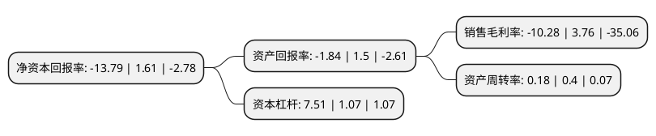

> 本页面由自动化程序生成于 2022年5月20日 01:27
> 内容可能存在错误，如有bug请提交issue至：https://github.com/Eroleice/doc-pi/issues
{.is-warning}

# 上市公司基本情况

## 基本资料

新疆库尔勒香梨股份有限公司（以下简称“香梨股份”）成立于1999年11月18日，巴音郭楞蒙古自治州。于2001年12月26日在上交所主板上市。

香梨股份注册资本14,770.687万元，主要产品:香梨，其他果品及包装物，杏酒。以下是详细信息：

- 公司名称: 新疆库尔勒香梨股份有限公司
- 股票代码: 600506.SH
- 所在地: 新疆 - 巴音郭楞蒙古自治州
- 成立日期: 1999年11月18日
- 注册资本: 14,770.687万元
- 法定代表人: 周恩鸿
- 主营业务: 主要产品:香梨，其他果品及包装物，杏酒
- 公司官网: www.xjxlgf.com.cn
- 公司介绍: 公司是国家农业产业化龙头企业。公司主要以新疆特色林果产业为主业，是集种植、冷藏、仓储、研发、加工、销售为一体的专业化农业产业龙头企业。本着“诚信经营、回报社会”的宗旨，为社会各界提供享誉世界的库尔勒香梨、吐鲁番葡萄干、新疆红枣、巴旦木、无花果等新疆特色果品。公司拥有“东方圣果”、“沙依东”、等市场美誉度价高的品牌，其中“东方圣果”牌香梨果酒、冰杏酒、库尔勒香梨、吐鲁番葡萄干、骏枣和灰枣等系列产品深受广大消费者喜爱。

## 股东及高管情况

上市公司第一大股东为新疆融盛投资有限公司，持股35,278,015股，占比23.88%，**疑似为**上市公司实际控制人。

截至2022年03月31日，上市公司的前十大股东中，共有9名自然人股东，1名机构股东，其中5%以上大股东共有1名。上市公司前十大股东明细如下：

> 未能通过持股比例判定出上市公司实际控制人（持股30%以上）
> 可能存在通过间接持股、联合持股、协议控制等方式拥有实际控制权的主体，具体请参考上市公司定期公告！
{.is-warning}

> 截至2022年03月31日，上市公司前十大股东信息如下：

| 股东名称 | 持股数量（股） | 持股比例 |
| --- | --- | --- |
| 新疆融盛投资有限公司 | 35,278,015 | 23.88% |
| 吴乃奇 | 6,661,032 | 4.51% |
| 石晓妍 | 2,856,248 | 1.93% |
| 张玉明 | 2,180,000 | 1.48% |
| 张敬红 | 1,652,500 | 1.12% |
| 张龙 | 1,144,600 | 0.77% |
| 杨惠琴 | 1,117,200 | 0.76% |
| 李陆军 | 1,000,000 | 0.68% |
| 杜超 | 946,200 | 0.64% |
| 丁忠彪 | 774,500 | 0.52% |

## 利润表分析

上市公司2021年总收入为3.49亿元，净利润为-0.36亿元，**未实现盈利**。

## 杜邦分析

> 数据列示周期：2021年 | 2020年 | 2019年
{.is-info}

上市公司的净资产收益率在近一年有所下降，下降幅度为-956.52%，其变化情况分解如下：
- 上市公司的销售毛利率在近一年下降了-373.4%，可能是生产效率的下降、商品原材料价格上涨或商品价格的下跌所致。
- 上市公司的资产周转率在近一年下降了-55%，可能是源自于更慢的销售回款或库存管理效果下降。
- 上市公司的财务杠杆比率在近一年上升了601.87%，可能是增加负债扩大生产规模。

