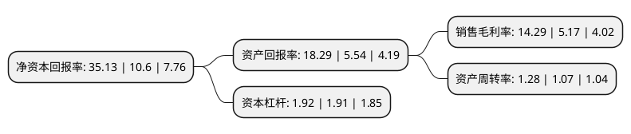

> 本页面由自动化程序生成于 2022年5月20日 01:27
> 内容可能存在错误，如有bug请提交issue至：https://github.com/Eroleice/doc-pi/issues
{.is-warning}

# 上市公司基本情况

## 基本资料

浙江新安化工集团股份有限公司（以下简称“新安股份”）成立于1993年05月12日，杭州市。于2001年09月06日在上交所主板上市。

新安股份注册资本81,839.039万元，主营业务:公司主要从事以草甘膦为主的农药产品和有机硅新材料产品的生产和销售;主要产品:两大主导产品为草甘膦和有机硅。以下是详细信息：

- 公司名称: 浙江新安化工集团股份有限公司
- 股票代码: 600596.SH
- 所在地: 浙江 - 杭州市
- 成立日期: 1993年05月12日
- 注册资本: 81,839.039万元
- 法定代表人: 吴建华
- 主营业务: 主营业务:公司主要从事以草甘膦为主的农药产品和有机硅新材料产品的生产和销售;主要产品:两大主导产品为草甘膦和有机硅
- 公司官网: www.wynca.com
- 公司介绍: 公司是国家创新型企业，主营作物保护、有机硅材料。公司开发形成以草甘膦原药及剂型产品为主导，杀虫剂、杀菌剂等多品种同步发展的产品群；围绕有机硅单体合成，搭建从硅矿冶炼、硅粉加工、单体合成、下游制品加工的完整产业链，形成硅橡胶、硅油、硅树脂、硅烷偶联剂等系列产品，成为拥有全产业链优势的有机硅企业。公司通过终端化、平台化、国际化战略，正式向现代服务型企业转型。公司是全国知识产权示范企业，建有完善的创新体系，拥有国家认定企业技术中心、博士后科研工作站、省级企业研究院和杭州市院士工作站。始终坚持“绿色化学创造美好生活”的发展使命，利用氯元素、磷元素、硅元素的循环先进技术，成为行业内循环经济模式的先行者，而且坚持通过发展循环经济、走资源节约型、环境友好型的发展道路，更好地服务社会、造福人类。

## 股东及高管情况

上市公司第一大股东为传化集团有限公司，持股101,725,800股，占比12.43%，**疑似为**上市公司实际控制人。

截至2022年03月31日，上市公司的前十大股东中，共有4名机构股东，5个产品账户，1个海外主体，其中5%以上大股东共有3名。上市公司前十大股东明细如下：

> 未能通过持股比例判定出上市公司实际控制人（持股30%以上）
> 可能存在通过间接持股、联合持股、协议控制等方式拥有实际控制权的主体，具体请参考上市公司定期公告！
{.is-warning}

> 截至2022年03月31日，上市公司前十大股东信息如下：

| 股东名称 | 持股数量（股） | 持股比例 |
| --- | --- | --- |
| 传化集团有限公司 | 101,725,800 | 12.43% |
| 浙江传化化学集团有限公司 | 83,200,000 | 10.17% |
| 开化县国有资产经营有限责任公司 | 48,756,136 | 5.96% |
| 香港中央结算有限公司(陆股通) | 15,630,202 | 1.91% |
| 中国银行股份有限公司-国投瑞银新能源混合型证券投资基金 | 9,747,900 | 1.19% |
| 光大永明资管-兴业银行-光大永明资产聚财121号定向资产管理产品 | 9,712,324 | 1.19% |
| 中国银行股份有限公司-国投瑞银产业趋势混合型证券投资基金 | 6,085,543 | 0.74% |
| 中国建设银行股份有限公司-国投瑞银先进制造混合型证券投资基金 | 6,016,506 | 0.74% |
| 中信证券股份有限公司 | 5,948,680 | 0.73% |
| 全国社保基金六零二组合 | 4,533,764 | 0.55% |

## 利润表分析

上市公司2021年总收入为189.76亿元，净利润为27.12亿元，实现盈利。

## 杜邦分析

> 数据列示周期：2021年 | 2020年 | 2019年
{.is-info}

上市公司的净资产收益率在近一年有所上升，上升幅度为231.42%，其变化情况分解如下：
- 上市公司的销售毛利率在近一年上升了176.4%，可能是生产效率的提升、商品原材料价格下跌或商品价格的上涨所致。
- 上市公司的资产周转率在近一年上升了19.63%，可能是源自于更快的销售回款或库存管理效果提升。
- 上市公司的财务杠杆比率在近一年上升了0.52%，可能是增加负债扩大生产规模。

