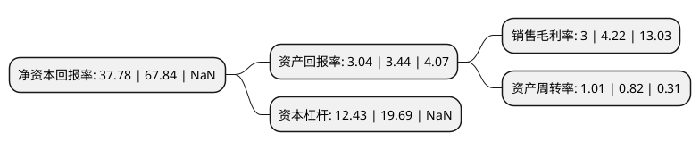

> 本页面由自动化程序生成于 2022年5月20日 01:27
> 内容可能存在错误，如有bug请提交issue至：https://github.com/Eroleice/doc-pi/issues
{.is-warning}

# 上市公司基本情况

## 基本资料

贵州中毅达股份有限公司（以下简称“中毅达”）成立于1992年06月22日，上海市。于1992年08月05日在上交所主板上市。

中毅达注册资本107,127.461万元，主营业务:园林设计工程以下是详细信息：

- 公司名称: 贵州中毅达股份有限公司
- 股票代码: 600610.SH
- 所在地: 上海 - 上海市
- 成立日期: 1992年06月22日
- 注册资本: 107,127.461万元
- 法定代表人: 虞宙斯
- 主营业务: 主营业务:园林设计工程
- 公司官网: www.shanghaizhongyida.com
- 公司介绍: 公司主要从事园林工程施工、市政工程施工及销售苗木业务。公司拥有具有城市园林绿化一级资质全资子公司厦门中毅达环境艺术工程有限公司，主要以市政工程施工为主，园林工程施工、销售苗木为辅的业务模式。公司旗下拥有市政公用工程总承包壹级资质和城市园林绿化壹级资质，能同时参与各类传统市政工程和传统园林工程的招投标，大大扩展了市场范围，另外，通过市政和园林这两个市场领域互为补充、相互渗透，将进一步拓展市场份额，既能做“大市政”业务，又能做“小园林”业务。

## 股东及高管情况

上市公司第一大股东为信达证券-兴业银行-信达兴融4号集合资产管理计划，持股260,000,000股，占比24.27%，**疑似为**上市公司实际控制人。

截至2022年05月10日，上市公司的前十大股东中，共有4名自然人股东，3名机构股东，2个产品账户，1个海外主体，其中5%以上大股东共有4名。上市公司前十大股东明细如下：

> 未能通过持股比例判定出上市公司实际控制人（持股30%以上）
> 可能存在通过间接持股、联合持股、协议控制等方式拥有实际控制权的主体，具体请参考上市公司定期公告！
{.is-warning}

> 截至2022年05月10日，上市公司前十大股东信息如下：

| 股东名称 | 持股数量（股） | 持股比例 |
| --- | --- | --- |
| 信达证券-兴业银行-信达兴融4号集合资产管理计划 | 260,000,000 | 24.27% |
| 信达证券-兴业银行-信达兴融4号集合资产管理计划 | 260,000,000 | 24.27% |
| 西藏一乙资产管理有限公司 | 82,990,000 | 7.75% |
| 西藏一乙资产管理有限公司 | 81,290,000 | 7.5882% |
| 倪赣 | 12,710,000 | 1.19% |
| SHENWAN HONGYUAN NOMINEES (H.K.) LIMITED | 10,380,004 | 0.97% |
| 上海南上海商业房地产有限公司 | 10,296,000 | 0.96% |
| 张文军 | 4,870,000 | 0.45% |
| 徐小岳 | 4,203,300 | 0.39% |
| 唐保和 | 3,620,500 | 0.34% |

## 杜邦分析

> 数据列示周期：2021年 | 2020年 | 2019年
{.is-info}

上市公司的净资产收益率在近一年有所下降，下降幅度为-44.31%，其变化情况分解如下：
- 上市公司的销售毛利率在近一年下降了-28.91%，可能是生产效率的下降、商品原材料价格上涨或商品价格的下跌所致。
- 上市公司的资产周转率在近一年上升了23.17%，可能是源自于更快的销售回款或库存管理效果提升。
- 上市公司的财务杠杆比率在近一年下降了-36.87%，可能是减少负债降低财务费用。

