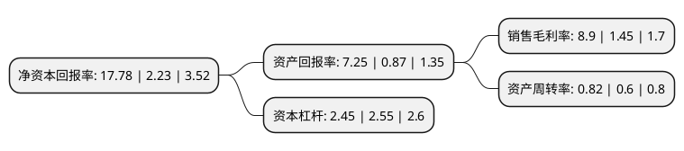

> 本页面由自动化程序生成于 2022年5月20日 01:27
> 内容可能存在错误，如有bug请提交issue至：https://github.com/Eroleice/doc-pi/issues
{.is-warning}

# 上市公司基本情况

## 基本资料

上海华谊集团股份有限公司（以下简称“华谊集团”）成立于1992年08月05日，上海市。于1992年12月04日在上交所主板上市。

华谊集团注册资本213,144.96万元，主要产品:轮胎。以下是详细信息：

- 公司名称: 上海华谊集团股份有限公司
- 股票代码: 600623.SH
- 所在地: 上海 - 上海市
- 成立日期: 1992年08月05日
- 注册资本: 213,144.96万元
- 法定代表人: 刘训峰
- 主营业务: 主要产品:轮胎
- 公司官网: www.doublecoinholdings.com
- 公司介绍: 公司是由上海市政府国有资产监督管理委员会授权，通过资产重组建立的大型化工企业集团。公司主要从事能源化工、绿色轮胎、先进材料、精细化工和化工服务等核心业务，并已基本形成“制造+服务”双核驱动的业务发展模式，以及覆盖“基础化学品、精细化学品和先进材料、面向终端客户产品”的上下游产业链一体化发展体系。公司拥有行业内先进的研发软硬件创新条件，包括国家级企业技术中心、市级企业中心、上海市高新技术企业、国家检测实验室，并设有博士后科研工作站，构筑了“工业催化、化工新材料、精细化工、过程开发、分析检测”等技术研究平台。公司拥有一系列中国名牌、中国驰名商标、上海名牌、中华老字号等著名商标。

## 股东及高管情况

上市公司第一大股东为上海华谊(集团)公司，持股894,949,825股，占比41.99%，为上市公司实际控制人。

截至2022年03月31日，上市公司的前十大股东中，共有2名自然人股东，3名机构股东，5个产品账户，其中5%以上大股东共有2名。上市公司前十大股东明细如下：

> 截至2022年03月31日，上市公司前十大股东信息如下：

| 股东名称 | 持股数量（股） | 持股比例 |
| --- | --- | --- |
| 上海华谊(集团)公司 | 894,949,825 | 41.99% |
| 上海国盛(集团)有限公司 | 366,845,496 | 17.21% |
| 海富通基金-上海国盛(集团)有限公司-海富通基金光虹单一资产管理计划 | 31,628,900 | 1.48% |
| 上海国盛集团投资有限公司 | 29,230,769 | 1.37% |
| 刘玮巍 | 21,216,230 | 1% |
| 海富通基金-上海国盛(集团)有限公司-海富通基金光嘉单一资产管理计划 | 11,000,000 | 0.52% |
| 中国工商银行股份有限公司-中证上海国企交易型开放式指数证券投资基金 | 8,331,213 | 0.39% |
| 招商证券股份有限公司-天弘中证500指数增强型证券投资基金 | 6,993,800 | 0.33% |
| 吕立芬 | 5,305,700 | 0.25% |
| 国信证券股份有限公司-华夏中证500指数智选增强型证券投资基金 | 4,679,788 | 0.22% |

## 利润表分析

上市公司2021年总收入为400.34亿元，净利润为35.3亿元，实现盈利。

## 杜邦分析

> 数据列示周期：2021年 | 2020年 | 2019年
{.is-info}

上市公司的净资产收益率在近一年有所上升，上升幅度为697.31%，其变化情况分解如下：
- 上市公司的销售毛利率在近一年上升了513.79%，可能是生产效率的提升、商品原材料价格下跌或商品价格的上涨所致。
- 上市公司的资产周转率在近一年上升了36.67%，可能是源自于更快的销售回款或库存管理效果提升。
- 上市公司的财务杠杆比率在近一年下降了-3.92%，可能是减少负债降低财务费用。

