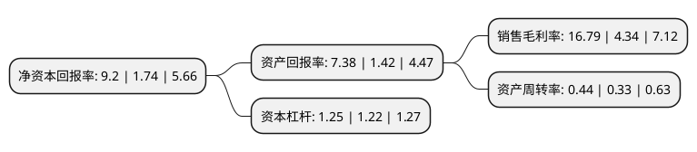

> 本页面由自动化程序生成于 2022年5月20日 01:28
> 内容可能存在错误，如有bug请提交issue至：https://github.com/Eroleice/doc-pi/issues
{.is-warning}

# 上市公司基本情况

## 基本资料

河北金牛化工股份有限公司（以下简称“金牛化工”）成立于1996年06月17日，沧州市。于1996年06月26日在上交所主板上市。

金牛化工注册资本68,031.968万元，树脂，烧碱，水泥。以下是详细信息：

- 公司名称: 河北金牛化工股份有限公司
- 股票代码: 600722.SH
- 所在地: 河北 - 沧州市
- 成立日期: 1996年06月17日
- 注册资本: 68,031.968万元
- 法定代表人: 郑温雅
- 主营业务: 树脂，烧碱，水泥
- 公司官网: www.hbjnhg.com
- 公司介绍: 公司是以化工生产经营为主的大型综合经济实体，是我国领先的PVC树脂生产基地，同时是河北省规模领先的氯碱工业原料基地，生产工艺达到了世界先进水平。公司拥有河北金牛物流有限公司、河北金牛旭阳化工有限公司、揭阳华南沧化实业有限公司、沧州金牛劳动服务有限公司等子公司。公司积极推进科技创新，加快产品结构调整，延伸相关高附加值产业链，立足行业特点，大力开展节能减排，全面实施循环经济示范区工程，高标准，高起点创建环境优美，文明和谐的花园式新厂区。逐步将公司建设成为资源配置合理，技术装备先进，具有可持续发展和较强竞争力的化工企业集团。

## 股东及高管情况

上市公司第一大股东为冀中能源股份有限公司，持股381,262,977股，占比56.04%，为上市公司实际控制人。

截至2022年03月31日，上市公司的前十大股东中，共有8名自然人股东，2名机构股东，其中5%以上大股东共有1名。上市公司前十大股东明细如下：

> 截至2022年03月31日，上市公司前十大股东信息如下：

| 股东名称 | 持股数量（股） | 持股比例 |
| --- | --- | --- |
| 冀中能源股份有限公司 | 381,262,977 | 56.04% |
| 钟永杰 | 4,574,100 | 0.67% |
| 樊菲 | 2,855,158 | 0.42% |
| 范向武 | 1,241,000 | 0.18% |
| 何岸 | 1,223,000 | 0.18% |
| 朱卫兵 | 1,118,100 | 0.16% |
| 袁景波 | 1,045,400 | 0.15% |
| 武汉九通物流有限公司 | 931,800 | 0.14% |
| 陈莉 | 930,400 | 0.14% |
| 郭旭 | 858,000 | 0.13% |

## 利润表分析

上市公司2021年总收入为5.67亿元，净利润为0.95亿元，实现盈利。

## 杜邦分析

> 数据列示周期：2021年 | 2020年 | 2019年
{.is-info}

上市公司的净资产收益率在近一年有所上升，上升幅度为428.74%，其变化情况分解如下：
- 上市公司的销售毛利率在近一年上升了286.87%，可能是生产效率的提升、商品原材料价格下跌或商品价格的上涨所致。
- 上市公司的资产周转率在近一年上升了33.33%，可能是源自于更快的销售回款或库存管理效果提升。
- 上市公司的财务杠杆比率在近一年上升了2.46%，可能是增加负债扩大生产规模。

