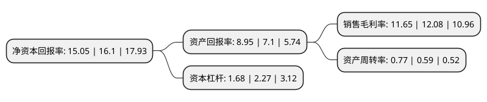

> 本页面由自动化程序生成于 2022年5月20日 01:30
> 内容可能存在错误，如有bug请提交issue至：https://github.com/Eroleice/doc-pi/issues
{.is-warning}

# 上市公司基本情况

## 基本资料

安徽华塑股份有限公司（以下简称“华塑股份”）成立于2009年03月30日，滁州市。于2021年11月26日在上交所主板上市。

华塑股份注册资本350,740.181万元，主要产品包括PVC，烧碱，灰岩，电石渣水泥，石灰等。主要从事以PVC和烧碱为核心的氯碱化工产品生产与销售，业务涵盖原盐及灰岩开采，煤炭发电及电石制备，PVC及烧碱生产和“三废”综合利用等，构建了氯碱化工一体化循环经济体系。以下是详细信息：

- 公司名称: 安徽华塑股份有限公司
- 股票代码: 600935.SH
- 所在地: 安徽 - 滁州市
- 成立日期: 2009年03月30日
- 注册资本: 350,740.181万元
- 法定代表人: 赵世通
- 主营业务: 主要产品包括PVC，烧碱，灰岩，电石渣水泥，石灰等主要从事以PVC和烧碱为核心的氯碱化工产品生产与销售，业务涵盖原盐及灰岩开采，煤炭发电及电石制备，PVC及烧碱生产和“三废”综合利用等，构建了氯碱化工一体化循环经济体系
- 公司官网: www.hwasu.com
- 公司介绍: 公司是长三角地区大型氯碱化工企业，是国企改革“双百行动”的试点企业、“安徽省十大优秀创新企业”、“安徽省制造业综合实力50强企业”。公司大型盐化工项目是安徽省“861”行动计划重点项目、振兴皖北经济“一号工程”的重要组成部分。公司自成立以来便致力于循环经济与资源综合利用，依托自身拥有的优质电石灰岩和原盐资源优势，以及“两淮”地区丰富的煤炭资源，采用先进、高效、清洁的生产工艺，建成了以PVC、烧碱为核心的“矿—煤—电—氯碱化工—‘三废’综合利用”的一体化循环经济体系，在资源、成本、技术、规模、环保等多个方面具有较为明显的综合竞争优势。

## 股东及高管情况

上市公司第一大股东为淮北矿业(集团)有限责任公司，持股1,652,700,588股，占比47.12%，为上市公司实际控制人。

截至2022年03月31日，上市公司的前十大股东中，共有3名自然人股东，7名机构股东，其中5%以上大股东共有4名。上市公司前十大股东明细如下：

> 截至2022年03月31日，上市公司前十大股东信息如下：

| 股东名称 | 持股数量（股） | 持股比例 |
| --- | --- | --- |
| 淮北矿业(集团)有限责任公司 | 1,652,700,588 | 47.12% |
| 安徽皖投工业投资有限公司 | 481,657,955 | 13.73% |
| 建信金融资产投资有限公司 | 337,331,334 | 9.62% |
| 中国成达工程有限公司 | 180,000,000 | 5.13% |
| 定远县国有资产运营有限公司 | 169,721,935 | 4.84% |
| 中盐东兴盐化股份有限公司 | 150,000,000 | 4.28% |
| 马钢集团投资有限公司 | 150,000,000 | 4.28% |
| 柳静 | 3,524,214 | 0.1% |
| 陈昭年 | 1,109,000 | 0.03% |
| 盛立强 | 905,196 | 0.03% |

## 利润表分析

上市公司2021年总收入为67.39亿元，净利润为7.85亿元，实现盈利。

## 杜邦分析

> 数据列示周期：2021年 | 2020年 | 2019年
{.is-info}

上市公司的净资产收益率在近一年有所下降，下降幅度为-6.52%，其变化情况分解如下：
- 上市公司的销售毛利率在近一年下降了-3.56%，可能是生产效率的下降、商品原材料价格上涨或商品价格的下跌所致。
- 上市公司的资产周转率在近一年上升了30.51%，可能是源自于更快的销售回款或库存管理效果提升。
- 上市公司的财务杠杆比率在近一年下降了-25.99%，可能是减少负债降低财务费用。

