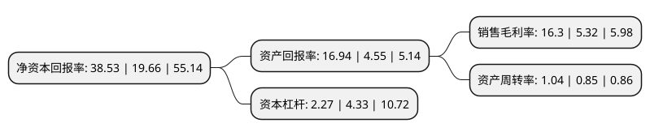

> 本页面由自动化程序生成于 2022年5月20日 01:30
> 内容可能存在错误，如有bug请提交issue至：https://github.com/Eroleice/doc-pi/issues
{.is-warning}

# 上市公司基本情况

## 基本资料

利华益维远化学股份有限公司（以下简称“维远股份”）成立于2010年12月23日，东营市。于2021年09月15日在上交所主板上市。

维远股份注册资本55,000万元，有机化学新材料产品的研发，生产与销售，主要包括苯酚，丙酮，双酚A，聚碳酸酯和异丙醇。以下是详细信息：

- 公司名称: 利华益维远化学股份有限公司
- 股票代码: 600955.SH
- 所在地: 山东 - 东营市
- 成立日期: 2010年12月23日
- 注册资本: 55,000万元
- 法定代表人: 魏玉东
- 主营业务: 有机化学新材料产品的研发，生产与销售，主要包括苯酚，丙酮，双酚A，聚碳酸酯和异丙醇
- 公司官网: www.wyhx.net.cn
- 公司介绍: 公司通过打造和完善一体化的“苯酚、丙酮—双酚A—聚碳酸酯”产业链，充分发掘和抓住产业链市场机遇，形成产业链相加、价值链相乘、供应链相通“三链重构”模式，构筑起“特色突出、链条完备、品牌集聚、国内一流”的产业格局，走出了一条“长链条、短流程、高端化、高附加值、顶端整合”的特色发展道路。公司获得了“第十一届全国设备管理优秀单位”、“2017-2018年度山东化工行业明星单位”、“石油和化工行业绿色工厂”等多项国家级、省级荣誉，多个项目列入“增强制造业核心竞争力中央预算内投资项目”、“产业振兴和技术改造中央预算内投资项目”、“山东省重点建设项目”、“山东省‘黄蓝’两区建设专项资金项目”、“山东省工业提质增效升级专项资金项目”，走出了一条“技术领先、短流程工艺、清洁生产、本质安全、有机化工新材料高端化”的发展之路。

## 股东及高管情况

上市公司第一大股东为维远控股有限责任公司，持股108,500,000股，占比19.73%，**疑似为**上市公司实际控制人。

截至2022年03月31日，上市公司的前十大股东中，共有1名自然人股东，8名机构股东，1个产品账户，其中5%以上大股东共有4名。上市公司前十大股东明细如下：

> 未能通过持股比例判定出上市公司实际控制人（持股30%以上）
> 可能存在通过间接持股、联合持股、协议控制等方式拥有实际控制权的主体，具体请参考上市公司定期公告！
{.is-warning}

> 截至2022年03月31日，上市公司前十大股东信息如下：

| 股东名称 | 持股数量（股） | 持股比例 |
| --- | --- | --- |
| 维远控股有限责任公司 | 108,500,000 | 19.73% |
| 东营远达投资管理中心(有限合伙) | 59,500,000 | 10.82% |
| 东营永益投资管理中心(有限合伙) | 54,400,000 | 9.89% |
| 东营汇泽投资管理中心(有限合伙) | 51,000,000 | 9.27% |
| 青岛天诚股权投资基金管理有限公司-东营市显比股权投资基金合伙企业(有限合伙) | 25,000,000 | 4.55% |
| 东营益安股权投资管理中心(有限合伙) | 13,600,000 | 2.47% |
| 山东京阳科技股份有限公司 | 12,500,000 | 2.27% |
| 徐云亭 | 10,500,000 | 1.91% |
| 中泰创业投资(深圳)有限公司 | 10,000,000 | 1.82% |
| 金石灏沣股权投资(杭州)合伙企业(有限合伙) | 6,250,000 | 1.14% |

## 利润表分析

上市公司2021年总收入为96.34亿元，净利润为21.49亿元，实现盈利。

## 杜邦分析

> 数据列示周期：2020年 | 2019年 | 2018年
{.is-info}

上市公司的净资产收益率在近一年有所上升，上升幅度为95.98%，其变化情况分解如下：
- 上市公司的销售毛利率在近一年上升了206.39%，可能是生产效率的提升、商品原材料价格下跌或商品价格的上涨所致。
- 上市公司的资产周转率在近一年上升了22.35%，可能是源自于更快的销售回款或库存管理效果提升。
- 上市公司的财务杠杆比率在近一年下降了-47.58%，可能是减少负债降低财务费用。

