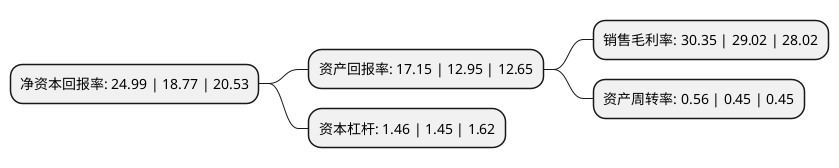

> 本页面由自动化程序生成于 2022年5月20日 01:30
> 内容可能存在错误，如有bug请提交issue至：https://github.com/Eroleice/doc-pi/issues
{.is-warning}

# 上市公司基本情况

## 基本资料

宁夏宝丰能源集团股份有限公司（以下简称“宝丰能源”）成立于2005年11月02日，银川市。于2019年05月16日在上交所主板上市。

宝丰能源注册资本733,336万元，现代煤化工产品的生产与销售，主要产品包括烯烃类产品，焦化类产品，精细化工类产品以下是详细信息：

- 公司名称: 宁夏宝丰能源集团股份有限公司
- 股票代码: 600989.SH
- 所在地: 宁夏 - 银川市
- 成立日期: 2005年11月02日
- 注册资本: 733,336万元
- 法定代表人: 刘元管
- 主营业务: 现代煤化工产品的生产与销售，主要产品包括烯烃类产品，焦化类产品，精细化工类产品
- 公司官网: www.baofengenergy.com
- 公司介绍: 公司位于中国能源“金三角”的宁东国家级能源化工基地核心区，自2005年成立以来，坚持绿色发展理念，依托科技创新，应用国际国内领先的技术、工艺和装备，打造了集“煤、焦、气、甲醇、烯烃、聚乙烯、聚丙烯、精细化工”于一体的高端煤基新材料循环经济产业集群，用煤替代石油生产出近100种高端化工产品，能耗、环保等综合指标达到国内领先水平，实现煤炭资源清洁高效的利用。生产的产品广泛应用于工业、农业、军工、航空航天、医疗及生产生活用品等领域，同时填补了国内聚烯烃等高端化工原料进口缺口，为保障国家能源战略安全发挥了积极作用。公司建设项目投资727亿元，占地面积14000亩，总体规划产能为“年产300万吨烯烃、150万吨聚乙烯、150万吨聚丙烯、1000万吨甲醇、134.5万吨精细化工、400万吨焦炭、810万煤炭”。规划项目全部建成后，公司年销售收入将突破400亿元，员工达25000人，成为全国单厂规模最大的高端煤基新材料和化学品生产制造商，致力打造技术领先、行业领军、世界一流的现代能源化工企业。

## 股东及高管情况

上市公司第一大股东为宁夏宝丰集团有限公司，持股2,608,470,063股，占比35.57%，为上市公司实际控制人。

截至2022年03月31日，上市公司的前十大股东中，共有6名自然人股东，3名机构股东，1个海外主体，其中5%以上大股东共有3名。上市公司前十大股东明细如下：

> 截至2022年03月31日，上市公司前十大股东信息如下：

| 股东名称 | 持股数量（股） | 持股比例 |
| --- | --- | --- |
| 宁夏宝丰集团有限公司 | 2,608,470,063 | 35.57% |
| 东毅国际集团有限公司 | 2,000,000,000 | 27.27% |
| 党彦宝 | 552,000,000 | 7.53% |
| 宁夏聚汇信股权投资合伙企业(有限合伙) | 125,000,000 | 1.7% |
| 张龙 | 118,075,500 | 1.61% |
| 香港中央结算有限公司(陆股通) | 99,155,754 | 1.35% |
| 关晓濛 | 47,500,000 | 0.65% |
| 田翠莲 | 46,500,100 | 0.63% |
| 胡亦对 | 45,408,295 | 0.62% |
| 党彦峰 | 36,800,000 | 0.5% |

## 利润表分析

上市公司2021年总收入为232.99亿元，净利润为70.7亿元，实现盈利。

## 杜邦分析

> 数据列示周期：2021年 | 2020年 | 2019年
{.is-info}

上市公司的净资产收益率在近一年有所上升，上升幅度为33.14%，其变化情况分解如下：
- 上市公司的销售毛利率在近一年上升了4.58%，可能是生产效率的提升、商品原材料价格下跌或商品价格的上涨所致。
- 上市公司的资产周转率在近一年上升了24.44%，可能是源自于更快的销售回款或库存管理效果提升。
- 上市公司的财务杠杆比率在近一年上升了0.69%，可能是增加负债扩大生产规模。

