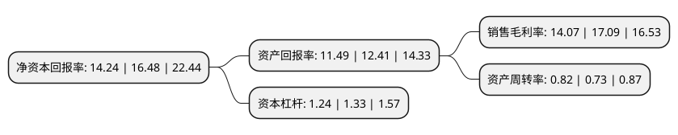

> 本页面由自动化程序生成于 2022年5月20日 01:31
> 内容可能存在错误，如有bug请提交issue至：https://github.com/Eroleice/doc-pi/issues
{.is-warning}

# 上市公司基本情况

## 基本资料

陕西北元化工集团股份有限公司（以下简称“北元集团”）成立于2003年05月06日，榆林市。于2020年10月20日在上交所主板上市。

北元集团注册资本361,111.111万元，主要从事聚氯乙烯，烧碱等产品的生产和销售，主营产品包括聚氯乙烯和烧碱等。以下是详细信息：

- 公司名称: 陕西北元化工集团股份有限公司
- 股票代码: 601568.SH
- 所在地: 陕西 - 榆林市
- 成立日期: 2003年05月06日
- 注册资本: 361,111.111万元
- 法定代表人: 刘国强
- 主营业务: 主要从事聚氯乙烯，烧碱等产品的生产和销售，主营产品包括聚氯乙烯和烧碱等
- 公司官网: www.sxbychem.com
- 公司介绍: 公司是一家高新技术企业,主要从事聚氯乙烯、烧碱等产品的生产和销售，主营产品包括聚氯乙烯和烧碱等。公司依托榆林地区丰富的煤炭和原盐资源优势，自设立以来，致力于一体化经营，以自备电厂为纽带，建设以PVC产品为核心的“煤—电—电石—氯碱化工(离子膜烧碱、PVC)—工业废渣综合利用生产水泥”的一体化循环经济产业链。公司是由陕西煤业化工集团有限责任公司与民营企业及自然人组建的大型混合所有制盐化工企业，依托区域丰富的煤炭和原盐资源，公司坚持多元一体化发展模式，连续多年被评为“中国化工500强企业”，先后荣获“国家两化融合示范企业”、“全国安全文化建设示范企业”、“中国企业文化建设先进单位”、“陕西省十佳经营诚信示范单位”、“陕西省安全生产先进单位”、“陕西省质量工作先进单位”、“陕西省先进集体”等荣誉。“北元”牌聚氯乙烯和高纯氢氧化钠产品被评为“陕西省名牌产品”，“北元”商标被评为“陕西省著名商标”。目前，公司已经在行业内建立起良好的产品口碑和具有影响力的市场品牌。

## 股东及高管情况

上市公司第一大股东为陕西煤业化工集团有限责任公司，持股1,275,166,667股，占比35.31%，为上市公司实际控制人。

截至2022年03月31日，上市公司的前十大股东中，共有7名自然人股东，3名机构股东，其中5%以上大股东共有2名。上市公司前十大股东明细如下：

> 截至2022年03月31日，上市公司前十大股东信息如下：

| 股东名称 | 持股数量（股） | 持股比例 |
| --- | --- | --- |
| 陕西煤业化工集团有限责任公司 | 1,275,166,667 | 35.31% |
| 陕西恒源投资集团有限公司 | 1,029,000,000 | 28.5% |
| 王振明 | 169,166,667 | 4.68% |
| 王文明 | 169,166,667 | 4.68% |
| 何怀斌 | 107,680,556 | 2.98% |
| 刘平泽 | 84,583,333 | 2.34% |
| 孙俊良 | 84,583,333 | 2.34% |
| 神木电化有限责任公司 | 82,305,555 | 2.28% |
| 刘银娥 | 67,666,667 | 1.87% |
| 徐继红 | 56,803,700 | 1.57% |

## 利润表分析

上市公司2021年总收入为131.53亿元，净利润为18.5亿元，实现盈利。

## 杜邦分析

> 数据列示周期：2021年 | 2020年 | 2019年
{.is-info}

上市公司的净资产收益率在近一年有所下降，下降幅度为-13.59%，其变化情况分解如下：
- 上市公司的销售毛利率在近一年下降了-17.67%，可能是生产效率的下降、商品原材料价格上涨或商品价格的下跌所致。
- 上市公司的资产周转率在近一年上升了12.33%，可能是源自于更快的销售回款或库存管理效果提升。
- 上市公司的财务杠杆比率在近一年下降了-6.77%，可能是减少负债降低财务费用。

