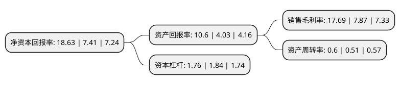

> 本页面由自动化程序生成于 2022年5月20日 01:31
> 内容可能存在错误，如有bug请提交issue至：https://github.com/Eroleice/doc-pi/issues
{.is-warning}

# 上市公司基本情况

## 基本资料

滨化集团股份有限公司（以下简称“滨化股份”）成立于1998年05月21日，滨州市。于2010年02月23日在上交所主板上市。

滨化股份注册资本205,803.628万元，主营业务:有机，无机化工产品的生产，加工与销售。主要产品为离子膜烧碱系列产品，环氧丙烷产品，油田破乳剂等精细化工产品。以下是详细信息：

- 公司名称: 滨化集团股份有限公司
- 股票代码: 601678.SH
- 所在地: 山东 - 滨州市
- 成立日期: 1998年05月21日
- 注册资本: 205,803.628万元
- 法定代表人: 任元滨
- 主营业务: 主营业务:有机，无机化工产品的生产，加工与销售主要产品为离子膜烧碱系列产品，环氧丙烷产品，油田破乳剂等精细化工产品
- 公司官网: www.befar.com
- 公司介绍: 公司是我国三氯乙烯、油田助剂供应商和重要的环氧丙烷及烧碱产品生产商，国内最具影响力的油田助剂厂商之一，在国内化工氯碱行业内享有良好的知名度和美誉度。公司已发展成为主业突出、产业链完整的综合型化工企业集团，产业涵盖盐化工、石油化工、精细化工、热电、口岸仓储、金融等领域，产品覆盖全球多个国家和地区。公司采用“资源合理使用、产品精深加工、能源综合利用”为特色的良性循环经济运营模式，形成了具有滨化特色的一体化氯碱产业链。公司多套生产装置引进了国际先进的工艺技术，成为业内标杆和典范，公司主要产品纯度级别高于行业同类产品，在市场上享有良好声誉。

## 股东及高管情况

上市公司第一大股东为滨州和宜产业投资合伙企业(有限合伙)，持股145,678,110股，占比7.08%，**疑似为**上市公司实际控制人。

截至2022年03月31日，上市公司的前十大股东中，共有5名自然人股东，2名机构股东，3个产品账户，其中5%以上大股东共有2名。上市公司前十大股东明细如下：

> 未能通过持股比例判定出上市公司实际控制人（持股30%以上）
> 可能存在通过间接持股、联合持股、协议控制等方式拥有实际控制权的主体，具体请参考上市公司定期公告！
{.is-warning}

> 上市公司第一大股东持股不超过10%，请检查是否存在公司控制权风险！
{.is-danger}

> 截至2022年03月31日，上市公司前十大股东信息如下：

| 股东名称 | 持股数量（股） | 持股比例 |
| --- | --- | --- |
| 滨州和宜产业投资合伙企业(有限合伙) | 145,678,110 | 7.08% |
| 张忠正 | 129,729,600 | 6.3% |
| 石秦岭 | 47,303,100 | 2.3% |
| 滨州安泰控股集团有限公司 | 42,274,565 | 2.05% |
| 滨化集团股份有限公司-首期员工持股计划 | 34,617,100 | 1.68% |
| 陈跃 | 25,986,531 | 1.26% |
| 王黎明 | 25,927,200 | 1.26% |
| 西藏神州牧基金管理有限公司-神州牧量子1号私募证券投资基金 | 25,420,000 | 1.24% |
| 李德敏 | 24,141,232 | 1.17% |
| 北京神州牧投资基金管理有限公司-红炎神州牧基金 | 20,510,000 | 1% |

## 利润表分析

上市公司2021年总收入为92.68亿元，净利润为16.39亿元，实现盈利。

## 杜邦分析

> 数据列示周期：2021年 | 2020年 | 2019年
{.is-info}

上市公司的净资产收益率在近一年有所上升，上升幅度为151.42%，其变化情况分解如下：
- 上市公司的销售毛利率在近一年上升了124.78%，可能是生产效率的提升、商品原材料价格下跌或商品价格的上涨所致。
- 上市公司的资产周转率在近一年上升了17.65%，可能是源自于更快的销售回款或库存管理效果提升。
- 上市公司的财务杠杆比率在近一年下降了-4.35%，可能是减少负债降低财务费用。

