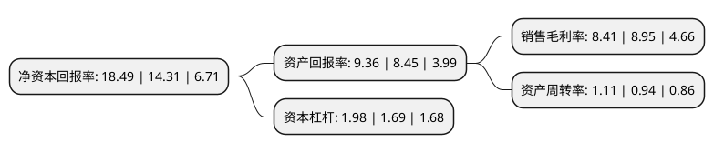

> 本页面由自动化程序生成于 2022年5月20日 01:32
> 内容可能存在错误，如有bug请提交issue至：https://github.com/Eroleice/doc-pi/issues
{.is-warning}

# 上市公司基本情况

## 基本资料

宏昌电子材料股份有限公司（以下简称“宏昌电子”）成立于1995年09月28日，广州市。于2012年05月18日在上交所主板上市。

宏昌电子注册资本90,387.52万元，公司的主营业务为电子级环氧树脂的生产和销售。主要产品包括高性能，环保型的电子级环氧树脂。主要分为液态型，固态型，溶剂型及阻燃型环氧树脂。以下是详细信息：

- 公司名称: 宏昌电子材料股份有限公司
- 股票代码: 603002.SH
- 所在地: 广东 - 广州市
- 成立日期: 1995年09月28日
- 注册资本: 90,387.52万元
- 法定代表人: 林瑞荣
- 主营业务: 公司的主营业务为电子级环氧树脂的生产和销售主要产品包括高性能，环保型的电子级环氧树脂主要分为液态型，固态型，溶剂型及阻燃型环氧树脂
- 公司官网: www.graceepoxy.com
- 公司介绍: 公司为中国第一家有能力生产高端电子级环氧树脂的专业生产厂商，主要产品为电子级环氧树脂。公司产品可应用于电子行业的覆铜板、发光二极管、回扫变压器、电容器等电子零件，以及环氧模塑料、航天及军事用途的特殊复合材料、胶粘剂与工艺品等行业。公司的高端电子级环氧树脂可完全替代进口电子级环氧树脂，填补中国在高端电子级环氧树脂的空白，为国内使用电子级环氧树脂的企业提供优质、稳定的产品以及全面的技术服务。

## 股东及高管情况

上市公司第一大股东为EPOXY BASE INVESTMENT HOLDING LTD.，持股253,702,000股，占比28.07%，**疑似为**上市公司实际控制人。

截至2022年03月31日，上市公司的前十大股东中，共有5名自然人股东，3名机构股东，2个海外主体，其中5%以上大股东共有4名。上市公司前十大股东明细如下：

> 未能通过持股比例判定出上市公司实际控制人（持股30%以上）
> 可能存在通过间接持股、联合持股、协议控制等方式拥有实际控制权的主体，具体请参考上市公司定期公告！
{.is-warning}

> 截至2022年03月31日，上市公司前十大股东信息如下：

| 股东名称 | 持股数量（股） | 持股比例 |
| --- | --- | --- |
| EPOXY BASE INVESTMENT HOLDING LTD. | 253,702,000 | 28.07% |
| 广州宏仁电子工业有限公司 | 238,230,953 | 26.36% |
| 聚豐投資有限公司 | 64,169,152 | 7.1% |
| 聚丰投资有限公司 | 64,169,152 | 7.1% |
| CRESCENT UNION LIMITED | 32,786,885 | 3.63% |
| 彭清文 | 4,980,000 | 0.55% |
| 陈良 | 4,315,800 | 0.48% |
| 刘占刚 | 3,091,477 | 0.34% |
| 徐大庆 | 2,625,000 | 0.29% |
| 栗建伟 | 2,000,000 | 0.22% |

## 利润表分析

上市公司2021年总收入为44.52亿元，净利润为3.74亿元，实现盈利。

## 杜邦分析

> 数据列示周期：2021年 | 2020年 | 2019年
{.is-info}

上市公司的净资产收益率在近一年有所上升，上升幅度为29.21%，其变化情况分解如下：
- 上市公司的销售毛利率在近一年下降了-6.03%，可能是生产效率的下降、商品原材料价格上涨或商品价格的下跌所致。
- 上市公司的资产周转率在近一年上升了18.09%，可能是源自于更快的销售回款或库存管理效果提升。
- 上市公司的财务杠杆比率在近一年上升了17.16%，可能是增加负债扩大生产规模。

