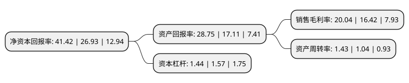

> 本页面由自动化程序生成于 2022年5月20日 01:32
> 内容可能存在错误，如有bug请提交issue至：https://github.com/Eroleice/doc-pi/issues
{.is-warning}

# 上市公司基本情况

## 基本资料

浙江万盛股份有限公司（以下简称“万盛股份”）成立于2000年07月17日，台州市。于2014年10月10日在上交所主板上市。

万盛股份注册资本48,527.265万元，主要从事有机磷系阻燃剂以及其他橡塑助剂的研发，生产和销售。有机磷系阻燃剂是公司的主要产品，包括应用于聚氨酯材料领域和工程塑料领域的阻燃剂。另外，公司还生产另一类产品聚合物多元醇，该产品主要应用于聚氨酯软泡的合成。以下是详细信息：

- 公司名称: 浙江万盛股份有限公司
- 股票代码: 603010.SH
- 所在地: 浙江 - 台州市
- 成立日期: 2000年07月17日
- 注册资本: 48,527.265万元
- 法定代表人: 高献国
- 主营业务: 主要从事有机磷系阻燃剂以及其他橡塑助剂的研发，生产和销售有机磷系阻燃剂是公司的主要产品，包括应用于聚氨酯材料领域和工程塑料领域的阻燃剂另外，公司还生产另一类产品聚合物多元醇，该产品主要应用于聚氨酯软泡的合成
- 公司官网: www.ws-chem.com
- 公司介绍: 公司是国内最主要的有机磷系阻燃剂生产企业之一、国家火炬计划重点高新技术企业、浙江省高新技术企业、浙江省创新型试点企业。公司主要从事有机磷系阻燃剂以及其他橡塑助剂的研发、生产和销售。公司拥有多项国家发明专利。阻燃剂产品目前已形成聚氨酯阻燃剂、工程塑料阻燃剂等产品线，其中由公司自主研发的聚氨酯软泡阻燃剂WSFR-504L，是国内首批符合宜家公司关于IOS-MAT-0010第九版对阻燃要求的产品，且已经应用于汽车座椅等车用聚氨酯材料领域。专利产品工程塑料阻燃剂WSFR-PX220项目、WSFR-RDP项目也已被列入国家火炬计划。公司将继续以“走在阻燃领域前沿，与世界同步”为使命，通过不断加强企业技术的开发和销售网络建设，努力将公司打造成世界有机磷阻燃剂的重要供应商。

## 股东及高管情况

上市公司第一大股东为南京钢铁股份有限公司，持股174,305,939股，占比29.56%，**疑似为**上市公司实际控制人。

截至2022年04月07日，上市公司的前十大股东中，共有6名自然人股东，4名机构股东，其中5%以上大股东共有4名。上市公司前十大股东明细如下：

> 未能通过持股比例判定出上市公司实际控制人（持股30%以上）
> 可能存在通过间接持股、联合持股、协议控制等方式拥有实际控制权的主体，具体请参考上市公司定期公告！
{.is-warning}

> 截至2022年04月07日，上市公司前十大股东信息如下：

| 股东名称 | 持股数量（股） | 持股比例 |
| --- | --- | --- |
| 南京钢铁股份有限公司 | 174,305,939 | 29.56% |
| 南京钢铁股份有限公司 | 70,000,000 | 14.42% |
| 河南洛升企业管理咨询合伙企业(有限合伙) | 68,627,720 | 11.64% |
| 河南洛升企业管理咨询合伙企业(有限合伙) | 68,627,720 | 14.14% |
| 高峰 | 11,788,562 | 2.43% |
| 周三昌 | 9,313,308 | 1.92% |
| 勇新 | 5,018,008 | 1.03% |
| 金译平 | 4,870,961 | 1% |
| 滕湘 | 4,708,960 | 0.97% |
| 滕湘 | 4,708,960 | 0.97% |

## 利润表分析

上市公司2021年总收入为41.14亿元，净利润为8.24亿元，实现盈利。

## 杜邦分析

> 数据列示周期：2021年 | 2020年 | 2019年
{.is-info}

上市公司的净资产收益率在近一年有所上升，上升幅度为53.81%，其变化情况分解如下：
- 上市公司的销售毛利率在近一年上升了22.05%，可能是生产效率的提升、商品原材料价格下跌或商品价格的上涨所致。
- 上市公司的资产周转率在近一年上升了37.5%，可能是源自于更快的销售回款或库存管理效果提升。
- 上市公司的财务杠杆比率在近一年下降了-8.28%，可能是减少负债降低财务费用。

