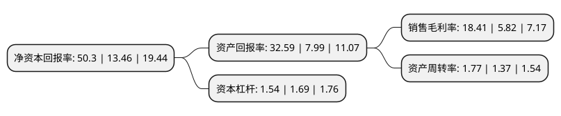

> 本页面由自动化程序生成于 2022年5月20日 01:32
> 内容可能存在错误，如有bug请提交issue至：https://github.com/Eroleice/doc-pi/issues
{.is-warning}

# 上市公司基本情况

## 基本资料

山东石大胜华化工集团股份有限公司（以下简称“石大胜华”）成立于2002年12月31日，东营市。于2015年05月29日在上交所主板上市。

石大胜华注册资本20,268万元，主要产品:公司自成立以来，始终专注于对基本有机化工产品的深加工，围绕碳酸酯类产品打造一体化完整的产业链，形成了以碳酸二甲酯系列产品为核心，以MTBE，混合芳烃，液化气为主要产品，燃料油，环氧丙烷等产品为辅的格局。以下是详细信息：

- 公司名称: 山东石大胜华化工集团股份有限公司
- 股票代码: 603026.SH
- 所在地: 山东 - 东营市
- 成立日期: 2002年12月31日
- 注册资本: 20,268万元
- 法定代表人: 郭天明
- 主营业务: 主要产品:公司自成立以来，始终专注于对基本有机化工产品的深加工，围绕碳酸酯类产品打造一体化完整的产业链，形成了以碳酸二甲酯系列产品为核心，以MTBE，混合芳烃，液化气为主要产品，燃料油，环氧丙烷等产品为辅的格局
- 公司官网: www.sinodmc.com
- 公司介绍: 公司是教育部直属全国重点大学，国家“211工程'重点建设高校--中国石油大学(华东)的校办企业，是以基本有机化工产品的生产、销售为主的国家重点高新技术企业。主要产品有碳酸二甲酯、碳酸丙烯酯、碳酸乙烯酯、碳酸甲乙酯等碳酸酯类产品，六氟磷酸锂，电解液特种添加剂和MTBE等产品。凭借独特的技术和质量优势，公司已成为国内外多家锂离子电池电解液生产厂家的高品质溶剂原料供应商，为推动新能源行业的发展贡献了智慧和力量。公司生产的MTBE作为高品质汽油添加剂，能很好地满足未来清洁能源的需求。公司自成立以来，先后获得山东省管理创新优秀企业，东营市市长质量奖、安全生产工作先进单位、外经贸工作先进企业等多项荣誉称号。公司秉承“引领绿色化工潮流，提升健康生活品质”的使命，致力于成为全球优秀的碳酸酯类产品和锂离子电池材料供应商及具有持续盈利能力和行业影响力的上市公司。

## 股东及高管情况

上市公司第一大股东为北京哲厚新能源科技开发有限公司，持股19,096,578股，占比9.42%，**疑似为**上市公司实际控制人。

截至2022年03月31日，上市公司的前十大股东中，共有1名自然人股东，7名机构股东，1个产品账户，1个海外主体，其中5%以上大股东共有4名。上市公司前十大股东明细如下：

> 未能通过持股比例判定出上市公司实际控制人（持股30%以上）
> 可能存在通过间接持股、联合持股、协议控制等方式拥有实际控制权的主体，具体请参考上市公司定期公告！
{.is-warning}

> 上市公司第一大股东持股不超过10%，请检查是否存在公司控制权风险！
{.is-danger}

> 截至2022年03月31日，上市公司前十大股东信息如下：

| 股东名称 | 持股数量（股） | 持股比例 |
| --- | --- | --- |
| 北京哲厚新能源科技开发有限公司 | 19,096,578 | 9.42% |
| 青岛中石大控股有限公司 | 16,851,146 | 8.31% |
| 青岛军民融合发展集团有限公司 | 15,201,000 | 7.5% |
| 青岛开发区投资建设集团有限公司 | 15,201,000 | 7.5% |
| 栗建伟 | 6,481,659 | 3.2% |
| 北京铭哲恒达科技有限公司 | 4,421,400 | 2.18% |
| 北京托普瑞思能源贸易有限公司 | 3,245,337 | 1.6% |
| 北京昕惟商贸有限公司 | 2,672,123 | 1.32% |
| 中国银行股份有限公司-华夏行业景气混合型证券投资基金 | 2,206,971 | 1.09% |
| 香港中央结算有限公司(陆股通) | 1,937,307 | 0.96% |

## 利润表分析

上市公司2021年总收入为70.56亿元，净利润为12.98亿元，实现盈利。

## 杜邦分析

> 数据列示周期：2021年 | 2020年 | 2019年
{.is-info}

上市公司的净资产收益率在近一年有所上升，上升幅度为273.7%，其变化情况分解如下：
- 上市公司的销售毛利率在近一年上升了216.32%，可能是生产效率的提升、商品原材料价格下跌或商品价格的上涨所致。
- 上市公司的资产周转率在近一年上升了29.2%，可能是源自于更快的销售回款或库存管理效果提升。
- 上市公司的财务杠杆比率在近一年下降了-8.88%，可能是减少负债降低财务费用。

