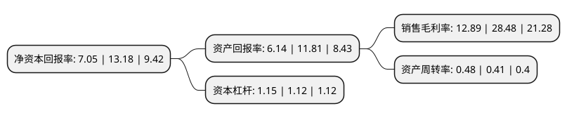

> 本页面由自动化程序生成于 2022年5月20日 01:32
> 内容可能存在错误，如有bug请提交issue至：https://github.com/Eroleice/doc-pi/issues
{.is-warning}

# 上市公司基本情况

## 基本资料

江苏美思德化学股份有限公司（以下简称“美思德”）成立于2000年11月24日，南京市。于2017年03月30日在上交所主板上市。

美思德注册资本14,088.284万元，公司主营业务为聚氨酯泡沫稳定剂的研发，生产和销售，主要产品为聚氨酯泡沫稳定剂。以下是详细信息：

- 公司名称: 江苏美思德化学股份有限公司
- 股票代码: 603041.SH
- 所在地: 江苏 - 南京市
- 成立日期: 2000年11月24日
- 注册资本: 14,088.284万元
- 法定代表人: 孙宇
- 主营业务: 公司主营业务为聚氨酯泡沫稳定剂的研发，生产和销售，主要产品为聚氨酯泡沫稳定剂
- 公司官网: www.maysta.com
- 公司介绍: 公司是中国领先的聚氨酯泡沫稳定剂生产商。公司主要从事有机硅表面活性剂的研发、生产和销售。在聚氨酯行业公司已发展成为国内技术领先的聚氨酯泡沫稳定剂专业生产企业，在提供产品的同时也为客户提供专业化、个性化的技术服务和支持。产品遍及世界五大洲各地区，广泛应用于家电、家具、建筑、汽车等行业公司获得了中国石油和化工优秀民营企业、中国聚氨酯典范成长企业、国家高新技术企业、江苏省科技小巨人企业、江苏省有机硅表面活性剂工程技术研究中心等荣誉称号。公司产品被认定为江苏省高新技术产品、江苏省名牌产品。

## 股东及高管情况

上市公司第一大股东为佛山市顺德区德美化工集团有限公司，持股74,865,000股，占比40.88%，为上市公司实际控制人。

截至2022年05月06日，上市公司的前十大股东中，共有4名自然人股东，5名机构股东，1个产品账户，其中5%以上大股东共有6名。上市公司前十大股东明细如下：

> 截至2022年05月06日，上市公司前十大股东信息如下：

| 股东名称 | 持股数量（股） | 持股比例 |
| --- | --- | --- |
| 佛山市顺德区德美化工集团有限公司 | 74,865,000 | 40.88% |
| 佛山市顺德区德美化工集团有限公司 | 74,865,000 | 40.88% |
| 佛山市顺德区德美化工集团有限公司 | 74,865,000 | 53.14% |
| 宁波世创物产有限公司 | 10,567,230 | 5.77% |
| 宁波世创物产有限公司 | 10,567,230 | 7.5% |
| 孙宇 | 7,885,500 | 5.6% |
| 张伟 | 1,181,250 | 0.84% |
| 金致成 | 1,155,670 | 0.82% |
| UBSAG | 549,557 | 0.39% |
| 中国民生银行股份有限公司-金元顺安元启灵活配置混合型证券投资基金 | 526,880 | 0.37% |

## 利润表分析

上市公司2021年总收入为4.94亿元，净利润为0.63亿元，实现盈利。

## 杜邦分析

> 数据列示周期：2021年 | 2020年 | 2019年
{.is-info}

上市公司的净资产收益率在近一年有所下降，下降幅度为-46.51%，其变化情况分解如下：
- 上市公司的销售毛利率在近一年下降了-54.74%，可能是生产效率的下降、商品原材料价格上涨或商品价格的下跌所致。
- 上市公司的资产周转率在近一年上升了17.07%，可能是源自于更快的销售回款或库存管理效果提升。
- 上市公司的财务杠杆比率在近一年上升了2.68%，可能是增加负债扩大生产规模。

