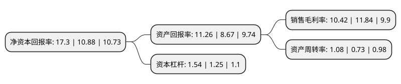

> 本页面由自动化程序生成于 2022年5月20日 01:32
> 内容可能存在错误，如有bug请提交issue至：https://github.com/Eroleice/doc-pi/issues
{.is-warning}

# 上市公司基本情况

## 基本资料

湖北振华化学股份有限公司（以下简称“振华股份”）成立于2003年06月19日，黄石市。于2016年09月13日在上交所主板上市。

振华股份注册资本50,841.617万元，主营业务:主要从事铬盐系列产品的研发，制造与销售，并对铬盐副产品及其它固废资源化综合利用。主要产品有重铬酸钠，铬酸酐，氧化铬绿，碱式硫酸铬。以下是详细信息：

- 公司名称: 湖北振华化学股份有限公司
- 股票代码: 603067.SH
- 所在地: 湖北 - 黄石市
- 成立日期: 2003年06月19日
- 注册资本: 50,841.617万元
- 法定代表人: 蔡再华
- 主营业务: 主营业务:主要从事铬盐系列产品的研发，制造与销售，并对铬盐副产品及其它固废资源化综合利用主要产品有重铬酸钠，铬酸酐，氧化铬绿，碱式硫酸铬
- 公司官网: www.hbzhenhua.com
- 公司介绍: 公司是国家重点铬盐生产骨干企业，公司主要从事铬盐系列产品的研发、生产与销售。主要有重铬酸钠、铬酸酐、晶体铬酸酐、液体铬酸酐、铬绿、重铬酸钾、碱式硫酸铬、维生素K3、元明粉、氢氧化铝等产品。公司拥有一支团结协作、奋发向上、懂技术、善管理的高素质管理团队和一支精通铬盐生产操作的熟练员工队伍，并建立科学规范的管理体系，通过了ISO9001质量、14000环境和18000职业健康安全的管理体系认证，并实现有效运作。公司是最早一家拥有无钙焙烧自主知识产权的生产企业，是少数已掌握无钙焙烧工艺的企业之一，具备生产系统数字化集成控制技术能力，并建成了“数字化无钙焙烧清洁生产技术制红矾钠技术改造示范工程”。公司秉承“诚信、奉献、创新、争先”的企业宗旨，以国家战略产业发展和技术创新需求为导向，积极构建高端化、优质化、高新化产业结构，加快科技创新、产品升级，致力于发展清洁环保节能的铬盐生产，着力构建资源节约型、环境友好型、经济效益型、本质安全型的绿色化工企业。

## 股东及高管情况

上市公司第一大股东为蔡再华，持股198,283,319股，占比39%，为上市公司实际控制人。

截至2022年03月31日，上市公司的前十大股东中，共有3名自然人股东，2名机构股东，5个产品账户，其中5%以上大股东共有2名。上市公司前十大股东明细如下：

> 截至2022年03月31日，上市公司前十大股东信息如下：

| 股东名称 | 持股数量（股） | 持股比例 |
| --- | --- | --- |
| 蔡再华 | 198,283,319 | 39% |
| 重庆化医控股(集团)公司 | 57,676,166 | 11.34% |
| 阮国斌 | 5,720,480 | 1.13% |
| 柯愈胜 | 5,406,688 | 1.06% |
| 中国工商银行股份有限公司-南方卓越优选3个月持有期混合型证券投资基金 | 4,518,428 | 0.89% |
| 中信银行股份有限公司-华安聚嘉精选混合型证券投资基金 | 4,503,708 | 0.89% |
| 博时资本博成1号单一资产管理计划 | 4,249,900 | 0.84% |
| 海宁兄弟投资有限公司 | 3,979,680 | 0.78% |
| 中国银行股份有限公司-华安精致生活混合型证券投资基金 | 3,852,677 | 0.76% |
| 中国工商银行股份有限公司-南方优享分红灵活配置混合型证券投资基金 | 3,001,204 | 0.59% |

## 利润表分析

上市公司2021年总收入为29.93亿元，净利润为3.11亿元，实现盈利。

## 杜邦分析

> 数据列示周期：2021年 | 2020年 | 2019年
{.is-info}

上市公司的净资产收益率在近一年有所上升，上升幅度为59.01%，其变化情况分解如下：
- 上市公司的销售毛利率在近一年下降了-11.99%，可能是生产效率的下降、商品原材料价格上涨或商品价格的下跌所致。
- 上市公司的资产周转率在近一年上升了47.95%，可能是源自于更快的销售回款或库存管理效果提升。
- 上市公司的财务杠杆比率在近一年上升了23.2%，可能是增加负债扩大生产规模。

