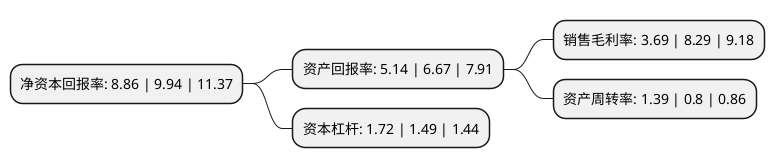

> 本页面由自动化程序生成于 2022年5月20日 01:33
> 内容可能存在错误，如有bug请提交issue至：https://github.com/Eroleice/doc-pi/issues
{.is-warning}

# 上市公司基本情况

## 基本资料

上海汇得科技股份有限公司（以下简称“汇得科技”）成立于2007年06月25日，上海市。于2018年08月28日在上交所主板上市。

汇得科技注册资本10,666.667万元，公司主营业务为聚氨酯树脂产品的研发，生产，销售与技术服务，主要产品为合成革用聚氨酯(PU)，聚氨酯弹性体原液和聚酯多元醇。以下是详细信息：

- 公司名称: 上海汇得科技股份有限公司
- 股票代码: 603192.SH
- 所在地: 上海 - 上海市
- 成立日期: 2007年06月25日
- 注册资本: 10,666.667万元
- 法定代表人: 钱建中
- 主营业务: 公司主营业务为聚氨酯树脂产品的研发，生产，销售与技术服务，主要产品为合成革用聚氨酯(PU)，聚氨酯弹性体原液和聚酯多元醇
- 公司官网: www.shhdsz.com
- 公司介绍: 公司最早创立于1997年，是一家集研发、生产、销售、服务于一体，专业生产合成革用聚氨酯树脂、聚酯多元醇的民营化工企业。产品有聚氨酯树脂和聚酯多元醇等系列。其中聚氨酯树脂产品涵盖干法面层、干法粘接层、湿法三大系列及干法二液型、干法发泡型、湿法牛巴革、高剥离、耐水解高剥离、耐寒不黄变等多类新产品；聚酯多元醇产品已开发胶粘剂、TPU、鞋底等多种弹性体用途。产品达到国际领先，国内一流的水平，在业内享有很高声誉。公司通过不断的管理提升和技术创新迅速发展，以优秀的产品质量和优良的过程服务跻身行业前列。公司遵照“诚信为先求共赢，客户至上求发展”的服务理念，凭借优秀的销售团队、专业的技术支持、过硬的产品质量和快捷的运输体系，与国内众多客户建立了长期稳定的合作关系，业务遍及全国各地，并已成功开拓国际市场，产品远销东南亚、欧美等众多国家和地区。

## 股东及高管情况

上市公司第一大股东为上海汇得企业集团有限公司，持股38,000,000股，占比35.62%，为上市公司实际控制人。

截至2022年03月31日，上市公司的前十大股东中，共有1名自然人股东，3名机构股东，6个产品账户，其中5%以上大股东共有3名。上市公司前十大股东明细如下：

> 截至2022年03月31日，上市公司前十大股东信息如下：

| 股东名称 | 持股数量（股） | 持股比例 |
| --- | --- | --- |
| 上海汇得企业集团有限公司 | 38,000,000 | 35.62% |
| 颜群 | 24,000,000 | 22.5% |
| 上海湛然股权投资管理合伙企业(有限合伙) | 13,000,000 | 12.19% |
| 上海涌腾股权投资管理合伙企业(有限合伙) | 5,000,000 | 4.69% |
| 中国工商银行股份有限公司-华安安康灵活配置混合型证券投资基金 | 1,269,700 | 1.19% |
| 国信证券股份有限公司-华夏中证500指数智选增强型证券投资基金 | 1,176,833 | 1.1% |
| 中国农业银行股份有限公司-华夏中证500指数增强型证券投资基金 | 1,101,086 | 1.03% |
| 全国社保基金一一一组合 | 1,048,312 | 0.98% |
| 兴业银行股份有限公司-圆信永丰优加生活股票型证券投资基金 | 860,100 | 0.81% |
| 兴业银行股份有限公司-圆信永丰兴诺一年持有期灵活配置混合型证券投资基金 | 700,000 | 0.66% |

## 利润表分析

上市公司2021年总收入为31.91亿元，净利润为1.17亿元，实现盈利。

## 杜邦分析

> 数据列示周期：2021年 | 2020年 | 2019年
{.is-info}

上市公司的净资产收益率在近一年有所下降，下降幅度为-10.87%，其变化情况分解如下：
- 上市公司的销售毛利率在近一年下降了-55.49%，可能是生产效率的下降、商品原材料价格上涨或商品价格的下跌所致。
- 上市公司的资产周转率在近一年上升了73.75%，可能是源自于更快的销售回款或库存管理效果提升。
- 上市公司的财务杠杆比率在近一年上升了15.44%，可能是增加负债扩大生产规模。

