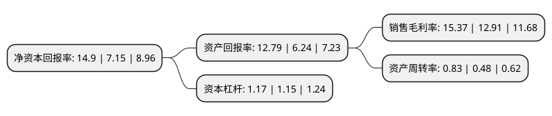

> 本页面由自动化程序生成于 2022年5月20日 01:33
> 内容可能存在错误，如有bug请提交issue至：https://github.com/Eroleice/doc-pi/issues
{.is-warning}

# 上市公司基本情况

## 基本资料

元利化学集团股份有限公司（以下简称“元利科技”）成立于2003年02月17日，潍坊市。于2019年06月20日在上交所主板上市。

元利科技注册资本13,012.9万元，主营业务:从事精细化学品的研发，生产，销售，公司围绕己二酸及其副产品混合二元酸开发了二元酸二甲酯系列产品，脂肪醇系列产品;围绕癸二酸副产品仲辛醇开发了邻苯二甲酸二仲辛酯等增塑剂系列产品。以下是详细信息：

- 公司名称: 元利化学集团股份有限公司
- 股票代码: 603217.SH
- 所在地: 山东 - 潍坊市
- 成立日期: 2003年02月17日
- 注册资本: 13,012.9万元
- 法定代表人: 刘修华
- 主营业务: 主营业务:从事精细化学品的研发，生产，销售，公司围绕己二酸及其副产品混合二元酸开发了二元酸二甲酯系列产品，脂肪醇系列产品;围绕癸二酸副产品仲辛醇开发了邻苯二甲酸二仲辛酯等增塑剂系列产品
- 公司官网: www.yuanlichem.com.cn
- 公司介绍: 公司是一家专业的从事精细化学品研发、生产、销售的企业。公司围绕己二酸及其副产品混合二元酸开发了二元酸二甲酯系列产品、脂肪醇系列产品；围绕癸二酸副产品仲辛醇开发了邻苯二甲酸二仲辛酯等增塑剂系列产品。公司自成立以来以发展循环经济模式为导向，立足资源高效综合利用，通过不断的探索，积累形成了以反应精馏、酯化合成和精馏提纯为核心的技术体系；通过对上游己二酸、癸二酸行业副产品混合二元酸、仲辛醇的综合开发利用，实现了从上游原材料，特别是大宗化工产品副产品，到附加值高、应用领域广泛的一系列产成品的高效转化，做到了精细化工产品价值提升，提高了资源利用效率，也促进了上游己二酸、癸二酸行业的发展。公司为国家知识产权优势企业、高新技术企业、山东省知识产权示范企业、山东省省级两化融合管理体系贯标试点企业，被中国石油和化学工业联合会评为中国石油和化工优秀民营企业。

## 股东及高管情况

上市公司第一大股东为刘修华，持股75,039,751股，占比57.67%，为上市公司实际控制人。

截至2022年03月31日，上市公司的前十大股东中，共有4名自然人股东，1名机构股东，5个产品账户，其中5%以上大股东共有1名。上市公司前十大股东明细如下：

> 截至2022年03月31日，上市公司前十大股东信息如下：

| 股东名称 | 持股数量（股） | 持股比例 |
| --- | --- | --- |
| 刘修华 | 75,039,751 | 57.67% |
| 潍坊同利企业管理咨询合伙企业(有限合伙) | 5,999,892 | 4.61% |
| 青岛聚金山股权投资基金企业(有限合伙) | 2,462,500 | 1.89% |
| 王俊玉 | 1,857,452 | 1.43% |
| 中国民生银行股份有限公司-光大保德信信用添益债券型证券投资基金 | 1,058,942 | 0.81% |
| 张美玲 | 836,700 | 0.64% |
| 中国民生银行股份有限公司-光大保德信安祺债券型证券投资基金 | 732,560 | 0.56% |
| 兴业银行股份有限公司-广发稳鑫保本混合型证券投资基金 | 687,100 | 0.53% |
| 刘玉江 | 677,017 | 0.52% |
| 北京银行股份有限公司-广发盛锦混合型证券投资基金 | 673,096 | 0.52% |

## 利润表分析

上市公司2021年总收入为23.43亿元，净利润为3.6亿元，实现盈利。

## 杜邦分析

> 数据列示周期：2021年 | 2020年 | 2019年
{.is-info}

上市公司的净资产收益率在近一年有所上升，上升幅度为108.39%，其变化情况分解如下：
- 上市公司的销售毛利率在近一年上升了19.05%，可能是生产效率的提升、商品原材料价格下跌或商品价格的上涨所致。
- 上市公司的资产周转率在近一年上升了72.92%，可能是源自于更快的销售回款或库存管理效果提升。
- 上市公司的财务杠杆比率在近一年上升了1.74%，可能是增加负债扩大生产规模。

