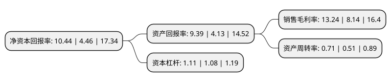

> 本页面由自动化程序生成于 2022年5月20日 01:34
> 内容可能存在错误，如有bug请提交issue至：https://github.com/Eroleice/doc-pi/issues
{.is-warning}

# 上市公司基本情况

## 基本资料

浙江三美化工股份有限公司（以下简称“三美股份”）成立于2001年05月11日，金华市。于2019年04月02日在上交所主板上市。

三美股份注册资本61,047.904万元，主要从事氟碳化学品和无机氟产品等氟化工产品的研发，生产和销售。公司氟碳化学品主要包括氟制冷剂和氟发泡剂，其中氟制冷剂主要包括HFCs制冷剂和HCFCs制冷剂，主要用于汽车，家庭和工商业空调系统;氟发泡剂主要是HCFC-141b，主要用于聚氨酯硬泡生产。公司无机氟产品主要包括无水氟化氢，氢氟酸等，主要用于氟化工行业的基础原材料或刻蚀玻璃，金属清洗及表面处理等。以下是详细信息：

- 公司名称: 浙江三美化工股份有限公司
- 股票代码: 603379.SH
- 所在地: 浙江 - 金华市
- 成立日期: 2001年05月11日
- 注册资本: 61,047.904万元
- 法定代表人: 胡淇翔
- 主营业务: 主要从事氟碳化学品和无机氟产品等氟化工产品的研发，生产和销售公司氟碳化学品主要包括氟制冷剂和氟发泡剂，其中氟制冷剂主要包括HFCs制冷剂和HCFCs制冷剂，主要用于汽车，家庭和工商业空调系统;氟发泡剂主要是HCFC-141b，主要用于聚氨酯硬泡生产公司无机氟产品主要包括无水氟化氢，氢氟酸等，主要用于氟化工行业的基础原材料或刻蚀玻璃，金属清洗及表面处理等
- 公司官网: www.sanmeichem.com
- 公司介绍: 公司是一家专业从事氟化工产品技术研发、产品生产、经营销售的股份制民营企业，主要从事氟碳化学品和无机氟产品等氟化工产品的研发,生产和销售，通过了ISO9000质量管理体系的认证，2004年通过了ISO14001环境管理体系认证，公司是全国化工企业500强、中国专业化学品制造业百强、金华市工业十强企业、金华市首批“三名”培育企业、武义县最大规模工业企业，近十多年一直位列武义县纳税大户榜首。公司先后荣获中国石油和化工优秀民营企业、浙江省AAA级纳税信用单位、浙江省守合同重信用单位、浙江省诚信企业、浙江省劳动保障诚信企业、浙江省节能先进单位、金华市诚信经营示范单位、金华市劳动模范集体等荣誉称号。

## 股东及高管情况

上市公司第一大股东为胡荣达，持股230,913,959股，占比37.83%，为上市公司实际控制人。

截至2022年04月06日，上市公司的前十大股东中，共有5名自然人股东，4名机构股东，1个产品账户，其中5%以上大股东共有4名。上市公司前十大股东明细如下：

> 截至2022年04月06日，上市公司前十大股东信息如下：

| 股东名称 | 持股数量（股） | 持股比例 |
| --- | --- | --- |
| 胡荣达 | 230,913,959 | 37.83% |
| 胡淇翔 | 103,738,226 | 16.99% |
| 胡淇翔 | 103,738,226 | 16.99% |
| 武义三美投资有限公司 | 48,937,288 | 8.02% |
| 占林喜 | 24,408,846 | 4% |
| 宁波梅山保税港区飞宇创奇投资合伙企业(有限合伙) | 23,708,160 | 3.88% |
| 安吉慧丰辉年管理咨询合伙企业(有限合伙) | 15,805,440 | 2.59% |
| 武义美思卓源投资管理合伙企业(有限合伙) | 8,162,916 | 1.34% |
| 浙江三美化工股份有限公司-第一期员工持股计划 | 6,580,000 | 1.08% |
| 施富强 | 3,951,907 | 0.65% |

## 利润表分析

上市公司2021年总收入为40.48亿元，净利润为5.36亿元，实现盈利。

## 杜邦分析

> 数据列示周期：2021年 | 2020年 | 2019年
{.is-info}

上市公司的净资产收益率在近一年有所上升，上升幅度为134.08%，其变化情况分解如下：
- 上市公司的销售毛利率在近一年上升了62.65%，可能是生产效率的提升、商品原材料价格下跌或商品价格的上涨所致。
- 上市公司的资产周转率在近一年上升了39.22%，可能是源自于更快的销售回款或库存管理效果提升。
- 上市公司的财务杠杆比率在近一年上升了2.78%，可能是增加负债扩大生产规模。

