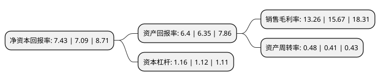

> 本页面由自动化程序生成于 2022年5月20日 01:34
> 内容可能存在错误，如有bug请提交issue至：https://github.com/Eroleice/doc-pi/issues
{.is-warning}

# 上市公司基本情况

## 基本资料

艾艾精密工业输送系统(上海)股份有限公司（以下简称“艾艾精工”）成立于1997年04月08日，上海市。于2017年05月25日在上交所主板上市。

艾艾精工注册资本13,067.32万元，轻型输送带的研发，生产及销售以下是详细信息：

- 公司名称: 艾艾精密工业输送系统(上海)股份有限公司
- 股票代码: 603580.SH
- 所在地: 上海 - 上海市
- 成立日期: 1997年04月08日
- 注册资本: 13,067.32万元
- 法定代表人: 涂木林
- 主营业务: 轻型输送带的研发，生产及销售
- 公司官网: www.aabelt.com.cn
- 公司介绍: 公司是国内知名领先的工业输送带制造商及供应商。公司专业从事轻型输送带的研发、生产及销售。轻型输送带作为自动化生产和输送设备的关键部件，广泛应用于铝型材加工、纺织印染、食品加工、物流运输、农产品加工、娱乐健身、木材加工、电子制造、印刷包装等行业和领域。公司部分产品(根据需要，内销产品无需认证)已获得欧盟“化学品注册、评估、许可和限制认证”(REACH认证)或SGS认证，具备优良的物理化学性质和环保特性，多年来获得了客户的肯定。公司致力于为大众提供高品质的轻型输送带产品，每年投入大量资金用于产品研发与技术提升，与上海大学及中国台湾中兴大学紧密合作，已拥有多项自主科研技术及核心知识产权，拥有创新轻型输送带技术。

## 股东及高管情况

上市公司第一大股东为涂木林，持股44,100,000股，占比33.75%，为上市公司实际控制人。

截至2022年03月31日，上市公司的前十大股东中，共有9名自然人股东，1个海外主体，其中5%以上大股东共有2名。上市公司前十大股东明细如下：

> 截至2022年03月31日，上市公司前十大股东信息如下：

| 股东名称 | 持股数量（股） | 持股比例 |
| --- | --- | --- |
| 涂木林 | 44,100,000 | 33.75% |
| 蔡瑞美 | 43,365,000 | 33.19% |
| 钱英 | 1,500,000 | 1.15% |
| 夏德森 | 1,158,598 | 0.89% |
| 周信钢 | 746,300 | 0.57% |
| 高华-汇丰-GOLDMAN, SACHS & CO.LLC | 658,116 | 0.5% |
| 董灿 | 600,000 | 0.46% |
| 窦志勇 | 564,468 | 0.43% |
| 顾云 | 533,920 | 0.41% |
| 姜登攀 | 460,000 | 0.35% |

## 利润表分析

上市公司2021年总收入为2.52亿元，净利润为0.33亿元，实现盈利。

## 杜邦分析

> 数据列示周期：2021年 | 2020年 | 2019年
{.is-info}

上市公司的净资产收益率在近一年有所上升，上升幅度为4.8%，其变化情况分解如下：
- 上市公司的销售毛利率在近一年下降了-15.38%，可能是生产效率的下降、商品原材料价格上涨或商品价格的下跌所致。
- 上市公司的资产周转率在近一年上升了17.07%，可能是源自于更快的销售回款或库存管理效果提升。
- 上市公司的财务杠杆比率在近一年上升了3.57%，可能是增加负债扩大生产规模。

