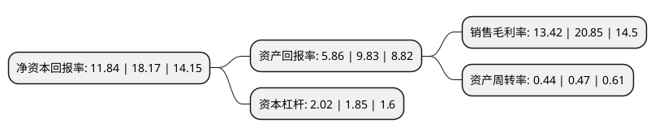

> 本页面由自动化程序生成于 2022年5月20日 01:34
> 内容可能存在错误，如有bug请提交issue至：https://github.com/Eroleice/doc-pi/issues
{.is-warning}

# 上市公司基本情况

## 基本资料

彤程新材料集团股份有限公司（以下简称“彤程新材”）成立于2008年06月04日，上海市。于2018年06月27日在上交所主板上市。

彤程新材注册资本59,715.245万元，主营业务:主要从事精细化工材料的研发，生产，销售和相关贸易业务。主要产品是服务于轮胎橡胶行业的高新技术产品，主要为橡胶用酚醛树脂，包括增粘树脂，补强树脂，粘合树脂等。以下是详细信息：

- 公司名称: 彤程新材料集团股份有限公司
- 股票代码: 603650.SH
- 所在地: 上海 - 上海市
- 成立日期: 2008年06月04日
- 注册资本: 59,715.245万元
- 法定代表人: Zhang Ning
- 主营业务: 主营业务:主要从事精细化工材料的研发，生产，销售和相关贸易业务主要产品是服务于轮胎橡胶行业的高新技术产品，主要为橡胶用酚醛树脂，包括增粘树脂，补强树脂，粘合树脂等
- 公司官网: www.rachem.com
- 公司介绍: 公司是一家化工材料制造和服务商，主要从事精细化工材料的研发、生产、销售和相关贸易业务，生产业务的主要产品是服务于轮胎橡胶行业的高新技术产品。公司自产产品型号种类多，主要为橡胶用酚醛树脂，包括增粘树脂、补强树脂、粘合树脂等，广泛应用于轮胎及其他橡胶制品制造行业。公司代理销售多家全球知名化工企业的橡胶助剂产品，包括巴斯夫的超级增粘树脂、Flow Polymers的均匀剂、住友化学的间苯二酚、Struktol的均匀剂及其他加工助剂、道达尔的环保油等。公司创业伊始，即从事全球知名品牌的轮胎橡胶用化工材料的商贸代理，以诚信品性和专案化服务方式，逐步成为国内外主要轮胎橡胶客户的长期合作伙伴。

## 股东及高管情况

上市公司第一大股东为RED   AVENUE INVESTMENT GROUP LIMITED，持股294,570,000股，占比49.33%，为上市公司实际控制人。

截至2022年03月31日，上市公司的前十大股东中，共有1名自然人股东，2名机构股东，4个产品账户，2个海外主体，1名其他股东，其中5%以上大股东共有3名。上市公司前十大股东明细如下：

> 截至2022年03月31日，上市公司前十大股东信息如下：

| 股东名称 | 持股数量（股） | 持股比例 |
| --- | --- | --- |
| RED   AVENUE INVESTMENT GROUP LIMITED | 294,570,000 | 49.33% |
| Virgin   Holdings Limited | 100,000,000 | 16.75% |
| 舟山市宇通投资合伙企业(有限合伙) | 47,500,023 | 7.95% |
| 陕西煤业股份有限公司 | 18,176,944 | 3.04% |
| 招商银行股份有限公司-银河创新成长混合型证券投资基金 | 3,900,000 | 0.65% |
| 曾鸣 | 3,548,049 | 0.59% |
| 交通银行股份有限公司-诺安和鑫保本混合型证券投资基金 | 3,521,543 | 0.59% |
| 澳门金融管理局-自有资金 | 3,230,184 | 0.54% |
| 太平人寿保险有限公司-传统-普通保险产品-022L-CT001沪 | 3,197,807 | 0.54% |
| 中国工商银行股份有限公司-金信稳健策略灵活配置混合型发起式证券投资基金 | 2,867,600 | 0.48% |

## 利润表分析

上市公司2021年总收入为23.08亿元，净利润为3.09亿元，实现盈利。

## 杜邦分析

> 数据列示周期：2021年 | 2020年 | 2019年
{.is-info}

上市公司的净资产收益率在近一年有所下降，下降幅度为-34.84%，其变化情况分解如下：
- 上市公司的销售毛利率在近一年下降了-35.64%，可能是生产效率的下降、商品原材料价格上涨或商品价格的下跌所致。
- 上市公司的资产周转率在近一年下降了-6.38%，可能是源自于更慢的销售回款或库存管理效果下降。
- 上市公司的财务杠杆比率在近一年上升了9.19%，可能是增加负债扩大生产规模。

