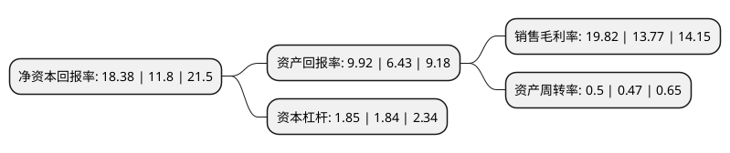

> 本页面由自动化程序生成于 2022年5月20日 01:34
> 内容可能存在错误，如有bug请提交issue至：https://github.com/Eroleice/doc-pi/issues
{.is-warning}

# 上市公司基本情况

## 基本资料

上海璞泰来新能源科技股份有限公司（以下简称“璞泰来”）成立于2012年11月06日，上海市。于2017年11月03日在上交所主板上市。

璞泰来注册资本69,438.354万元，主要业务:锂离子电池负极材料，自动化涂布机，涂覆隔膜，铝塑包装膜，纳米氧化铝等关键材料及工艺设备研发，生产和销售，为下游客户提供专业性，高品质的新能源锂离子电池材料及专业工艺设备综合解决方案，通过渠道共享，研发合作，工艺配套等实现了关键业务价值链的产业协同。主要产品:锂离子电池主要原材料，涂布机属于锂离子电池关键生产装备，铝塑包装膜属于聚合物软包锂离子电池关键辅助材料。以下是详细信息：

- 公司名称: 上海璞泰来新能源科技股份有限公司
- 股票代码: 603659.SH
- 所在地: 上海 - 上海市
- 成立日期: 2012年11月06日
- 注册资本: 69,438.354万元
- 法定代表人: 梁丰
- 主营业务: 锂离子电池负极材料，自动化涂布机，涂覆隔膜，铝塑包装膜，纳米氧化铝等关键材料及工艺设备研发，生产和销售，为下游客户提供专业性，高品质的新能源锂离子电池材料及专业工艺设备综合解决方案，通过渠道共享，研发合作，工艺配套等实现了关键业务价值链的产业协同主要产品:锂离子电池主要原材料，涂布机属于锂离子电池关键生产装备，铝塑包装膜属于聚合物软包锂离子电池关键辅助材料
- 公司官网: www.putailai.com
- 公司介绍: 公司致力于成为具有技术与规模双重领先优势的综合解决方案提供商。公司所服务的锂离子电池市场,处于清洁能源、节能环保及高效储能相关的关键产业环节，公司主营业务聚焦于锂离子电池关键材料及自动化工艺设备领域。公司相关业务互动发展并产生初步的协同效应，形成了以锂离子电池负极材料、自动化涂布机、隔膜涂覆加工、铝塑包装膜、纳米氧化铝等业务的全面延伸。公司积极把握行业发展机遇，配合上下游产业链共同成长；重视团队与企业文化建设，完善中长期激励机制，不断提升治理结构与经营管理的规范性。

## 股东及高管情况

上市公司第一大股东为梁丰，持股183,279,614股，占比26.39%，**疑似为**上市公司实际控制人。

截至2022年03月31日，上市公司的前十大股东中，共有4名自然人股东，2名机构股东，3个产品账户，1个海外主体，其中5%以上大股东共有5名。上市公司前十大股东明细如下：

> 未能通过持股比例判定出上市公司实际控制人（持股30%以上）
> 可能存在通过间接持股、联合持股、协议控制等方式拥有实际控制权的主体，具体请参考上市公司定期公告！
{.is-warning}

> 截至2022年03月31日，上市公司前十大股东信息如下：

| 股东名称 | 持股数量（股） | 持股比例 |
| --- | --- | --- |
| 梁丰 | 183,279,614 | 26.39% |
| 福建胜跃股权投资合伙企业(有限合伙) | 79,400,457 | 11.43% |
| 南阳阔能企业管理合伙企业(有限合伙) | 68,896,395 | 9.92% |
| 陈卫 | 60,169,712 | 8.67% |
| 香港中央结算有限公司(陆股通) | 51,071,356 | 7.35% |
| 齐晓东 | 13,100,000 | 1.89% |
| 中国工商银行股份有限公司-农银汇理新能源主题灵活配置混合型证券投资基金 | 12,038,205 | 1.73% |
| 中国建设银行股份有限公司-华夏能源革新股票型证券投资基金 | 6,212,187 | 0.89% |
| 中国建设银行股份有限公司-信达澳银新能源产业股票型证券投资基金 | 4,061,187 | 0.58% |
| 韩钟伟 | 3,749,651 | 0.54% |

## 利润表分析

上市公司2021年总收入为89.95亿元，净利润为17.82亿元，实现盈利。

## 杜邦分析

> 数据列示周期：2021年 | 2020年 | 2019年
{.is-info}

上市公司的净资产收益率在近一年有所上升，上升幅度为55.76%，其变化情况分解如下：
- 上市公司的销售毛利率在近一年上升了43.94%，可能是生产效率的提升、商品原材料价格下跌或商品价格的上涨所致。
- 上市公司的资产周转率在近一年上升了6.38%，可能是源自于更快的销售回款或库存管理效果提升。
- 上市公司的财务杠杆比率在近一年上升了0.54%，可能是增加负债扩大生产规模。

