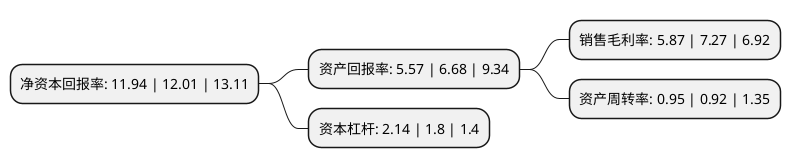

> 本页面由自动化程序生成于 2022年5月20日 01:35
> 内容可能存在错误，如有bug请提交issue至：https://github.com/Eroleice/doc-pi/issues
{.is-warning}

# 上市公司基本情况

## 基本资料

上海永冠众诚新材料科技(集团)股份有限公司（以下简称“永冠新材”）成立于2002年01月28日，上海市。于2019年03月26日在上交所主板上市。

永冠新材注册资本19,112.987万元，主营业务为各类胶带产品的研发，生产和销售，主要产品为民用型布基胶带，美纹纸胶带，清洁胶带，PVC胶带，OPP胶带，牛皮纸胶带等。以下是详细信息：

- 公司名称: 上海永冠众诚新材料科技(集团)股份有限公司
- 股票代码: 603681.SH
- 所在地: 上海 - 上海市
- 成立日期: 2002年01月28日
- 注册资本: 19,112.987万元
- 法定代表人: 吕新民
- 主营业务: 主营业务为各类胶带产品的研发，生产和销售，主要产品为民用型布基胶带，美纹纸胶带，清洁胶带，PVC胶带，OPP胶带，牛皮纸胶带等
- 公司官网: www.ygtape.com
- 公司介绍: 公司是一家综合性胶粘行业解决方案提供商。公司通过ISO9001管理体系认证，拥有OA集成办公系统以及远程视频开发管理团队，为企业集团化发展奠定了扎实的基础。ERP管理系统更是贯穿整个产业链，从原材料到成品出库，层层把控、环环相扣，使得永冠的产品品质日臻完善。公司通过UL,CSA,CE,Reach,Rosh等产品认证，同时非常注重产品的研发和创新，是上海市高新技能企业、上海市科技小巨人培育企业、上海市青浦区技术研发中心企业。公司致力于发展资源节约型、环境友好型企业，原材料回收利用成效显著，其中溶剂日平均回收率保持在85%以上。实现了低投入、高利用，以最小的成本获得最大的经济效益和社会效益。

## 股东及高管情况

上市公司第一大股东为吕新民，持股77,993,820股，占比40.81%，为上市公司实际控制人。

截至2022年03月31日，上市公司的前十大股东中，共有2名自然人股东，3名机构股东，4个产品账户，1个海外主体，其中5%以上大股东共有2名。上市公司前十大股东明细如下：

> 截至2022年03月31日，上市公司前十大股东信息如下：

| 股东名称 | 持股数量（股） | 持股比例 |
| --- | --- | --- |
| 吕新民 | 77,993,820 | 40.81% |
| 郭雪燕 | 15,003,600 | 7.85% |
| 永献(上海)投资管理中心(有限合伙) | 5,593,000 | 2.93% |
| 香港中央结算有限公司(陆股通) | 5,169,663 | 2.7% |
| 北京银行股份有限公司-广发盛锦混合型证券投资基金 | 5,135,120 | 2.69% |
| 上海浦东发展银行股份有限公司-易方达裕祥回报债券型证券投资基金 | 4,495,170 | 2.35% |
| 连冠(上海)投资管理中心(有限合伙) | 3,344,000 | 1.75% |
| 北京益安资本管理有限公司-益安永冠私募证券投资基金 | 3,234,890 | 1.69% |
| 永爱(上海)投资管理中心(有限合伙) | 3,000,000 | 1.57% |
| 上海浦东发展银行股份有限公司-易方达瑞程灵活配置混合型证券投资基金 | 2,506,680 | 1.31% |

## 利润表分析

上市公司2021年总收入为38.4亿元，净利润为2.25亿元，实现盈利。

## 杜邦分析

> 数据列示周期：2021年 | 2020年 | 2019年
{.is-info}

上市公司的净资产收益率在近一年有所下降，下降幅度为-0.58%，其变化情况分解如下：
- 上市公司的销售毛利率在近一年下降了-19.26%，可能是生产效率的下降、商品原材料价格上涨或商品价格的下跌所致。
- 上市公司的资产周转率在近一年上升了3.26%，可能是源自于更快的销售回款或库存管理效果提升。
- 上市公司的财务杠杆比率在近一年上升了18.89%，可能是增加负债扩大生产规模。

