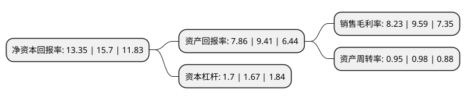

> 本页面由自动化程序生成于 2022年5月20日 01:35
> 内容可能存在错误，如有bug请提交issue至：https://github.com/Eroleice/doc-pi/issues
{.is-warning}

# 上市公司基本情况

## 基本资料

浙江新化化工股份有限公司（以下简称“新化股份”）成立于1997年09月24日，杭州市。于2019年06月27日在上交所主板上市。

新化股份注册资本14,140.99万元，脂肪胺，有机溶剂，香料香精，双氧水及其他精细化工产品的生产经营。以下是详细信息：

- 公司名称: 浙江新化化工股份有限公司
- 股票代码: 603867.SH
- 所在地: 浙江 - 杭州市
- 成立日期: 1997年09月24日
- 注册资本: 14,140.99万元
- 法定代表人: 胡健
- 主营业务: 脂肪胺，有机溶剂，香料香精，双氧水及其他精细化工产品的生产经营
- 公司官网: www.xhchem.com
- 公司介绍: 公司为从事脂肪胺、有机溶剂、香料香精、双氧水及其他精细化工产品的国家高新技术企业，公司坚持―科技为本，创新发展‖的经营战略，以打造―健康、安全、绿色、环保‖的新型现代化工企业为目标，已形成多元化、规模化、科技含量较高、工艺技术较为先进的脂肪胺系列、有机溶剂系列和合成香料香精系列产品；其中，异丙胺、乙基胺产品采用自行开发的生产工艺及催化剂，生产过程采用DCS系统控制，产品质量达到国外同类产品质量指标。公司已通过了ISO9001:2008质量管理体系认证、ISO14001:2004环境管理体系认证、OHSAS18001:2007职业健康安全管理体系认证及两化融合管理体系认证。公司建有浙江省博士后科研工作站、―新化高级胺省级高新技术研究开发中心‖、浙江省企业技术中心和省级新材料企业研究院，先后获得了浙江省标准创新型企业、浙江省质量管理体系认证示范企业、中国质量诚信企业、全国石化行业先进集体、中国石油和化工企业500强、制造业单项冠军产品(工业用一异丙胺)等荣誉或称号。

## 股东及高管情况

上市公司第一大股东为建德市国有资产经营有限公司，持股24,114,101股，占比17.02%，**疑似为**上市公司实际控制人。

截至2022年03月31日，上市公司的前十大股东中，共有8名自然人股东，2名机构股东，其中5%以上大股东共有2名。上市公司前十大股东明细如下：

> 未能通过持股比例判定出上市公司实际控制人（持股30%以上）
> 可能存在通过间接持股、联合持股、协议控制等方式拥有实际控制权的主体，具体请参考上市公司定期公告！
{.is-warning}

> 截至2022年03月31日，上市公司前十大股东信息如下：

| 股东名称 | 持股数量（股） | 持股比例 |
| --- | --- | --- |
| 建德市国有资产经营有限公司 | 24,114,101 | 17.02% |
| 胡健 | 14,772,815 | 10.43% |
| 宋凌 | 3,709,000 | 2.62% |
| 周益民 | 2,334,944 | 1.65% |
| 海通证券股份有限公司 | 2,000,000 | 1.41% |
| 王卫明 | 1,873,617 | 1.32% |
| 金志好 | 1,785,483 | 1.26% |
| 包江峰 | 1,649,620 | 1.16% |
| 张高明 | 1,572,300 | 1.11% |
| 吴永根 | 1,567,330 | 1.11% |

## 利润表分析

上市公司2021年总收入为25.54亿元，净利润为2.1亿元，实现盈利。

## 杜邦分析

> 数据列示周期：2021年 | 2020年 | 2019年
{.is-info}

上市公司的净资产收益率在近一年有所下降，下降幅度为-14.97%，其变化情况分解如下：
- 上市公司的销售毛利率在近一年下降了-14.18%，可能是生产效率的下降、商品原材料价格上涨或商品价格的下跌所致。
- 上市公司的资产周转率在近一年下降了-3.06%，可能是源自于更慢的销售回款或库存管理效果下降。
- 上市公司的财务杠杆比率在近一年上升了1.8%，可能是增加负债扩大生产规模。

