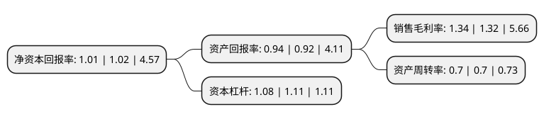

> 本页面由自动化程序生成于 2022年5月20日 01:35
> 内容可能存在错误，如有bug请提交issue至：https://github.com/Eroleice/doc-pi/issues
{.is-warning}

# 上市公司基本情况

## 基本资料

永悦科技股份有限公司（以下简称“永悦科技”）成立于2011年10月10日，泉州市。于2017年06月14日在上交所主板上市。

永悦科技注册资本36,231.444万元，主要产品:不饱和聚酯树脂，聚氨酯和可发性聚苯乙烯等。主营业务:合成树脂的研发，生产和销售。以下是详细信息：

- 公司名称: 永悦科技股份有限公司
- 股票代码: 603879.SH
- 所在地: 福建 - 泉州市
- 成立日期: 2011年10月10日
- 注册资本: 36,231.444万元
- 法定代表人: 陈翔
- 主营业务: 主要产品:不饱和聚酯树脂，聚氨酯和可发性聚苯乙烯等主营业务:合成树脂的研发，生产和销售
- 公司官网: www.fjyykj.com
- 公司介绍: 公司专注于不饱和聚酯树脂为主的合成树脂的研发、生产和销售。公司主营合成树脂的研发、生产和销售，产品包括不饱和聚酯树脂、聚氨酯和可发性聚苯乙烯等。公司主导产品为高分子合成材料──不饱和聚酯树脂。公司已研发出不同规格型号的不饱和聚酯树脂产品多种，产品广泛应用于人造石材、工艺品、玻璃钢复合材料和涂料等领域中。作为国内不饱和聚酯树脂领域品种较为齐全、应用领域较为广泛的厂商之一，公司凭借较强的研发实力和稳定的产品品质，获得了下游用户的广泛欢迎和高度认可。公司还与上、下游客户建立了共生、共荣、共赢的合作关系，建立了良好的社会口碑与企业商誉，客户资源遍布全国。

## 股东及高管情况

上市公司第一大股东为江苏华英企业管理股份有限公司，持股62,159,500股，占比17.16%，**疑似为**上市公司实际控制人。

截至2022年04月21日，上市公司的前十大股东中，共有8名自然人股东，2名机构股东，其中5%以上大股东共有5名。上市公司前十大股东明细如下：

> 未能通过持股比例判定出上市公司实际控制人（持股30%以上）
> 可能存在通过间接持股、联合持股、协议控制等方式拥有实际控制权的主体，具体请参考上市公司定期公告！
{.is-warning}

> 截至2022年04月21日，上市公司前十大股东信息如下：

| 股东名称 | 持股数量（股） | 持股比例 |
| --- | --- | --- |
| 江苏华英企业管理股份有限公司 | 62,159,500 | 17.16% |
| 江苏华英企业管理股份有限公司 | 62,159,500 | 17.16% |
| 傅文昌 | 57,330,000 | 15.82% |
| 陈志山 | 26,435,188 | 7.3% |
| 陈志山 | 25,342,018 | 6.9945% |
| 王庆仁 | 18,115,656 | 5% |
| 付秀珍 | 14,268,800 | 3.94% |
| 陈仁平 | 4,845,640 | 1.34% |
| 陶德琴 | 4,808,800 | 1.33% |
| 李德伟 | 4,040,442 | 1.12% |

## 利润表分析

上市公司2021年总收入为3.96亿元，净利润为0.05亿元，实现盈利。

## 杜邦分析

> 数据列示周期：2021年 | 2020年 | 2019年
{.is-info}

上市公司的净资产收益率在近一年有所下降，下降幅度为-0.98%，其变化情况分解如下：
- 上市公司的销售毛利率在近一年上升了1.52%，可能是生产效率的提升、商品原材料价格下跌或商品价格的上涨所致。
- 上市公司的资产周转率在近一年下降了0%，可能是源自于更慢的销售回款或库存管理效果下降。
- 上市公司的财务杠杆比率在近一年下降了-2.7%，可能是减少负债降低财务费用。

