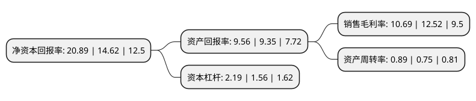

> 本页面由自动化程序生成于 2022年5月20日 01:36
> 内容可能存在错误，如有bug请提交issue至：https://github.com/Eroleice/doc-pi/issues
{.is-warning}

# 上市公司基本情况

## 基本资料

江苏龙蟠科技股份有限公司（以下简称“龙蟠科技”）成立于2003年03月11日，南京市。于2017年04月10日在上交所主板上市。

龙蟠科技注册资本48,209.135万元，公司自成立以来一直从事车用环保精细化学品的研发，生产和销售。公司主要产品包括;柴油机油汽油机油齿轮油液压油自动变速箱油制动液润滑脂发动机冷却液柴油发动机尾气处理液车用尿素配套加注设备国Ⅳ，国Ⅴ柴油机排放达标识保障产品可生物降解冷却液汽车深化保养产品冷却系统保养产品汽车VOC治理产品汽车外部清洁产品汽车内饰清洁保养产品5S清洁系列以下是详细信息：

- 公司名称: 江苏龙蟠科技股份有限公司
- 股票代码: 603906.SH
- 所在地: 江苏 - 南京市
- 成立日期: 2003年03月11日
- 注册资本: 48,209.135万元
- 法定代表人: 石俊峰
- 主营业务: 公司自成立以来一直从事车用环保精细化学品的研发，生产和销售公司主要产品包括;柴油机油汽油机油齿轮油液压油自动变速箱油制动液润滑脂发动机冷却液柴油发动机尾气处理液车用尿素配套加注设备国Ⅳ，国Ⅴ柴油机排放达标识保障产品可生物降解冷却液汽车深化保养产品冷却系统保养产品汽车VOC治理产品汽车外部清洁产品汽车内饰清洁保养产品5S清洁系列
- 公司官网: www.lopal.com.cn
- 公司介绍: 公司是国内名列前茅的独立润滑油企业。公司自成立以来一直从事车用环保精细化学品的研发、生产和销售，主导产品有车用汽油机油、柴油机油、3ECARE汽车养护品、车辆齿轮油、液压油、防冻液、制动液、润滑脂、摩托车油、工程机械润滑油、工业润滑油等。历经多年的发展，公司以润滑油节能环保最优化技术(ECO技术)、氮氧化合物排放控制技术(DeNOx技术)、挥发性有机物净化技术(VOC-Free技术)等核心技术体系为依托，已形成集润滑油、发动机冷却液、柴油发动机尾气处理液、车用养护品等于一体的车用环保精细化学品的产品体系，产品广泛应用于汽车整车制造、汽车后市场、工程机械等领域。公司先后荣获南京市长质量奖、江苏省质量奖、江苏省著名商标、中国驰名商标等多项称号及荣誉。

## 股东及高管情况

上市公司第一大股东为石俊峰，持股212,662,195股，占比44.11%，为上市公司实际控制人。

截至2022年03月31日，上市公司的前十大股东中，共有2名自然人股东，1名机构股东，7个产品账户，其中5%以上大股东共有1名。上市公司前十大股东明细如下：

> 截至2022年03月31日，上市公司前十大股东信息如下：

| 股东名称 | 持股数量（股） | 持股比例 |
| --- | --- | --- |
| 石俊峰 | 212,662,195 | 44.11% |
| 朱香兰 | 23,618,649 | 4.9% |
| 中国工商银行股份有限公司-财通资管价值成长混合型证券投资基金 | 8,701,862 | 1.81% |
| 中国邮政储蓄银行有限责任公司-东方增长中小盘混合型开放式证券投资基金 | 6,991,406 | 1.45% |
| 上海歆享资产管理有限公司-歆享盈新1号私募证券投资基金 | 5,706,000 | 1.18% |
| 中国工商银行股份有限公司-南方卓越优选3个月持有期混合型证券投资基金 | 5,486,228 | 1.14% |
| 建投嘉驰(上海)投资有限公司 | 4,951,187 | 1.03% |
| 平安基金-中国平安人寿保险股份有限公司-平安人寿-平安基金权益委托投资1号单一资产管理计划 | 4,648,653 | 0.96% |
| 中国工商银行股份有限公司-申万菱信新经济混合型证券投资基金 | 3,879,620 | 0.8% |
| 中国农业银行股份有限公司-财通资管价值发现混合型证券投资基金 | 3,840,270 | 0.8% |

## 利润表分析

上市公司2021年总收入为40.53亿元，净利润为4.33亿元，实现盈利。

## 杜邦分析

> 数据列示周期：2021年 | 2020年 | 2019年
{.is-info}

上市公司的净资产收益率在近一年有所上升，上升幅度为42.89%，其变化情况分解如下：
- 上市公司的销售毛利率在近一年下降了-14.62%，可能是生产效率的下降、商品原材料价格上涨或商品价格的下跌所致。
- 上市公司的资产周转率在近一年上升了18.67%，可能是源自于更快的销售回款或库存管理效果提升。
- 上市公司的财务杠杆比率在近一年上升了40.38%，可能是增加负债扩大生产规模。

