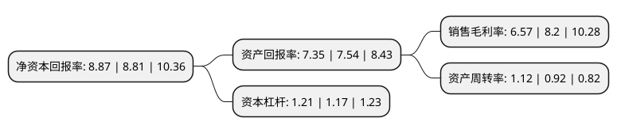

> 本页面由自动化程序生成于 2022年5月20日 01:36
> 内容可能存在错误，如有bug请提交issue至：https://github.com/Eroleice/doc-pi/issues
{.is-warning}

# 上市公司基本情况

## 基本资料

苏州兴业材料科技股份有限公司（以下简称“兴业股份”）成立于1996年04月05日，苏州市。于2016年12月12日在上交所主板上市。

兴业股份注册资本20,160万元，主营业务:专注于铸造造型材料产品研发，生产，销售和相关技术服务。主要产品包括铸造用自硬呋喃树脂，冷芯盒树脂，配套固化剂，铸造涂料和铸造辅助材料等。以下是详细信息：

- 公司名称: 苏州兴业材料科技股份有限公司
- 股票代码: 603928.SH
- 所在地: 江苏 - 苏州市
- 成立日期: 1996年04月05日
- 注册资本: 20,160万元
- 法定代表人: 王进兴
- 主营业务: 主营业务:专注于铸造造型材料产品研发，生产，销售和相关技术服务主要产品包括铸造用自硬呋喃树脂，冷芯盒树脂，配套固化剂，铸造涂料和铸造辅助材料等
- 公司官网: www.chinaxingye.com
- 公司介绍: 公司是专注于铸造功能新材料的研发、生产、销售和相关技术服务的高新技术企业。公司注重保护生态环境。在生产中，持续改进工艺流程，对每一种产品实施生态化合成和清洁生产，为员工提供安全、健康、卫生的工作条件和生活环境，在行业中率先通过了ISO9001质量管理体系、ISO14000环境管理体系和清洁生产标准认证，走资源节约型、环境友好型、生产安全型发展道路。公司坚守“创新精神哺育兴业，绿色产品回报社会”的经营理念，践行“营销精确化、产品个性化、服务专业化”的经营模式，不断为铸造创造化学新作用和铸造用粘结剂新家族，产品广泛应用于装备制造业的铸件生产。

## 股东及高管情况

上市公司第一大股东为王进兴，持股56,782,900股，占比28.17%，**疑似为**上市公司实际控制人。

截至2022年03月31日，上市公司的前十大股东中，共有9名自然人股东，1名机构股东，其中5%以上大股东共有2名。上市公司前十大股东明细如下：

> 未能通过持股比例判定出上市公司实际控制人（持股30%以上）
> 可能存在通过间接持股、联合持股、协议控制等方式拥有实际控制权的主体，具体请参考上市公司定期公告！
{.is-warning}

> 截至2022年03月31日，上市公司前十大股东信息如下：

| 股东名称 | 持股数量（股） | 持股比例 |
| --- | --- | --- |
| 王进兴 | 56,782,900 | 28.17% |
| 王泉兴 | 52,334,600 | 25.96% |
| 沈根珍 | 7,413,900 | 3.68% |
| 王文浩 | 5,931,300 | 2.94% |
| 王锦程 | 5,523,800 | 2.74% |
| 曹连英 | 4,448,300 | 2.21% |
| 苏州宝沃创业投资有限公司 | 3,596,300 | 1.78% |
| 王文娟 | 1,482,700 | 0.74% |
| 张红 | 1,377,600 | 0.68% |
| 张玉成 | 978,900 | 0.49% |

## 利润表分析

上市公司2021年总收入为19.72亿元，净利润为1.29亿元，实现盈利。

## 杜邦分析

> 数据列示周期：2021年 | 2020年 | 2019年
{.is-info}

上市公司的净资产收益率在近一年有所上升，上升幅度为0.68%，其变化情况分解如下：
- 上市公司的销售毛利率在近一年下降了-19.88%，可能是生产效率的下降、商品原材料价格上涨或商品价格的下跌所致。
- 上市公司的资产周转率在近一年上升了21.74%，可能是源自于更快的销售回款或库存管理效果提升。
- 上市公司的财务杠杆比率在近一年上升了3.42%，可能是增加负债扩大生产规模。

