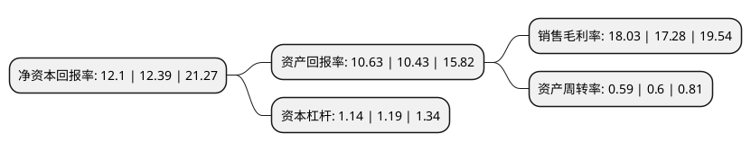

> 本页面由自动化程序生成于 2022年5月20日 01:36
> 内容可能存在错误，如有bug请提交issue至：https://github.com/Eroleice/doc-pi/issues
{.is-warning}

# 上市公司基本情况

## 基本资料

杭州格林达电子材料股份有限公司（以下简称“格林达”）成立于2001年10月17日，杭州市。于2020年08月19日在上交所主板上市。

格林达注册资本14,254.17万元，专业从事超净高纯湿电子化学品的研发，生产和销售业务，产品主要有显影液，蚀刻液，稀释液，清洗液等。以下是详细信息：

- 公司名称: 杭州格林达电子材料股份有限公司
- 股票代码: 603931.SH
- 所在地: 浙江 - 杭州市
- 成立日期: 2001年10月17日
- 注册资本: 14,254.17万元
- 法定代表人: 方伟华
- 主营业务: 专业从事超净高纯湿电子化学品的研发，生产和销售业务，产品主要有显影液，蚀刻液，稀释液，清洗液等
- 公司官网: www.greendachem.com
- 公司介绍: 公司专业从事超净高纯湿电子化学品的研发、生产和销售业务，产品主要有显影液、蚀刻液、稀释液、清洗液等。下游应用领域主要为显示面板、半导体、太阳能电池等，主要用于显影、蚀刻、清洗等电子产品制造工艺中。公司是国家高新技术企业、杭州市专利试点企业，自主研发掌握多项专利技术，设有浙江省省级企业研究院和杭州市市级企业技术中心。公司是中国电子材料协会理事单位、中国集成电路材料和零部件产业技术创新战略联盟会员单位、全国半导体设备和材料标准技术委员会电子化学品标准工作组组长单位。公司自主研发的TMAH显影液制备工艺，实现了技术突破，填补国内空白。公司曾荣获“国家彩电产业战略转型产业化专项项目”、“国家火炬计划产业化示范项目”、“2015年浙江省优秀工业产品”、“2017年度中国显示产业链卓越贡献奖”、“2017年度中国显示产业链协同开发奖”、“中国电子材料行业-电子化工材料专业十强”等多项殊荣。公司产品在行业中具备较好的口碑和声誉，产品终端用户包括京东方集团、韩国LG集团、华星光电、天马微电子、中电熊猫等国内外知名企业。

## 股东及高管情况

上市公司第一大股东为杭州电化集团有限公司，持股60,039,890股，占比42.12%，为上市公司实际控制人。

截至2022年03月31日，上市公司的前十大股东中，共有5名自然人股东，5名机构股东，其中5%以上大股东共有3名。上市公司前十大股东明细如下：

> 截至2022年03月31日，上市公司前十大股东信息如下：

| 股东名称 | 持股数量（股） | 持股比例 |
| --- | --- | --- |
| 杭州电化集团有限公司 | 60,039,890 | 42.12% |
| 宁波聚合股权投资合伙企业(有限合伙) | 30,295,451 | 21.25% |
| 杭州绿生投资合伙企业(有限合伙) | 7,634,228 | 5.36% |
| 杭州金贝尔投资有限公司 | 4,665,761 | 3.27% |
| 宁波康达源投资合伙企业(有限合伙) | 3,738,290 | 2.62% |
| 梁留生 | 547,520 | 0.38% |
| 尹云舰 | 532,620 | 0.37% |
| 路民平 | 240,000 | 0.17% |
| 张力明 | 209,020 | 0.15% |
| 虞乐军 | 171,000 | 0.12% |

## 利润表分析

上市公司2021年总收入为7.79亿元，净利润为1.4亿元，实现盈利。

## 杜邦分析

> 数据列示周期：2021年 | 2020年 | 2019年
{.is-info}

上市公司的净资产收益率在近一年有所下降，下降幅度为-2.34%，其变化情况分解如下：
- 上市公司的销售毛利率在近一年上升了4.34%，可能是生产效率的提升、商品原材料价格下跌或商品价格的上涨所致。
- 上市公司的资产周转率在近一年下降了-1.67%，可能是源自于更慢的销售回款或库存管理效果下降。
- 上市公司的财务杠杆比率在近一年下降了-4.2%，可能是减少负债降低财务费用。

