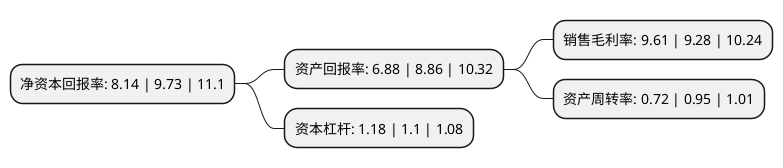

> 本页面由自动化程序生成于 2022年5月20日 01:36
> 内容可能存在错误，如有bug请提交issue至：https://github.com/Eroleice/doc-pi/issues
{.is-warning}

# 上市公司基本情况

## 基本资料

唐山三孚硅业股份有限公司（以下简称“三孚股份”）成立于2006年10月20日，唐山市。于2017年06月28日在上交所主板上市。

三孚股份注册资本19,521.658万元，主要从事三氯氢硅及氢氧化钾等精细化工产品的研发，生产和销售。主要产品:三氯氢硅，氢氧化钾。以下是详细信息：

- 公司名称: 唐山三孚硅业股份有限公司
- 股票代码: 603938.SH
- 所在地: 河北 - 唐山市
- 成立日期: 2006年10月20日
- 注册资本: 19,521.658万元
- 法定代表人: 孙任靖
- 主营业务: 主要从事三氯氢硅及氢氧化钾等精细化工产品的研发，生产和销售主要产品:三氯氢硅，氢氧化钾
- 公司官网: www.tssunfar.com
- 公司介绍: 公司是一家资源综合利用，经济循环发展的高科技化工企业。公司主要产品包括三氯氢硅、四氯化硅、光纤四氯化硅、氢氧化钾、硫酸钾、特种气体等，产品广泛应用于光伏、光纤、电子芯片等领域。公司项目建设立足于延伸产业链条，打造三孚特色产业体系。本着绿色环保的发展理念，公司三氯氢硅、四氯化硅、氢氧化钾、硫酸钾“两硅两钾”生产系统实现协调联动生产,资源循环利用，产品互相支撑的循环产业链条初步形成，走出了一条化工行业绿色循环发展新路。公司产品均通过ISO9001:2015质量管理体系、ISO14001:2015环境质量体系认证和OHSAS18001职业健康及安全管理体系认证。公司目前已与江苏中能、洛阳中硅、长飞光纤、浙江富通、辛集化工、金能科技等客户建立稳定的合作关系，产品销往国内多个省市，并出口到美洲、欧洲、中东、日本、韩国等多个国家，具有较为明显的客户资源和品牌优势。

## 股东及高管情况

上市公司第一大股东为孙任靖，持股76,737,000股，占比39.31%，为上市公司实际控制人。

截至2022年03月31日，上市公司的前十大股东中，共有3名自然人股东，1名机构股东，6个产品账户，其中5%以上大股东共有2名。上市公司前十大股东明细如下：

> 截至2022年03月31日，上市公司前十大股东信息如下：

| 股东名称 | 持股数量（股） | 持股比例 |
| --- | --- | --- |
| 孙任靖 | 76,737,000 | 39.31% |
| 唐山元亨科技有限公司 | 50,050,000 | 25.64% |
| 冯瑞红 | 3,978,430 | 2.04% |
| 中国工商银行股份有限公司-海富通改革驱动灵活配置混合型证券投资基金 | 3,140,045 | 1.61% |
| 上海牧鑫资产管理有限公司-牧鑫佳利和5号私募证券投资基金 | 2,605,300 | 1.33% |
| 南京银行股份有限公司-博时优质鑫选一年持有期混合型证券投资基金 | 2,291,205 | 1.17% |
| 陈贺东 | 1,800,000 | 0.92% |
| 中信银行股份有限公司-华安聚嘉精选混合型证券投资基金 | 1,374,800 | 0.7% |
| 中国建设银行股份有限公司-南方信息创新混合型证券投资基金 | 1,374,786 | 0.7% |
| 中国银行-海富通收益增长证券投资基金 | 727,964 | 0.37% |

## 利润表分析

上市公司2021年总收入为15.98亿元，净利润为3.34亿元，实现盈利。

## 杜邦分析

> 数据列示周期：2020年 | 2019年 | 2018年
{.is-info}

上市公司的净资产收益率在近一年有所下降，下降幅度为-16.34%，其变化情况分解如下：
- 上市公司的销售毛利率在近一年上升了3.56%，可能是生产效率的提升、商品原材料价格下跌或商品价格的上涨所致。
- 上市公司的资产周转率在近一年下降了-24.21%，可能是源自于更慢的销售回款或库存管理效果下降。
- 上市公司的财务杠杆比率在近一年上升了7.27%，可能是增加负债扩大生产规模。

