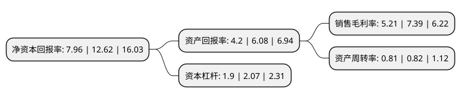

> 本页面由自动化程序生成于 2022年5月20日 01:36
> 内容可能存在错误，如有bug请提交issue至：https://github.com/Eroleice/doc-pi/issues
{.is-warning}

# 上市公司基本情况

## 基本资料

浙江永和制冷股份有限公司（以下简称“永和股份”）成立于2004年07月02日，衢州市。于2021年07月09日在上交所主板上市。

永和股份注册资本26,975.099万元，主要产品包括氟碳化学品单质(HCFC-22，HFC-152a，HFC-143a，HFC-32，HFC-227ea，HFC-125等)，混合制冷剂(R410A，R404A等)，含氟高分子材料及其单体(FEP，HFP，PTFE等)以及氢氟酸，萤石精粉，萤石块矿等。主营业务为氟化学产品的研发，生产，销售，产业链覆盖萤石资源，氢氟酸，氟碳化学品，含氟高分子材料。以下是详细信息：

- 公司名称: 浙江永和制冷股份有限公司
- 股票代码: 605020.SH
- 所在地: 浙江 - 衢州市
- 成立日期: 2004年07月02日
- 注册资本: 26,975.099万元
- 法定代表人: 童建国
- 主营业务: 主要产品包括氟碳化学品单质(HCFC-22，HFC-152a，HFC-143a，HFC-32，HFC-227ea，HFC-125等)，混合制冷剂(R410A，R404A等)，含氟高分子材料及其单体(FEP，HFP，PTFE等)以及氢氟酸，萤石精粉，萤石块矿等主营业务为氟化学产品的研发，生产，销售，产业链覆盖萤石资源，氢氟酸，氟碳化学品，含氟高分子材料
- 公司官网: www.qhyh.com
- 公司介绍: 公司作为一家集萤石资源、氢氟酸、单质及混合氟碳化学品、含氟高分子材料的研发、生产和销售为一体的氟化工领军企业之一，是我国氟化工行业中产业链最完整的企业之一。公司拥有萤石资源，萤石精粉年产能8万吨，无水氢氟酸年产能8.5万吨，氟碳化学品单质年产能10万吨以上，含氟高分子材料年产能4,800吨，主要产品品质和产能规模国内领先；公司本部拥有年混配、分装6.72万吨单质制冷剂、混合制冷剂的生产能力。同时，公司在建产能包括13万吨氢氟酸、超过15万吨氟碳化学品和超过3万吨含氟高分子材料。公司制冷剂产品长期合作客户包括美的集团、东芝、大金、TCL集团等知名企业。公司自主品牌“冰龙”牌制冷剂在售后市场中的声誉和出货量方面均排名前列。“冰龙”品牌先后获得浙江省质量技术监督局授予的“浙江名牌产品”和浙江省商务厅授予的“浙江出口名牌”等荣誉。

## 股东及高管情况

上市公司第一大股东为童建国，持股119,377,500股，占比44.25%，为上市公司实际控制人。

截至2022年03月31日，上市公司的前十大股东中，共有5名自然人股东，5名机构股东，其中5%以上大股东共有3名。上市公司前十大股东明细如下：

> 截至2022年03月31日，上市公司前十大股东信息如下：

| 股东名称 | 持股数量（股） | 持股比例 |
| --- | --- | --- |
| 童建国 | 119,377,500 | 44.25% |
| 宁波梅山保税港区冰龙投资合伙企业(有限合伙) | 19,816,000 | 7.35% |
| 浙江星皓投资有限公司 | 15,000,000 | 5.56% |
| 华立集团股份有限公司 | 9,000,000 | 3.34% |
| 南通奕辉实业投资合伙企业(有限合伙) | 7,900,000 | 2.93% |
| 徐水土 | 4,080,000 | 1.51% |
| 沈祁峰 | 3,000,000 | 1.11% |
| 贾光庆 | 3,000,000 | 1.11% |
| 上海佐亚投资管理有限公司 | 2,812,500 | 1.04% |
| 童利民 | 2,649,000 | 0.98% |

## 利润表分析

上市公司2021年总收入为28.98亿元，净利润为2.78亿元，实现盈利。

## 杜邦分析

> 数据列示周期：2020年 | 2019年 | 2018年
{.is-info}

上市公司的净资产收益率在近一年有所下降，下降幅度为-36.93%，其变化情况分解如下：
- 上市公司的销售毛利率在近一年下降了-29.5%，可能是生产效率的下降、商品原材料价格上涨或商品价格的下跌所致。
- 上市公司的资产周转率在近一年下降了-1.22%，可能是源自于更慢的销售回款或库存管理效果下降。
- 上市公司的财务杠杆比率在近一年下降了-8.21%，可能是减少负债降低财务费用。

