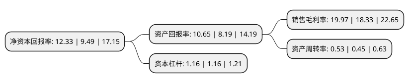

> 本页面由自动化程序生成于 2022年5月20日 01:36
> 内容可能存在错误，如有bug请提交issue至：https://github.com/Eroleice/doc-pi/issues
{.is-warning}

# 上市公司基本情况

## 基本资料

确成硅化学股份有限公司（以下简称“确成股份”）成立于2003年01月28日，无锡市。于2020年12月07日在上交所主板上市。

确成股份注册资本41,758.79万元，研发，生产饲料添加剂(限二氧化硅(I));研发，生产无机粉体填料(限白炭黑，二氧化硅，纳米二氧化硅)以下是详细信息：

- 公司名称: 确成硅化学股份有限公司
- 股票代码: 605183.SH
- 所在地: 江苏 - 无锡市
- 成立日期: 2003年01月28日
- 注册资本: 41,758.79万元
- 法定代表人: 阙伟东
- 主营业务: 研发，生产饲料添加剂(限二氧化硅(I));研发，生产无机粉体填料(限白炭黑，二氧化硅，纳米二氧化硅)
- 公司官网: www.quechen.com
- 公司介绍: 公司是全球主要的沉淀水合二氧化硅(白炭黑)专业生产企业之一，拥有无锡东沃化能有限公司和安徽确成硅化学有限公司两个控股子公司,被评为江苏省高新技术企业和无锡市重点工业企业。确成公司通过节能减排、资源回收利用，在生产运营全过程贯彻绿色环保、可持续发展这一理念。确成公司利用制备硫酸所产生的余热生产蒸汽,通过发电机组生产电力。在不增加能源消耗的情况下,低温回收装置每年多生产的蒸汽,相当于减少二氧化碳排放2万吨/年。中国石油和化学工业联合会授予确成公司“十一五”全国石油和化工环保先进单位的称号。

## 股东及高管情况

上市公司第一大股东为华威国际发展有限公司，持股247,837,590股，占比59.35%，为上市公司实际控制人。

截至2022年04月28日，上市公司的前十大股东中，共有2名自然人股东，3名机构股东，5个产品账户，其中5%以上大股东共有1名。上市公司前十大股东明细如下：

> 截至2022年04月28日，上市公司前十大股东信息如下：

| 股东名称 | 持股数量（股） | 持股比例 |
| --- | --- | --- |
| 华威国际发展有限公司 | 247,837,590 | 59.35% |
| 阙成桐 | 17,770,080 | 4.26% |
| 陈小燕 | 13,485,550 | 3.23% |
| 无锡确成同心投资企业(有限合伙) | 11,550,000 | 2.77% |
| 中国对外经济贸易信托有限公司-外贸信托-高毅晓峰鸿远集合资金信托计划 | 6,541,850 | 1.57% |
| 上海高毅资产管理合伙企业(有限合伙)-高毅晓峰2号致信基金 | 6,173,823 | 1.48% |
| 天津优势股权投资基金合伙企业(有限合伙) | 4,950,950 | 1.19% |
| 中国农业银行-大成创新成长混合型证券投资基金 | 4,762,900 | 1.14% |
| 南京优势股权投资基金(有限合伙) | 2,887,500 | 0.69% |
| 宁波梅山保税港区麟毅新动力投资管理合伙企业(有限合伙) | 2,307,900 | 0.55% |

## 利润表分析

上市公司2021年总收入为15.02亿元，净利润为3亿元，实现盈利。

## 杜邦分析

> 数据列示周期：2021年 | 2020年 | 2019年
{.is-info}

上市公司的净资产收益率在近一年有所上升，上升幅度为29.93%，其变化情况分解如下：
- 上市公司的销售毛利率在近一年上升了8.95%，可能是生产效率的提升、商品原材料价格下跌或商品价格的上涨所致。
- 上市公司的资产周转率在近一年上升了17.78%，可能是源自于更快的销售回款或库存管理效果提升。
- 上市公司的财务杠杆比率在近一年下降了0%，可能是减少负债降低财务费用。

