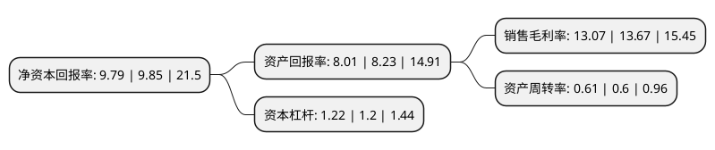

> 本页面由自动化程序生成于 2022年5月20日 01:37
> 内容可能存在错误，如有bug请提交issue至：https://github.com/Eroleice/doc-pi/issues
{.is-warning}

# 上市公司基本情况

## 基本资料

江西宏柏新材料股份有限公司（以下简称“宏柏新材”）成立于2005年12月31日，景德镇市。于2020年08月12日在上交所主板上市。

宏柏新材注册资本33,200万元，主要产品包括硅烷偶联剂和气相白炭黑。主营业务为功能性硅烷，纳米硅材料等硅基新材料及其他化学助剂的研发，生产与销售。以下是详细信息：

- 公司名称: 江西宏柏新材料股份有限公司
- 股票代码: 605366.SH
- 所在地: 江西 - 景德镇市
- 成立日期: 2005年12月31日
- 注册资本: 33,200万元
- 法定代表人: 纪金树
- 主营业务: 主要产品包括硅烷偶联剂和气相白炭黑主营业务为功能性硅烷，纳米硅材料等硅基新材料及其他化学助剂的研发，生产与销售
- 公司官网: www.hungpai.net
- 公司介绍: 公司主营业务为功能性硅烷、纳米硅材料等硅基新材料及其他化学助剂的研发、生产与销售，是我国功能性硅烷，特别是含硫硅烷细分领域中具备循环经济体系及世界领先产业规模的企业之一。公司与境内外大型知名轮胎制造商普利司通、米其林、固特异、德国马牌、韩泰、住友、中策等建立了紧密的长期业务合作关系。根据《中国硅产业年鉴(2014)》及《精细化工与专用化学品》，公司是国内功能性硅烷行业龙头企业之一。公司是高新技术企业，拥有本部技术部、哈尔滨硅材料研究所、东莞应用研发中心三个研发部门。公司还与杜善义院士团队合作设有院士工作站，进行产品工艺的改造设计。经过多年积累，公司掌握了含硫硅烷、新一代氨基硅烷、下一代含硫硅烷及气凝胶的生产技术。

## 股东及高管情况

上市公司第一大股东为宏柏化學有限公司，持股75,630,037股，占比22.78%，**疑似为**上市公司实际控制人。

截至2022年03月31日，上市公司的前十大股东中，共有3名自然人股东，6名机构股东，1个产品账户，其中5%以上大股东共有5名。上市公司前十大股东明细如下：

> 未能通过持股比例判定出上市公司实际控制人（持股30%以上）
> 可能存在通过间接持股、联合持股、协议控制等方式拥有实际控制权的主体，具体请参考上市公司定期公告！
{.is-warning}

> 截至2022年03月31日，上市公司前十大股东信息如下：

| 股东名称 | 持股数量（股） | 持股比例 |
| --- | --- | --- |
| 宏柏化學有限公司 | 75,630,037 | 22.78% |
| 宏柏化学有限公司 | 75,630,037 | 22.78% |
| 南昌龙厚实业有限公司 | 30,452,650 | 9.17% |
| 新余市宝隆企业管理中心(有限合伙) | 23,568,957 | 7.1% |
| 吴华 | 20,622,229 | 6.21% |
| 江西省和光电子科技有限公司 | 10,000,000 | 3.01% |
| 胡成发 | 5,625,001 | 1.69% |
| 新余市锦宏科技合伙企业(有限合伙) | 5,049,373 | 1.52% |
| 江西宏柏新材料股份有限公司回购专用证券账户 | 3,300,000 | 0.99% |
| 周怀国 | 3,076,162 | 0.93% |

## 杜邦分析

> 数据列示周期：2021年 | 2020年 | 2019年
{.is-info}

上市公司的净资产收益率在近一年有所下降，下降幅度为-0.61%，其变化情况分解如下：
- 上市公司的销售毛利率在近一年下降了-4.39%，可能是生产效率的下降、商品原材料价格上涨或商品价格的下跌所致。
- 上市公司的资产周转率在近一年上升了1.67%，可能是源自于更快的销售回款或库存管理效果提升。
- 上市公司的财务杠杆比率在近一年上升了1.67%，可能是增加负债扩大生产规模。

