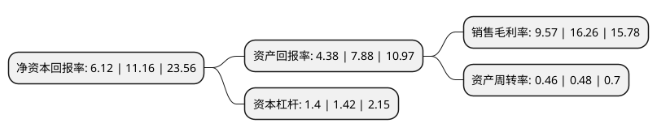

> 本页面由自动化程序生成于 2022年5月20日 01:38
> 内容可能存在错误，如有bug请提交issue至：https://github.com/Eroleice/doc-pi/issues
{.is-warning}

# 上市公司基本情况

## 基本资料

苏州金宏气体股份有限公司（以下简称“金宏气体”）成立于1999年10月28日，苏州市。于2020年06月16日在上交所科创板上市。

金宏气体注册资本48,433.34万元，气体的研发，生产，销售和服务，公司主要产品包括:(1)超纯氨，氢气，氧化亚氮，氦气，混合气，医用气体，氟碳气体等特种气体;(2)氧气，氮气，氩气，二氧化碳，乙炔等大宗气体;(3)天然气。以下是详细信息：

- 公司名称: 苏州金宏气体股份有限公司
- 股票代码: 688106.SH
- 所在地: 江苏 - 苏州市
- 成立日期: 1999年10月28日
- 注册资本: 48,433.34万元
- 法定代表人: 金向华
- 主营业务: 气体的研发，生产，销售和服务，公司主要产品包括:(1)超纯氨，氢气，氧化亚氮，氦气，混合气，医用气体，氟碳气体等特种气体;(2)氧气，氮气，氩气，二氧化碳，乙炔等大宗气体;(3)天然气
- 公司官网: www.jinhonggroup.com
- 公司介绍: 公司是一家专业从事气体研发、生产、销售和服务的环保集约型综合气体供应商。经过20余年的探索和发展，公司目前已初步建立品类完备、布局合理、配送可靠的气体供应和服务网络，能够为客户提供特种气体、大宗气体和天然气三大类100多个气体品种。公司通过空气分离、化学合成、物理提纯、充装及尾气回收等多种工艺为客户提供多品种的气体产品，满足市场的多样化需求。“金宏气体”品牌先后被苏州市工商行政管理局认定为“苏州市知名商标”，江苏省工商行政管理局认定为“江苏省著名商标”和国家工商行政管理总局认定为“驰名商标”。公司注重研发创新，设有CNAS实验室、研发中心、博士后科研工作站、江苏省特种气体及吸附剂制备工程技术研究中心等。公司把应用于电子半导体领域的特种气体和大宗气体作为重点研发方向，公司研发并投产的超纯氨、高纯氧化亚氮等超高纯气体得到了国内知名电子半导体厂商的认可。公司拥有贯穿气体生产、提纯、检测、运输、使用全过程的多项核心技术。

## 股东及高管情况

上市公司第一大股东为金向华，持股123,880,385股，占比25.508%，**疑似为**上市公司实际控制人。

截至2022年05月11日，上市公司的前十大股东中，共有9名自然人股东，1名机构股东，其中5%以上大股东共有9名。上市公司前十大股东明细如下：

> 未能通过持股比例判定出上市公司实际控制人（持股30%以上）
> 可能存在通过间接持股、联合持股、协议控制等方式拥有实际控制权的主体，具体请参考上市公司定期公告！
{.is-warning}

> 截至2022年05月11日，上市公司前十大股东信息如下：

| 股东名称 | 持股数量（股） | 持股比例 |
| --- | --- | --- |
| 金向华 | 123,880,385 | 25.508% |
| 金向华 | 123,612,295 | 25.4528% |
| 金向华 | 123,612,295 | 25.4528% |
| 朱根林 | 50,034,385 | 10.3025% |
| 朱根林 | 49,748,000 | 10.2435% |
| 朱根林 | 49,728,000 | 10.2394% |
| 金建萍 | 36,060,000 | 7.4251% |
| 金建萍 | 36,060,000 | 7.4251% |
| 金建萍 | 36,060,000 | 7.4251% |
| 苏州市相城埭溪创业投资有限责任公司 | 9,941,400 | 2.05% |

## 杜邦分析

> 数据列示周期：2021年 | 2020年 | 2019年
{.is-info}

上市公司的净资产收益率在近一年有所下降，下降幅度为-45.16%，其变化情况分解如下：
- 上市公司的销售毛利率在近一年下降了-41.14%，可能是生产效率的下降、商品原材料价格上涨或商品价格的下跌所致。
- 上市公司的资产周转率在近一年下降了-4.17%，可能是源自于更慢的销售回款或库存管理效果下降。
- 上市公司的财务杠杆比率在近一年下降了-1.41%，可能是减少负债降低财务费用。

