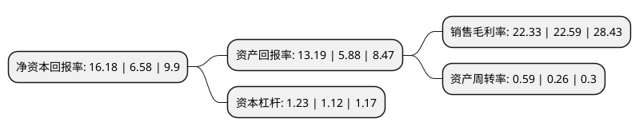

> 本页面由自动化程序生成于 2022年5月20日 01:38
> 内容可能存在错误，如有bug请提交issue至：https://github.com/Eroleice/doc-pi/issues
{.is-warning}

# 上市公司基本情况

## 基本资料

江苏天奈科技股份有限公司（以下简称“天奈科技”）成立于2011年01月06日，镇江市。于2019年09月25日在上交所科创板上市。

天奈科技注册资本23,222.919万元，公司主要从事纳米级碳材料及相关产品的研发，生产及销售，是一家具有自主研发和创新能力的高新技术企业。产品包括碳纳米管粉体，碳纳米管导电浆料，石墨烯复合导电浆料，碳纳米管导电母粒等。以下是详细信息：

- 公司名称: 江苏天奈科技股份有限公司
- 股票代码: 688116.SH
- 所在地: 江苏 - 镇江市
- 成立日期: 2011年01月06日
- 注册资本: 23,222.919万元
- 法定代表人: 郑涛
- 主营业务: 公司主要从事纳米级碳材料及相关产品的研发，生产及销售，是一家具有自主研发和创新能力的高新技术企业产品包括碳纳米管粉体，碳纳米管导电浆料，石墨烯复合导电浆料，碳纳米管导电母粒等
- 公司官网: www.cnanotechnology.com
- 公司介绍: 公司是一家从事纳米级材料及相关产品的研发、生产及销售的高新技术企业。公司主要通过研发、制造与销售三元正极材料及其前驱体实现盈利。公司产品包括碳纳米管粉体、碳纳米管导电浆料、石墨烯复合导电浆料、碳纳米管导电母粒等，产品广泛应用于锂电池领域，并有望在导电塑料领域有所突破。公司目前是国内最大的碳纳米管生产企业，在碳纳米管及其相关复合材料领域处于全球领先水平。公司掌握的碳纳米管制备技术已通过技术授权的方式授予SABIC公司使用相关技术并收取技术授权费。公司的产品目前主要应用于锂电池领域，公司客户为比亚迪、ATL、CATL等锂电池生产企业。公司拥有较强的自主创新能力，在所在行业领域已经形成了丰富的产品体系和技术储备，公司的碳纳米管导电浆料在多个核心指标均处于行业领先水平。

## 股东及高管情况

上市公司第一大股东为TAO ZHENG，持股23,507,502股，占比10.12%，**疑似为**上市公司实际控制人。

截至2022年03月31日，上市公司的前十大股东中，共有5名机构股东，3个产品账户，2个海外主体，其中5%以上大股东共有1名。上市公司前十大股东明细如下：

> 未能通过持股比例判定出上市公司实际控制人（持股30%以上）
> 可能存在通过间接持股、联合持股、协议控制等方式拥有实际控制权的主体，具体请参考上市公司定期公告！
{.is-warning}

> 截至2022年03月31日，上市公司前十大股东信息如下：

| 股东名称 | 持股数量（股） | 持股比例 |
| --- | --- | --- |
| TAO ZHENG | 23,507,502 | 10.12% |
| 共青城新奈共成投资管理合伙企业(有限合伙) | 9,616,975 | 4.14% |
| 镇江新奈智汇科技服务企业(有限合伙) | 9,023,300 | 3.89% |
| 招商银行股份有限公司-华夏上证科创板50成份交易型开放式指数证券投资基金 | 5,309,281 | 2.29% |
| 共青城日盛天宸投资合伙企业(有限合伙) | 4,837,597 | 2.08% |
| MEIJIE ZHANG | 4,772,669 | 2.06% |
| 中国邮政储蓄银行有限责任公司-东方增长中小盘混合型开放式证券投资基金 | 4,508,019 | 1.94% |
| 江苏今创投资经营有限公司 | 3,897,620 | 1.68% |
| 深圳新宙邦科技股份有限公司 | 3,848,496 | 1.66% |
| 上海浦东发展银行股份有限公司-景顺长城新能源产业股票型证券投资基金 | 3,576,864 | 1.54% |

## 杜邦分析

> 数据列示周期：2021年 | 2020年 | 2019年
{.is-info}

上市公司的净资产收益率在近一年有所上升，上升幅度为145.9%，其变化情况分解如下：
- 上市公司的销售毛利率在近一年下降了-1.15%，可能是生产效率的下降、商品原材料价格上涨或商品价格的下跌所致。
- 上市公司的资产周转率在近一年上升了126.92%，可能是源自于更快的销售回款或库存管理效果提升。
- 上市公司的财务杠杆比率在近一年上升了9.82%，可能是增加负债扩大生产规模。

