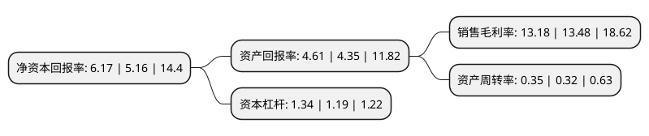

> 本页面由自动化程序生成于 2022年5月20日 01:38
> 内容可能存在错误，如有bug请提交issue至：https://github.com/Eroleice/doc-pi/issues
{.is-warning}

# 上市公司基本情况

## 基本资料

天津久日新材料股份有限公司（以下简称“久日新材”）成立于1998年10月30日，天津市。于2019年11月05日在上交所科创板上市。

久日新材注册资本11,122.68万元，主要从事系列光引发剂的研发，生产和销售，主要产品为光引发剂。以下是详细信息：

- 公司名称: 天津久日新材料股份有限公司
- 股票代码: 688199.SH
- 所在地: 天津 - 天津市
- 成立日期: 1998年10月30日
- 注册资本: 11,122.68万元
- 法定代表人: 赵国锋
- 主营业务: 主要从事系列光引发剂的研发，生产和销售，主要产品为光引发剂
- 公司官网: www.jiuri.cc
- 公司介绍: 公司是国内最早生产ITX光引发剂的企业，在该产品细分市场处于垄断地位，TPO、DETX、TPO-L等产品亦已成为国内主要厂家，公司经过近年来快速的发展，已经成为国内产品系列齐全、规模较大、技术实力和营销能力突出的行业领先企业.公司主要从事系列光引发剂的研发、生产和销售，所处行业为《战略性新兴产业分类(2018)》之“先进石化化工新材料”，是全国产量最大、品种最全的光引发剂生产供应商，光引发剂业务市场占有率约30%，在光固化领域具有全球影响力。公司共拥有3项发明专利，另有11项发明专利正在申请过程中，其中4项在申请发明专利为国际专利，TPO-L精制工艺为公司独有技术，核心技术为：采用“一锅法”合成，工艺简单、操作方便、成本低、收益率高、副产物少，其中采用的催化氧化技术，工艺参数较复杂，不易被模仿。产品提纯方法先进，成品率高。

## 股东及高管情况

上市公司第一大股东为赵国锋，持股19,771,609股，占比17.78%，**疑似为**上市公司实际控制人。

截至2022年03月31日，上市公司的前十大股东中，共有5名自然人股东，2名机构股东，3个产品账户，其中5%以上大股东共有2名。上市公司前十大股东明细如下：

> 未能通过持股比例判定出上市公司实际控制人（持股30%以上）
> 可能存在通过间接持股、联合持股、协议控制等方式拥有实际控制权的主体，具体请参考上市公司定期公告！
{.is-warning}

> 截至2022年03月31日，上市公司前十大股东信息如下：

| 股东名称 | 持股数量（股） | 持股比例 |
| --- | --- | --- |
| 赵国锋 | 19,771,609 | 17.78% |
| 解敏雨 | 6,368,033 | 5.73% |
| 深圳市创新投资集团有限公司 | 4,517,659 | 4.06% |
| 王立新 | 1,486,437 | 1.34% |
| 中国工商银行股份有限公司-宝盈优势产业灵活配置混合型证券投资基金 | 1,329,841 | 1.2% |
| 中国银行股份有限公司-宝盈国家安全战略沪港深股票型证券投资基金 | 1,183,978 | 1.06% |
| 山东圣丰投资有限公司 | 1,100,000 | 0.99% |
| 招商银行股份有限公司-宝盈成长精选混合型证券投资基金 | 1,054,116 | 0.95% |
| 项金生 | 1,000,000 | 0.9% |
| 牟桂芬 | 904,680 | 0.81% |

## 利润表分析

上市公司2021年总收入为12.52亿元，净利润为1.65亿元，实现盈利。

## 杜邦分析

> 数据列示周期：2021年 | 2020年 | 2019年
{.is-info}

上市公司的净资产收益率在近一年有所上升，上升幅度为19.57%，其变化情况分解如下：
- 上市公司的销售毛利率在近一年下降了-2.23%，可能是生产效率的下降、商品原材料价格上涨或商品价格的下跌所致。
- 上市公司的资产周转率在近一年上升了9.38%，可能是源自于更快的销售回款或库存管理效果提升。
- 上市公司的财务杠杆比率在近一年上升了12.61%，可能是增加负债扩大生产规模。

