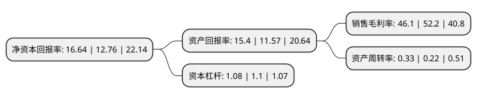

> 本页面由自动化程序生成于 2022年5月20日 01:38
> 内容可能存在错误，如有bug请提交issue至：https://github.com/Eroleice/doc-pi/issues
{.is-warning}

# 上市公司基本情况

## 基本资料

锦州神工半导体股份有限公司（以下简称“神工股份”）成立于2013年07月24日，锦州市。于2020年02月21日在上交所科创板上市。

神工股份注册资本16,000万元，主营业务为半导体级单晶硅材料的研发，生产和销售。以下是详细信息：

- 公司名称: 锦州神工半导体股份有限公司
- 股票代码: 688233.SH
- 所在地: 辽宁 - 锦州市
- 成立日期: 2013年07月24日
- 注册资本: 16,000万元
- 法定代表人: 潘连胜
- 主营业务: 主营业务为半导体级单晶硅材料的研发，生产和销售
- 公司官网: www.thinkon-cn.com
- 公司介绍: 公司是国内领先的半导体级单晶硅材料供应商，主营业务为半导体级单晶硅材料的研发、生产和销售。公司核心产品为大尺寸高纯度半导体级单晶硅材料，目前主要应用于加工制成半导体级单晶硅部件，是晶圆制造刻蚀环节所必需的核心耗材。公司生产的半导体级单晶硅材料纯度达到11个9，量产尺寸最大可达19英寸，产品质量核心指标达到国际先进水平，可满足7nm先进制程芯片制造刻蚀环节对硅材料的工艺要求。公司核心产品过去几年成功打入国际先进半导体材料供应链体系，并已逐步替代国外同类产品，在刻蚀电极细分领域的市场份额已达13%-15%，广泛应用于国际知名半导体厂商的生产流程。经过多年的发展，公司在半导体级单晶硅材料领域已建立起完整的研发、生产和销售体系，公司产品主要销往日本、韩国、美国等国家和地区。凭借先进的生产制造技术、高效的产品供应体系以及良好的综合管理能力，公司与客户建立了长期稳定的合作关系，市场认可度较高，公司已成功进入国际先进半导体材料产业链体系，形成了一定的品牌优势。

## 股东及高管情况

上市公司第一大股东为更多亮照明有限公司，持股37,003,560股，占比23.13%，**疑似为**上市公司实际控制人。

截至2022年03月31日，上市公司的前十大股东中，共有5名机构股东，5个产品账户，其中5%以上大股东共有3名。上市公司前十大股东明细如下：

> 未能通过持股比例判定出上市公司实际控制人（持股30%以上）
> 可能存在通过间接持股、联合持股、协议控制等方式拥有实际控制权的主体，具体请参考上市公司定期公告！
{.is-warning}

> 截至2022年03月31日，上市公司前十大股东信息如下：

| 股东名称 | 持股数量（股） | 持股比例 |
| --- | --- | --- |
| 更多亮照明有限公司 | 37,003,560 | 23.13% |
| 矽康半导体科技(上海)有限公司 | 35,550,301 | 22.22% |
| 北京航天科工军民融合科技成果转化创业投资基金(有限合伙) | 9,941,705 | 6.21% |
| 626投資控股有限公司 | 4,142,715 | 2.59% |
| 626投资控股有限公司 | 4,142,715 | 2.59% |
| 中国工商银行股份有限公司-海富通改革驱动灵活配置混合型证券投资基金 | 3,269,111 | 2.04% |
| 宁波梅山保税港区晶励投资管理合伙企业(有限合伙) | 2,873,733 | 1.8% |
| 中国建设银行股份有限公司-易方达科创板两年定期开放混合型证券投资基金 | 1,752,311 | 1.1% |
| 兴业银行股份有限公司-南方兴润价值一年持有期混合型证券投资基金 | 1,387,756 | 0.87% |
| 中国建设银行股份有限公司-易方达信息产业混合型证券投资基金 | 1,279,151 | 0.8% |

## 利润表分析

上市公司2021年总收入为4.73亿元，净利润为2.18亿元，实现盈利。

## 杜邦分析

> 数据列示周期：2021年 | 2020年 | 2019年
{.is-info}

上市公司的净资产收益率在近一年有所上升，上升幅度为30.41%，其变化情况分解如下：
- 上市公司的销售毛利率在近一年下降了-11.69%，可能是生产效率的下降、商品原材料价格上涨或商品价格的下跌所致。
- 上市公司的资产周转率在近一年上升了50%，可能是源自于更快的销售回款或库存管理效果提升。
- 上市公司的财务杠杆比率在近一年下降了-1.82%，可能是减少负债降低财务费用。

