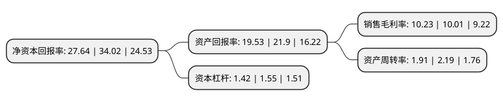

> 本页面由自动化程序生成于 2022年5月20日 01:39
> 内容可能存在错误，如有bug请提交issue至：https://github.com/Eroleice/doc-pi/issues
{.is-warning}

# 上市公司基本情况

## 基本资料

西安凯立新材料股份有限公司（以下简称“凯立新材”）成立于2002年03月15日，西安市。于2021年06月09日在上交所科创板上市。

凯立新材注册资本9,336万元，主要从事贵金属催化剂的研发与生产，催化应用技术的研究开发，废旧贵金属催化剂的回收及再加工等业务以下是详细信息：

- 公司名称: 西安凯立新材料股份有限公司
- 股票代码: 688269.SH
- 所在地: 陕西 - 西安市
- 成立日期: 2002年03月15日
- 注册资本: 9,336万元
- 法定代表人: 张之翔
- 主营业务: 主要从事贵金属催化剂的研发与生产，催化应用技术的研究开发，废旧贵金属催化剂的回收及再加工等业务
- 公司官网: www.xakaili.com
- 公司介绍: 公司为我国精细化工领域技术领先的贵金属催化剂供应商，开发的多种贵金属催化剂产品实现了进口替代,主要从事贵金属催化剂的研发与生产、催化应用技术的研究开发、废旧贵金属催化剂的回收及再加工等业务,公司亦开发多项催化应用技术、贵金属回收再加工技术与工业废水废气催化处理技术，可以为客户提供专用催化剂设计开发、催化剂改进提升、废旧贵金属催化剂回收、下游催化应用技术开发及优化、工业废水废气催化处理等全套催化解决方案，产品及服务广泛应用于医药、化工新材料、农药、染料及颜料、环保、新能源、电子、基础化工等领域。公司先后承担国家科技攻关项目、国家重点产业振兴和技术改造项目、国家火炬计划产业化示范项目、工信部绿色制造系统集成项目、陕西省重大科技创新项目等多类科研攻关或产业化项目，同时拥有新型贵金属催化剂研发技术国家地方联合工程研究中心等平台。

## 股东及高管情况

上市公司第一大股东为西北有色金属研究院，持股24,000,000股，占比25.71%，**疑似为**上市公司实际控制人。

截至2022年03月31日，上市公司的前十大股东中，共有3名自然人股东，6个产品账户，1名其他股东，其中5%以上大股东共有2名。上市公司前十大股东明细如下：

> 未能通过持股比例判定出上市公司实际控制人（持股30%以上）
> 可能存在通过间接持股、联合持股、协议控制等方式拥有实际控制权的主体，具体请参考上市公司定期公告！
{.is-warning}

> 截至2022年03月31日，上市公司前十大股东信息如下：

| 股东名称 | 持股数量（股） | 持股比例 |
| --- | --- | --- |
| 西北有色金属研究院 | 24,000,000 | 25.71% |
| 西安航天新能源产业基金投资有限公司 | 6,999,080 | 7.5% |
| 张之翔 | 3,898,000 | 4.18% |
| 陕西省高技术服务创业投资基金(有限合伙) | 3,000,000 | 3.21% |
| 西安敦成投资管理有限公司-西安兴和成投资基金合伙企业(有限合伙) | 2,500,000 | 2.68% |
| 深圳艺融同创基金管理有限公司 | 2,289,100 | 2.45% |
| 中国建设银行股份有限公司-交银施罗德阿尔法核心混合型证券投资基金 | 1,436,679 | 1.54% |
| 中国工商银行股份有限公司-汇添富科创板2年定期开放混合型证券投资基金 | 1,378,276 | 1.48% |
| 王鹏宝 | 1,340,000 | 1.44% |
| 文永忠 | 1,200,000 | 1.29% |

## 利润表分析

上市公司2021年总收入为15.89亿元，净利润为1.62亿元，实现盈利。

## 杜邦分析

> 数据列示周期：2021年 | 2020年 | 2019年
{.is-info}

上市公司的净资产收益率在近一年有所下降，下降幅度为-18.75%，其变化情况分解如下：
- 上市公司的销售毛利率在近一年上升了2.2%，可能是生产效率的提升、商品原材料价格下跌或商品价格的上涨所致。
- 上市公司的资产周转率在近一年下降了-12.79%，可能是源自于更慢的销售回款或库存管理效果下降。
- 上市公司的财务杠杆比率在近一年下降了-8.39%，可能是减少负债降低财务费用。

