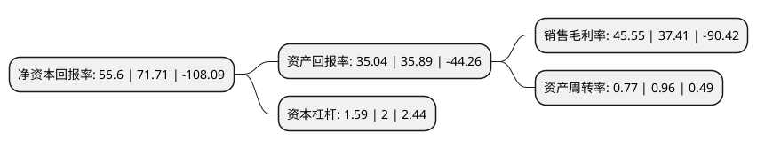

> 本页面由自动化程序生成于 2022年5月20日 01:39
> 内容可能存在错误，如有bug请提交issue至：https://github.com/Eroleice/doc-pi/issues
{.is-warning}

# 上市公司基本情况

## 基本资料

陕西华秦科技实业股份有限公司（以下简称“华秦科技”）成立于1992年12月28日，西安市。于2022年03月07日在上交所科创板上市。

华秦科技注册资本6,666.667万元，主要从事特种功能材料，包括隐身材料，伪装材料及防护材料的研发，生产和销售，产品主要应用于我国重大国防武器装备如飞机，主战坦克，舰船，导弹等的隐身，重要地面军事目标的伪装和各类装备部件的表面防护。以下是详细信息：

- 公司名称: 陕西华秦科技实业股份有限公司
- 股票代码: 688281.SH
- 所在地: 陕西 - 西安市
- 成立日期: 1992年12月28日
- 注册资本: 6,666.667万元
- 法定代表人: 折生阳
- 主营业务: 主要从事特种功能材料，包括隐身材料，伪装材料及防护材料的研发，生产和销售，产品主要应用于我国重大国防武器装备如飞机，主战坦克，舰船，导弹等的隐身，重要地面军事目标的伪装和各类装备部件的表面防护
- 公司官网: www.huaqinkj.com
- 公司介绍: 公司经过多年持续艰苦攻关，突破了多项特种功能材料研发与产业化的关键技术瓶颈，主要产品在多军种、多型号装备实现装机应用，隐身材料及伪装材料的核心产品分别在2019年及2020年实现了批产，大力推动了特种功能材料在我国武器装备隐身领域和军事目标伪装等领域的应用进程，为我国国防科技工业和先进武器装备建设事业做出了重大贡献，对维护国防安全具有战略性意义。公司拥有陕西省隐身材料技术工程研究中心、院士专家工作站及博士后科研工作站等一系列高层次人才培养、新材料研发和成果转化研究平台，覆盖隐身材料、伪装材料、高效热阻材料及重防腐材料等特种功能材料的研究与开发。

## 股东及高管情况

上市公司第一大股东为折生阳，持股15,000,000股，占比22.5%，**疑似为**上市公司实际控制人。

截至2022年03月31日，上市公司的前十大股东中，共有9名自然人股东，1名机构股东，其中5%以上大股东共有5名。上市公司前十大股东明细如下：

> 未能通过持股比例判定出上市公司实际控制人（持股30%以上）
> 可能存在通过间接持股、联合持股、协议控制等方式拥有实际控制权的主体，具体请参考上市公司定期公告！
{.is-warning}

> 截至2022年03月31日，上市公司前十大股东信息如下：

| 股东名称 | 持股数量（股） | 持股比例 |
| --- | --- | --- |
| 折生阳 | 15,000,000 | 22.5% |
| 周万城 | 7,000,000 | 10.5% |
| 陕西华秦万生商务信息咨询合伙企业(有限合伙) | 5,375,000 | 8.06% |
| 罗发 | 4,900,000 | 7.35% |
| 白红艳 | 4,500,000 | 6.75% |
| 朱冬梅 | 3,150,000 | 4.72% |
| 黄智斌 | 3,000,000 | 4.5% |
| 孙纪洲 | 1,500,000 | 2.25% |
| 康青梅 | 1,250,000 | 1.87% |
| 王均芳 | 1,250,000 | 1.87% |

## 利润表分析

上市公司2021年总收入为5.11亿元，净利润为2.33亿元，实现盈利。

## 杜邦分析

> 数据列示周期：2021年 | 2020年 | 2019年
{.is-info}

上市公司的净资产收益率在近一年有所下降，下降幅度为-22.47%，其变化情况分解如下：
- 上市公司的销售毛利率在近一年上升了21.76%，可能是生产效率的提升、商品原材料价格下跌或商品价格的上涨所致。
- 上市公司的资产周转率在近一年下降了-19.79%，可能是源自于更慢的销售回款或库存管理效果下降。
- 上市公司的财务杠杆比率在近一年下降了-20.5%，可能是减少负债降低财务费用。

