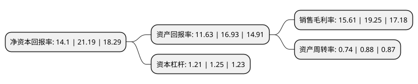

> 本页面由自动化程序生成于 2022年5月20日 01:39
> 内容可能存在错误，如有bug请提交issue至：https://github.com/Eroleice/doc-pi/issues
{.is-warning}

# 上市公司基本情况

## 基本资料

广州三孚新材料科技股份有限公司（以下简称“三孚新科”）成立于2009年04月13日，广州市。于2021年05月21日在上交所科创板上市。

三孚新科注册资本9,218万元，主要从事表面工程技术的研究及新型环保表面工程专用化学品的研发，生产和销售。主要有金属涂镀前处理系列产品，表面处理添加剂，电子化学品，通用电镀专用化学品以下是详细信息：

- 公司名称: 广州三孚新材料科技股份有限公司
- 股票代码: 688359.SH
- 所在地: 广东 - 广州市
- 成立日期: 2009年04月13日
- 注册资本: 9,218万元
- 法定代表人: 上官文龙
- 主营业务: 主要从事表面工程技术的研究及新型环保表面工程专用化学品的研发，生产和销售主要有金属涂镀前处理系列产品，表面处理添加剂，电子化学品，通用电镀专用化学品
- 公司官网: www.gzsanfu.com.cn/www.gzsf.com
- 公司介绍: 公司是一家专门从事表面工程化学品研发、生产、销售的高新技术企业。依托对PCB、手机通讯、通信设备、五金卫浴、汽车零部件等领域表面工程技术的研究，把握客户需求和行业发展趋势，推出无氰、无铬、无铅、无镉、无磷、无氨氮、低COD等一系列具有自主知识产权、自主品牌的新型环保表面工程专用化学品，公司产品广泛应用于PCB、通信基站设备、手机零部件、五金卫浴产品及汽车零部件等工业产品的表面处理。2012年，公司的无氰高密度铜工艺(含无氰碱铜)入选国家发改委、环保部、科技部和工信部等四部委联合发布的《国家鼓励的循环经济技术、工艺、设备名录(第一批)》第一项；2013年，公司获得国家发改委批准建设“替代氰化电镀的高密度铜电镀循环经济关键技术产业化国家示范项目”；2013年，公司获选“中国表面工程协会副理事长单位”；2015年，公司获认“广东省绿色电镀工程技术研究中心”。经过多年的发展及积累，公司已经发展成为国内表面工程行业影响力较强的表面工程技术解决方案提供商之一。

## 股东及高管情况

上市公司第一大股东为上官文龙，持股27,952,000股，占比30.32%，为上市公司实际控制人。

截至2022年03月31日，上市公司的前十大股东中，共有4名自然人股东，4名机构股东，2个产品账户，其中5%以上大股东共有3名。上市公司前十大股东明细如下：

> 截至2022年03月31日，上市公司前十大股东信息如下：

| 股东名称 | 持股数量（股） | 持股比例 |
| --- | --- | --- |
| 上官文龙 | 27,952,000 | 30.32% |
| 瞿承红 | 15,000,000 | 16.27% |
| 广东省科技风险投资有限公司 | 5,172,174 | 5.61% |
| 广州创钰投资管理有限公司-广州创钰铭晨股权投资基金企业(有限合伙) | 2,910,000 | 3.16% |
| 詹益腾 | 2,500,000 | 2.71% |
| 许荣国 | 2,500,000 | 2.71% |
| 珠海市汇垠德擎股权投资基金管理有限公司-广州宏大广誉投资合伙企业(有限合伙) | 2,407,440 | 2.61% |
| 广州君瓴股权投资管理有限公司-广东君瓴盈泰股权投资合伙企业(有限合伙) | 2,253,244 | 2.44% |
| 珠海迪振投资合伙企业(有限合伙) | 2,190,000 | 2.38% |
| 珠海迪朗投资合伙企业(有限合伙) | 2,010,000 | 2.18% |

## 利润表分析

上市公司2021年总收入为3.75亿元，净利润为0.58亿元，实现盈利。

## 杜邦分析

> 数据列示周期：2021年 | 2020年 | 2019年
{.is-info}

上市公司的净资产收益率在近一年有所下降，下降幅度为-33.46%，其变化情况分解如下：
- 上市公司的销售毛利率在近一年下降了-18.91%，可能是生产效率的下降、商品原材料价格上涨或商品价格的下跌所致。
- 上市公司的资产周转率在近一年下降了-15.91%，可能是源自于更慢的销售回款或库存管理效果下降。
- 上市公司的财务杠杆比率在近一年下降了-3.2%，可能是减少负债降低财务费用。

