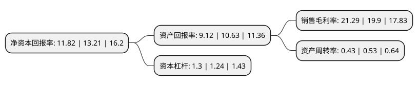

> 本页面由自动化程序生成于 2022年5月20日 01:39
> 内容可能存在错误，如有bug请提交issue至：https://github.com/Eroleice/doc-pi/issues
{.is-warning}

# 上市公司基本情况

## 基本资料

江苏泛亚微透科技股份有限公司（以下简称“泛亚微透”）成立于1995年11月08日，常州市。于2020年10月16日在上交所科创板上市。

泛亚微透注册资本7,000万元，主要产品细分类别较多，可根据其主要功能分为ePTFE微透产品，吸隔声产品，气体管理产品，CMD，挡水膜，密封件以及机械设备7个大类，主要从事膨体聚四氟乙烯膜(ePTFE)等微观多孔材料及其改性衍生产品的研发，生产及销售。以下是详细信息：

- 公司名称: 江苏泛亚微透科技股份有限公司
- 股票代码: 688386.SH
- 所在地: 江苏 - 常州市
- 成立日期: 1995年11月08日
- 注册资本: 7,000万元
- 法定代表人: 张云
- 主营业务: 主要产品细分类别较多，可根据其主要功能分为ePTFE微透产品，吸隔声产品，气体管理产品，CMD，挡水膜，密封件以及机械设备7个大类，主要从事膨体聚四氟乙烯膜(ePTFE)等微观多孔材料及其改性衍生产品的研发，生产及销售
- 公司官网: www.microvent.com.cn
- 公司介绍: 公司是一家拥有自主研发及创新能力的新材料供应商和解决方案提供商。通过对ePTFE膜的改性及与基础吸音棉、高性能干燥剂、SiO2气凝胶等材料复合，公司不断为客户定制化地开发具有特殊声、电、磁、热、防水透气、气体管理、耐候耐化学等特性的组件产品。公司通过从事挡水膜、密封件等产品生产及销售，在汽车行业逐渐树立起了自己的品牌并且积累了后续研发所需要的资金。在此基础之上，公司通过对ePTFE膜制备、改性和复合技术的不断研究，形成了现在的“产品多元、市场利基”的发展战略。

## 股东及高管情况

上市公司第一大股东为张云，持股19,511,467股，占比27.87%，**疑似为**上市公司实际控制人。

截至2022年03月31日，上市公司的前十大股东中，共有7名自然人股东，2名机构股东，1个产品账户，其中5%以上大股东共有3名。上市公司前十大股东明细如下：

> 未能通过持股比例判定出上市公司实际控制人（持股30%以上）
> 可能存在通过间接持股、联合持股、协议控制等方式拥有实际控制权的主体，具体请参考上市公司定期公告！
{.is-warning}

> 截至2022年03月31日，上市公司前十大股东信息如下：

| 股东名称 | 持股数量（股） | 持股比例 |
| --- | --- | --- |
| 张云 | 19,511,467 | 27.87% |
| 常州赛富高新创业投资中心(有限合伙) | 8,094,724 | 11.56% |
| 江苏南方轴承股份有限公司 | 7,029,302 | 10.04% |
| 邹东伟 | 2,394,716 | 3.42% |
| 杨明之 | 2,240,926 | 3.2% |
| 昌建忠 | 1,457,335 | 2.08% |
| 郭乃强 | 1,283,559 | 1.83% |
| 朱鸣钢 | 947,048 | 1.35% |
| 李建革 | 732,329 | 1.05% |
| 深圳碧烁私募证券基金管理有限公司-碧烁长远七号私募证券投资基金 | 674,707 | 0.96% |

## 利润表分析

上市公司2021年总收入为3.16亿元，净利润为0.67亿元，实现盈利。

## 杜邦分析

> 数据列示周期：2021年 | 2020年 | 2019年
{.is-info}

上市公司的净资产收益率在近一年有所下降，下降幅度为-10.52%，其变化情况分解如下：
- 上市公司的销售毛利率在近一年上升了6.98%，可能是生产效率的提升、商品原材料价格下跌或商品价格的上涨所致。
- 上市公司的资产周转率在近一年下降了-18.87%，可能是源自于更慢的销售回款或库存管理效果下降。
- 上市公司的财务杠杆比率在近一年上升了4.84%，可能是增加负债扩大生产规模。

