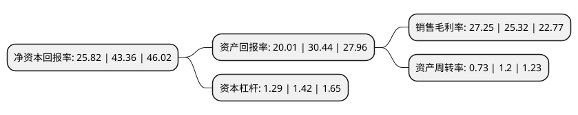

> 本页面由自动化程序生成于 2022年5月20日 01:40
> 内容可能存在错误，如有bug请提交issue至：https://github.com/Eroleice/doc-pi/issues
{.is-warning}

# 上市公司基本情况

## 基本资料

呈和科技股份有限公司（以下简称“呈和科技”）成立于2002年01月31日，广州市。于2021年06月07日在上交所科创板上市。

呈和科技注册资本13,333.34万元，主营产品包括成核剂，合成水滑石和NDO复合助剂三大类型高分子材料助剂产品，主要为制造高性能树脂材料与改性塑料的企业提供环保，安全，高性能的高分子材料助剂产品。以下是详细信息：

- 公司名称: 呈和科技股份有限公司
- 股票代码: 688625.SH
- 所在地: 广东 - 广州市
- 成立日期: 2002年01月31日
- 注册资本: 13,333.34万元
- 法定代表人: 赵文林
- 主营业务: 主营产品包括成核剂，合成水滑石和NDO复合助剂三大类型高分子材料助剂产品，主要为制造高性能树脂材料与改性塑料的企业提供环保，安全，高性能的高分子材料助剂产品
- 公司官网: www.gchchem.com
- 公司介绍: 公司是业内技术领先企业，是广东省塑料助剂工程研究开发中心，主持承担了广东省产学研重大项目。公司以自主研发的四氢苯酐金属盐作为β晶型增韧成核剂是行业首创，较传统β晶型增韧成核剂可显著提高聚丙烯树脂的韧性，已通过我国新化学物质登记。通过技术研发与产品创新，公司产品已在国内外得到广泛认可，为公司未来的市场开拓创造了良好条件。公司核心产品取得全球主流的聚丙烯树脂生产工艺技术Novolen(巴斯夫开发)和Unipol(壳牌和美国UCC联合开发)的准入认证，是国内唯一取得认证的成核剂、合成水滑石产品。公司通过了全球知名能源化工公司联合建立的TFS评估，达到了国际领先的能源化工行业供应链标准。公司是我国2011年实行食品相关产品新品种行政许可管理以来，首家获得审批的企业，也是首家通过美国FDA食品接触物质审批的中国企业，且为目前通过该审批最多的中国企业。公司核心产品符合全球主要国家与地区的食品接触材料标准与法规，包括我国国家卫生与健康委员会、美国FDA、日本JHOSPA、欧盟等机构颁布的标准与法规。

## 股东及高管情况

上市公司第一大股东为赵文林，持股46,050,000股，占比34.54%，为上市公司实际控制人。

截至2022年03月31日，上市公司的前十大股东中，共有1名自然人股东，5名机构股东，4个产品账户，其中5%以上大股东共有2名。上市公司前十大股东明细如下：

> 截至2022年03月31日，上市公司前十大股东信息如下：

| 股东名称 | 持股数量（股） | 持股比例 |
| --- | --- | --- |
| 赵文林 | 46,050,000 | 34.54% |
| 上海科汇投资管理有限公司 | 41,450,000 | 31.09% |
| 广州众呈投资合伙企业(有限合伙) | 5,000,000 | 3.75% |
| 建信基金-建设银行-中国人寿-中国人寿委托建信基金股票型组合 | 3,426,063 | 2.57% |
| 广州创钰投资管理有限公司-珠海创钰铭汇股权投资基金企业(有限合伙) | 2,900,000 | 2.17% |
| 广州创钰投资管理有限公司-广州创钰铭晨股权投资基金企业(有限合伙) | 2,600,000 | 1.95% |
| 中信建投证券-浦发银行-中信建投呈和1号科创板战略配售集合资产管理计划 | 2,033,000 | 1.52% |
| 珠海拓弘股权投资企业(有限合伙) | 2,000,000 | 1.5% |
| 华夏人寿保险股份有限公司-自有资金 | 1,627,955 | 1.22% |
| 中信建投投资有限公司 | 1,517,970 | 1.14% |

## 利润表分析

上市公司2021年总收入为5.76亿元，净利润为1.57亿元，实现盈利。

## 杜邦分析

> 数据列示周期：2021年 | 2020年 | 2019年
{.is-info}

上市公司的净资产收益率在近一年有所下降，下降幅度为-40.45%，其变化情况分解如下：
- 上市公司的销售毛利率在近一年上升了7.62%，可能是生产效率的提升、商品原材料价格下跌或商品价格的上涨所致。
- 上市公司的资产周转率在近一年下降了-39.17%，可能是源自于更慢的销售回款或库存管理效果下降。
- 上市公司的财务杠杆比率在近一年下降了-9.15%，可能是减少负债降低财务费用。

