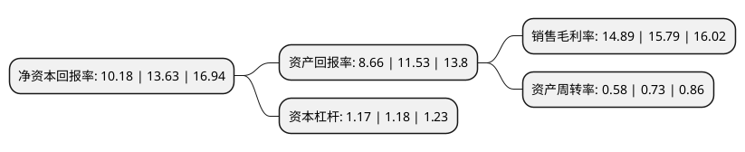

> 本页面由自动化程序生成于 2022年5月20日 01:40
> 内容可能存在错误，如有bug请提交issue至：https://github.com/Eroleice/doc-pi/issues
{.is-warning}

# 上市公司基本情况

## 基本资料

广东莱尔新材料科技股份有限公司（以下简称“莱尔科技”）成立于2004年04月02日，佛山市。于2021年04月12日在上交所科创板上市。

莱尔科技注册资本14,856万元，公司生产的功能性涂布胶膜材料主要有FFC多功能胶膜，补强板，LED柔性线路板膜等热熔胶膜，防爆装饰一体膜，制程保护膜，TP模组保护膜等压敏胶膜。公司生产的主要胶膜应用产品有FFC柔性扁平线缆和LED柔性线路板等。主营业务为功能性涂布胶膜材料及下游应用产品的研发，生产，销售。以下是详细信息：

- 公司名称: 广东莱尔新材料科技股份有限公司
- 股票代码: 688683.SH
- 所在地: 广东 - 佛山市
- 成立日期: 2004年04月02日
- 注册资本: 14,856万元
- 法定代表人: 伍仲乾
- 主营业务: 公司生产的功能性涂布胶膜材料主要有FFC多功能胶膜，补强板，LED柔性线路板膜等热熔胶膜，防爆装饰一体膜，制程保护膜，TP模组保护膜等压敏胶膜公司生产的主要胶膜应用产品有FFC柔性扁平线缆和LED柔性线路板等主营业务为功能性涂布胶膜材料及下游应用产品的研发，生产，销售
- 公司官网: www.leary.com.cn
- 公司介绍: 公司已获得国家高新技术企业认定，公司的“电子电器连接线专用热熔胶膜工程技术研究中心”被认定为广东省工程技术研究中心，公司被认定为“省级企业技术中心”、“佛山市企业技术中心”、佛山市第三批细分行业龙头企业，公司在长期的发展过程中，通过不断的研发投入形成技术积累和技术创新，具备了特种胶粘剂技术研发和精密涂布两大核心技术，为半导体、新能源汽车、医疗、高端电子等领域提供产品、技术、服务和解决方案。采用“功能性涂布胶膜研发+下游产品开发”双轮驱动模式，获得产品方案开发、应用信息反馈、产品性能提升、成本控制、技术保密等竞争优势，逐步推动公司快速发展。

## 股东及高管情况

上市公司第一大股东为广东特耐尔投资有限公司，持股80,000,000股，占比53.85%，为上市公司实际控制人。

截至2022年03月31日，上市公司的前十大股东中，共有4名自然人股东，5名机构股东，1个产品账户，其中5%以上大股东共有2名。上市公司前十大股东明细如下：

> 截至2022年03月31日，上市公司前十大股东信息如下：

| 股东名称 | 持股数量（股） | 持股比例 |
| --- | --- | --- |
| 广东特耐尔投资有限公司 | 80,000,000 | 53.85% |
| 范小平 | 12,000,000 | 8.08% |
| 龚伟泉 | 4,000,000 | 2.69% |
| 西部证券莱尔科技员工参与科创板战略配售集合资产管理计划 | 3,714,000 | 2.5% |
| 西藏承泰创业投资管理合伙企业(有限合伙) | 2,785,000 | 1.87% |
| 李子峰 | 2,785,000 | 1.87% |
| 楼肖斌 | 2,304,538 | 1.55% |
| 佛山市顺德区德鑫创业投资有限公司(SS) | 2,230,000 | 1.5% |
| 佛山市禾鑫投资合伙企业(有限合伙) | 1,900,000 | 1.28% |
| 拉萨沣泰创业投资合伙企业(有限合伙) | 1,860,700 | 1.25% |

## 利润表分析

上市公司2021年总收入为4.55亿元，净利润为0.67亿元，实现盈利。

## 杜邦分析

> 数据列示周期：2021年 | 2020年 | 2019年
{.is-info}

上市公司的净资产收益率在近一年有所下降，下降幅度为-25.31%，其变化情况分解如下：
- 上市公司的销售毛利率在近一年下降了-5.7%，可能是生产效率的下降、商品原材料价格上涨或商品价格的下跌所致。
- 上市公司的资产周转率在近一年下降了-20.55%，可能是源自于更慢的销售回款或库存管理效果下降。
- 上市公司的财务杠杆比率在近一年下降了-0.85%，可能是减少负债降低财务费用。

