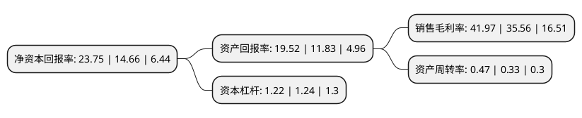

> 本页面由自动化程序生成于 2022年5月20日 01:40
> 内容可能存在错误，如有bug请提交issue至：https://github.com/Eroleice/doc-pi/issues
{.is-warning}

# 上市公司基本情况

## 基本资料

苏州纳微科技股份有限公司（以下简称“纳微科技”）成立于2007年10月22日，苏州市。于2021年06月23日在上交所科创板上市。

纳微科技注册资本40,014.595万元，专门从事高性能纳米微球材料研发，规模化生产，销售及应用服务，为生物医药，平板显示，分析检测及体外诊断等领域客户提供核心微球材料及相关技术解决方案。以下是详细信息：

- 公司名称: 苏州纳微科技股份有限公司
- 股票代码: 688690.SH
- 所在地: 江苏 - 苏州市
- 成立日期: 2007年10月22日
- 注册资本: 40,014.595万元
- 法定代表人: 江必旺
- 主营业务: 专门从事高性能纳米微球材料研发，规模化生产，销售及应用服务，为生物医药，平板显示，分析检测及体外诊断等领域客户提供核心微球材料及相关技术解决方案
- 公司官网: www.nanomicrotech.com
- 公司介绍: 公司致力于成为全球领先的微球品牌，打造战略性新兴产业的中国“芯”材料。在科技部科技创新创业人才江必旺博士的带领下，公司秉持“以创新，赢尊重，得未来”的经营理念，长期坚持底层技术创新和跨领域合作，突破了微球精准制备的技术难题，实现对微球材料粒径、孔径及表面性能的精准调控，成功将产品应用于生物医药、平板显示、分析检测及体外诊断等众多领域，打破了国外领先企业长期以来的技术和产品垄断，加快了高性能色谱填料和间隔物微球的国产化速度，推动了国产自主研发产品打入欧美发达国家市场的进程。

## 股东及高管情况

上市公司第一大股东为深圳市纳微科技有限公司，持股78,096,992股，占比19.52%，**疑似为**上市公司实际控制人。

截至2022年03月31日，上市公司的前十大股东中，共有4名自然人股东，6名机构股东，其中5%以上大股东共有6名。上市公司前十大股东明细如下：

> 未能通过持股比例判定出上市公司实际控制人（持股30%以上）
> 可能存在通过间接持股、联合持股、协议控制等方式拥有实际控制权的主体，具体请参考上市公司定期公告！
{.is-warning}

> 截至2022年03月31日，上市公司前十大股东信息如下：

| 股东名称 | 持股数量（股） | 持股比例 |
| --- | --- | --- |
| 深圳市纳微科技有限公司 | 78,096,992 | 19.52% |
| 江必旺 | 64,646,835 | 16.16% |
| 苏州纳研管理咨询合伙企业(有限合伙) | 28,500,000 | 7.12% |
| 宁波梅山保税港区铧杰股权投资管理有限公司-华杰(天津)医疗投资合伙企业(有限合伙) | 22,328,549 | 5.58% |
| 宋功友 | 21,547,018 | 5.38% |
| 胡维德 | 20,089,084 | 5.02% |
| 苏州工业园区新建元生物创业投资企业(有限合伙) | 14,579,939 | 3.64% |
| 深圳高瓴益恒投资咨询中心(有限合伙) | 14,474,037 | 3.62% |
| 苏州纳卓管理咨询合伙企业(有限合伙) | 14,250,000 | 3.56% |
| 宋怀海 | 11,663,853 | 2.91% |

## 利润表分析

上市公司2021年总收入为4.46亿元，净利润为1.87亿元，实现盈利。

## 杜邦分析

> 数据列示周期：2021年 | 2020年 | 2019年
{.is-info}

上市公司的净资产收益率在近一年有所上升，上升幅度为62.01%，其变化情况分解如下：
- 上市公司的销售毛利率在近一年上升了18.03%，可能是生产效率的提升、商品原材料价格下跌或商品价格的上涨所致。
- 上市公司的资产周转率在近一年上升了42.42%，可能是源自于更快的销售回款或库存管理效果提升。
- 上市公司的财务杠杆比率在近一年下降了-1.61%，可能是减少负债降低财务费用。

