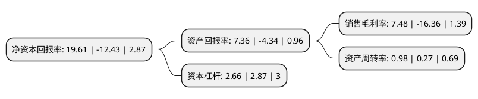

> 本页面由自动化程序生成于 2022年5月20日 01:40
> 内容可能存在错误，如有bug请提交issue至：https://github.com/Eroleice/doc-pi/issues
{.is-warning}

# 上市公司基本情况

## 基本资料

贵州振华新材料股份有限公司（以下简称“振华新材”）成立于2004年04月26日，贵阳市。于2021年09月14日在上交所科创板上市。

振华新材注册资本44,293.481万元，专注于锂离子电池正极材料的研发，生产及销售，主要提供新能源汽车，消费电子及储能领域产品所用的锂离子电池正极材料。以下是详细信息：

- 公司名称: 贵州振华新材料股份有限公司
- 股票代码: 688707.SH
- 所在地: 贵州 - 贵阳市
- 成立日期: 2004年04月26日
- 注册资本: 44,293.481万元
- 法定代表人: 侯乔坤
- 主营业务: 专注于锂离子电池正极材料的研发，生产及销售，主要提供新能源汽车，消费电子及储能领域产品所用的锂离子电池正极材料
- 公司官网: www.zh-echem.com
- 公司介绍: 公司自成立以来专注于锂离子电池正极材料的研发和生产，成功研发并形成一系列具备自主知识产权的核心技术，包括一次颗粒大单晶镍钴锰三元材料合成技术、大单晶无钴层状结构镍锰二元材料合成技术、高电压钴酸锂材料合成技术、多晶镍钴锰三元正极材料合成技术、尖晶石结构复合改性材料合成技术、正极材料掺杂技术、正极材料表面改性技术等。先后获得中国专利优秀奖、贵州省专利金奖、贵州省科技进步二等奖、贵州省科技成果转化二等奖等国家级、省部级奖励7项和贵阳市优秀新产品特等奖、贵阳市科技成果转化一等奖等地市级奖项7项。2018年12月，公司成功进入工信部第三批《锂离子电池行业规范条件》企业名单。公司锂离子电池正极材料的客户涵盖国内主流锂离子电池企业，与宁德时代、孚能科技、新能源科技(ATL)、微宏动力、天津力神、中山天贸、多氟多、珠海冠宇、惠州锂威等形成长期合作关系。

## 股东及高管情况

上市公司第一大股东为中国振华电子集团有限公司，持股125,380,000股，占比28.31%，**疑似为**上市公司实际控制人。

截至2022年03月31日，上市公司的前十大股东中，共有3名自然人股东，4名机构股东，3个产品账户，其中5%以上大股东共有4名。上市公司前十大股东明细如下：

> 未能通过持股比例判定出上市公司实际控制人（持股30%以上）
> 可能存在通过间接持股、联合持股、协议控制等方式拥有实际控制权的主体，具体请参考上市公司定期公告！
{.is-warning}

> 截至2022年03月31日，上市公司前十大股东信息如下：

| 股东名称 | 持股数量（股） | 持股比例 |
| --- | --- | --- |
| 中国振华电子集团有限公司 | 125,380,000 | 28.31% |
| 中电金投控股有限公司 | 28,786,812 | 6.5% |
| 舟山鑫天瑜成长股权投资合伙企业(有限合伙) | 25,120,000 | 5.67% |
| 国投(上海)科技成果转化创业投资基金企业(有限合伙) | 23,785,600 | 5.37% |
| 中信建投振华新材科创板战略配售集合资产管理计划 | 11,073,370 | 2.5% |
| 深圳鑫天瑜六期股权投资合伙企业(有限合伙) | 10,000,000 | 2.26% |
| 泰州鑫泰中信股权投资基金合伙企业(有限合伙) | 10,000,000 | 2.26% |
| 王琴英 | 8,297,745 | 1.87% |
| 董侠 | 7,800,000 | 1.76% |
| 熊小川 | 6,469,999 | 1.46% |

## 利润表分析

上市公司2021年总收入为55.14亿元，净利润为4.12亿元，实现盈利。

## 杜邦分析

> 数据列示周期：2021年 | 2020年 | 2019年
{.is-info}

上市公司的净资产收益率在近一年有所下降，下降幅度为-257.76%，其变化情况分解如下：
- 上市公司的销售毛利率在近一年下降了-145.72%，可能是生产效率的下降、商品原材料价格上涨或商品价格的下跌所致。
- 上市公司的资产周转率在近一年上升了262.96%，可能是源自于更快的销售回款或库存管理效果提升。
- 上市公司的财务杠杆比率在近一年下降了-7.32%，可能是减少负债降低财务费用。

