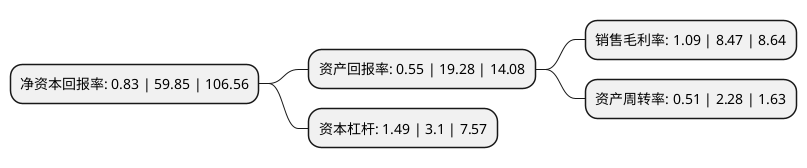

> 本页面由自动化程序生成于 2022年5月20日 01:40
> 内容可能存在错误，如有bug请提交issue至：https://github.com/Eroleice/doc-pi/issues
{.is-warning}

# 上市公司基本情况

## 基本资料

中自环保科技股份有限公司（以下简称“中自科技”）成立于2005年07月15日，成都市。于2021年10月22日在上交所科创板上市。

中自科技注册资本8,603.498万元，专注于环保催化剂的研发，生产和销售。以下是详细信息：

- 公司名称: 中自环保科技股份有限公司
- 股票代码: 688737.SH
- 所在地: 四川 - 成都市
- 成立日期: 2005年07月15日
- 注册资本: 8,603.498万元
- 法定代表人: 陈启章
- 主营业务: 专注于环保催化剂的研发，生产和销售
- 公司官网: www.sinocat.com.cn
- 公司介绍: 公司是一家专注于环保催化剂的研发、生产和销售的高新技术企业，是我国移动污染源(机动车、非道路机械、船舶等)尾气处理催化剂领域的少数主要国产厂商之一，并积极探索其技术在氢燃料电池电催化剂等新能源领域的应用。公司目前的主要产品是应用于各类天然气车、柴油车、汽油车和摩托车尾气处理的催化剂，以催化单元的形式或将催化单元及其他器件封装于金属外壳中后以封装成品的形式进行产品销售。尾气处理催化单元是尾气后处理系统的核心部件，安装在发动机的下游，通过氧化还原等催化反应将内燃机尾气中的碳氢化合物(HC)、一氧化碳(CO)、氮氧化物(NOx)等有害气体和颗粒物(PM)转化为水、二氧化碳(CO2)和氮气(N2)等无害物质。尾气处理催化单元系由催化剂厂商将催化剂涂覆在蜂窝陶瓷或金属等载体上而成，其中载体为尾气处理提供化学反应场所，而催化剂则起到处理尾气中有害物质的各类化学反应的关键催化作用，主要由稀土储氧材料、氧化铝材料、贵金属材料等催化材料和增强催化性能的助剂组成。尾气处理催化剂的性能对尾气处理的效果起到至关重要的作用，针对不同燃料类型、不同内燃机型号的尾气处理催化剂的具体配方均有不同，但核心技术共通。

## 股东及高管情况

上市公司第一大股东为陈启章，持股27,863,360股，占比32.39%，为上市公司实际控制人。

截至2022年03月31日，上市公司的前十大股东中，共有5名自然人股东，1名机构股东，4个产品账户，其中5%以上大股东共有2名。上市公司前十大股东明细如下：

> 截至2022年03月31日，上市公司前十大股东信息如下：

| 股东名称 | 持股数量（股） | 持股比例 |
| --- | --- | --- |
| 陈启章 | 27,863,360 | 32.39% |
| 南京银鞍岭英新能源产业投资基金合伙企业(有限合伙) | 5,605,418 | 6.52% |
| 成都鲁信菁蓉股权投资基金管理有限公司-成都鲁信菁蓉创业投资中心(有限合伙) | 3,027,618 | 3.52% |
| 陈耀强 | 2,480,000 | 2.88% |
| 成都博源新航创业投资基金合伙企业(有限合伙) | 2,162,584 | 2.51% |
| 陈翠容 | 2,068,884 | 2.4% |
| 申万宏源证券-中信银行-申万宏源中自科技员工参与科创板战略配售1号集合资产管理计划 | 2,038,392 | 2.37% |
| 尹立屹 | 2,018,400 | 2.35% |
| 四川圣诺投资管理有限公司 | 1,893,397 | 2.2% |
| 罗华金 | 1,810,900 | 2.1% |

## 利润表分析

上市公司2021年总收入为9.62亿元，净利润为0.1亿元，实现盈利。

## 杜邦分析

> 数据列示周期：2021年 | 2020年 | 2019年
{.is-info}

上市公司的净资产收益率在近一年有所下降，下降幅度为-98.61%，其变化情况分解如下：
- 上市公司的销售毛利率在近一年下降了-87.13%，可能是生产效率的下降、商品原材料价格上涨或商品价格的下跌所致。
- 上市公司的资产周转率在近一年下降了-77.63%，可能是源自于更慢的销售回款或库存管理效果下降。
- 上市公司的财务杠杆比率在近一年下降了-51.94%，可能是减少负债降低财务费用。

