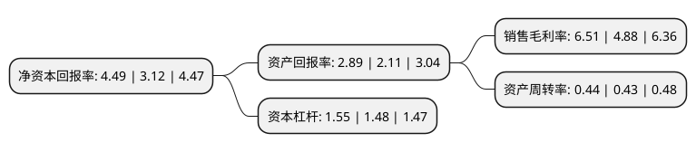

> 本页面由自动化程序生成于 2022年5月20日 01:07
> 内容可能存在错误，如有bug请提交issue至：https://github.com/Eroleice/doc-pi/issues
{.is-warning}

# 上市公司基本情况

## 基本资料

上海神开石油化工装备股份有限公司（以下简称“神开股份”）成立于1993年07月15日，上海市。于2009年08月11日在深交所中小板上市。

神开股份注册资本36,390.965万元，主要从事综合录井仪，钻井仪表，防喷器和防喷器控制装置，井口装置和采油(气)树，石油产品规格分析仪器的生产，销售以及与上述产品相关的技术服务。以下是详细信息：

- 公司名称: 上海神开石油化工装备股份有限公司
- 股票代码: 002278.SZ
- 所在地: 上海 - 上海市
- 成立日期: 1993年07月15日
- 注册资本: 36,390.965万元
- 法定代表人: 李芳英
- 主营业务: 主要从事综合录井仪，钻井仪表，防喷器和防喷器控制装置，井口装置和采油(气)树，石油产品规格分析仪器的生产，销售以及与上述产品相关的技术服务
- 公司官网: www.shenkai.com
- 公司介绍: 公司是一家以研究、开发、制造石油勘探仪器、石油钻探井控设备、采油井口设备和石油产品规格分析仪器为主的高新技术企业。公司拥有雄厚的技术研发能力，先进的制造设备和完善的质量保障体系；主要生产石油勘探开发仪器、井控设备、井口设备、钻采配件和石油产品规格分析仪器等，主导产品为综合录井仪、钻井仪表、无线随钻测量仪、裸眼和生产测井仪、系列油品分析仪、防喷器和防喷器控制装置、井口装置和采油(气)树、石油与矿山钻头和特种橡胶密封件等。公司是中石油的一级供应网络成员单位，是中石化和中海油的网络采购供应商成员，产品广泛应用于国内各油田并出口至美洲、中东、中欧、中亚、南亚和非洲等多个国家和地区。

## 股东及高管情况

上市公司第一大股东为上海业祥投资管理有限公司，持股47,577,481股，占比13.07%，**疑似为**上市公司实际控制人。

截至2022年05月12日，上市公司的前十大股东中，共有8名自然人股东，1名机构股东，1个产品账户，其中5%以上大股东共有4名。上市公司前十大股东明细如下：

> 未能通过持股比例判定出上市公司实际控制人（持股30%以上）
> 可能存在通过间接持股、联合持股、协议控制等方式拥有实际控制权的主体，具体请参考上市公司定期公告！
{.is-warning}

> 截至2022年05月12日，上市公司前十大股东信息如下：

| 股东名称 | 持股数量（股） | 持股比例 |
| --- | --- | --- |
| 上海业祥投资管理有限公司 | 47,577,481 | 13.07% |
| 李清江 | 41,041,300 | 11.28% |
| 王祥伟 | 22,561,561 | 6.2% |
| 李芳英 | 19,253,140 | 5.29% |
| 郑帼芳 | 10,913,883 | 3% |
| 上海神开石油化工装备股份有限公司-第一期员工持股计划 | 10,000,000 | 2.75% |
| 赵树荣 | 9,822,775 | 2.7% |
| 赵心怡 | 7,315,085 | 2.01% |
| 贺艳 | 4,000,100 | 1.1% |
| 刘世刚 | 2,140,600 | 0.59% |

## 利润表分析

上市公司2021年总收入为7.75亿元，净利润为0.5亿元，实现盈利。

## 杜邦分析

> 数据列示周期：2021年 | 2020年 | 2019年
{.is-info}

上市公司的净资产收益率在近一年有所上升，上升幅度为43.91%，其变化情况分解如下：
- 上市公司的销售毛利率在近一年上升了33.4%，可能是生产效率的提升、商品原材料价格下跌或商品价格的上涨所致。
- 上市公司的资产周转率在近一年上升了2.33%，可能是源自于更快的销售回款或库存管理效果提升。
- 上市公司的财务杠杆比率在近一年上升了4.73%，可能是增加负债扩大生产规模。

