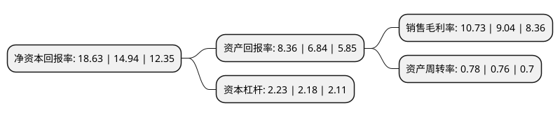

> 本页面由自动化程序生成于 2022年5月20日 01:09
> 内容可能存在错误，如有bug请提交issue至：https://github.com/Eroleice/doc-pi/issues
{.is-warning}

# 上市公司基本情况

## 基本资料

杭氧集团股份有限公司（以下简称“杭氧股份”）成立于2002年12月18日，杭州市。于2010年06月10日在深交所中小板上市。

杭氧股份注册资本98,287.678万元，本公司主营业务为空气分离设备，工业气体产品和石化设备的生产及销售业务。本公司主导产品为大型成套空气分离设备。本公司生产的成套空气分离设备的主要部机及气体产品储运设备包括精馏塔，板翅式换热器，离心式空气压缩机，离心式氧气压缩机，离心式氮气压缩机，离心式膨胀机，液氧液氮设备，液化贮槽，液化气体运输槽车等。以下是详细信息：

- 公司名称: 杭氧集团股份有限公司
- 股票代码: 002430.SZ
- 所在地: 浙江 - 杭州市
- 成立日期: 2002年12月18日
- 注册资本: 98,287.678万元
- 法定代表人: 毛绍融
- 主营业务: 本公司主营业务为空气分离设备，工业气体产品和石化设备的生产及销售业务本公司主导产品为大型成套空气分离设备本公司生产的成套空气分离设备的主要部机及气体产品储运设备包括精馏塔，板翅式换热器，离心式空气压缩机，离心式氧气压缩机，离心式氮气压缩机，离心式膨胀机，液氧液氮设备，液化贮槽，液化气体运输槽车等
- 公司官网: www.hangyang.com
- 公司介绍: 公司是行业领先的空分设备和石化设备开发、设计、制造成套企业，主要从事气体分离设备、工业气体产品和石化设备的生产及销售业务。公司生产的空分设备以及工业气体广泛应用于冶金、化工、煤化工等领域。目前，公司已成功研制十万等级空分设备并投入运行，其性能指标达到国际先进水平。公司利用在空分设备设计制造的优势，实现产业链的延伸，大力进军工业气体领域，加大发展工业气体产业的力度和步伐，在全国范围内投资设立多家专业气体公司，目前公司已发展成为国内最主要的工业气体供应商之一。公司产品覆盖全国各地和世界多个国家和地区，被世界著名公司如德国MESSER集团、英国BOC公司等认可并采购。公司拥有国家级企业技术中心，是我国重大技术装备国产化基地。

## 股东及高管情况

上市公司第一大股东为杭州杭氧控股有限公司，持股524,754,485股，占比53.36%，为上市公司实际控制人。

截至2022年04月13日，上市公司的前十大股东中，共有2名机构股东，7个产品账户，1个海外主体，其中5%以上大股东共有2名。上市公司前十大股东明细如下：

> 截至2022年04月13日，上市公司前十大股东信息如下：

| 股东名称 | 持股数量（股） | 持股比例 |
| --- | --- | --- |
| 杭州杭氧控股有限公司 | 524,754,485 | 53.36% |
| 中国华融资产管理股份有限公司 | 55,841,567 | 5.68% |
| 香港中央结算有限公司(陆股通) | 41,766,718 | 4.25% |
| 中国工商银行股份有限公司-富国天惠精选成长混合型证券投资基金(LOF) | 22,000,000 | 2.24% |
| 全国社保基金四零六组合 | 20,528,883 | 2.09% |
| 全国社保基金一零二组合 | 18,612,514 | 1.89% |
| 中国人寿保险股份有限公司-传统-普通保险产品-005L-CT001深 | 11,902,200 | 1.21% |
| 全国社保基金一一四组合 | 9,877,000 | 1% |
| 平安银行股份有限公司-博时成长领航灵活配置混合型证券投资基金 | 8,692,395 | 0.88% |
| 交通银行股份有限公司-工银瑞信互联网加股票型证券投资基金 | 8,133,668 | 0.83% |

## 利润表分析

上市公司2021年总收入为118.77亿元，净利润为12.74亿元，实现盈利。

## 杜邦分析

> 数据列示周期：2021年 | 2020年 | 2019年
{.is-info}

上市公司的净资产收益率在近一年有所上升，上升幅度为24.7%，其变化情况分解如下：
- 上市公司的销售毛利率在近一年上升了18.69%，可能是生产效率的提升、商品原材料价格下跌或商品价格的上涨所致。
- 上市公司的资产周转率在近一年上升了2.63%，可能是源自于更快的销售回款或库存管理效果提升。
- 上市公司的财务杠杆比率在近一年上升了2.29%，可能是增加负债扩大生产规模。

