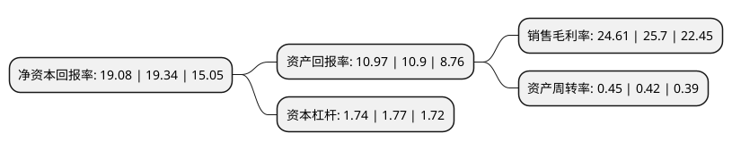

> 本页面由自动化程序生成于 2022年5月20日 01:11
> 内容可能存在错误，如有bug请提交issue至：https://github.com/Eroleice/doc-pi/issues
{.is-warning}

# 上市公司基本情况

## 基本资料

哈尔滨博实自动化股份有限公司（以下简称“博实股份”）成立于1997年09月12日，哈尔滨市。于2012年09月11日在深交所中小板上市。

博实股份注册资本102,255万元，主营业务是石化化工后处理成套设备的研发，生产和销售，并为客户提供相关的服务。公司凭借雄厚的技术实力，可为客户提供石化化工后处理成套设备的专业化解决方案。以下是详细信息：

- 公司名称: 哈尔滨博实自动化股份有限公司
- 股票代码: 002698.SZ
- 所在地: 黑龙江 - 哈尔滨市
- 成立日期: 1997年09月12日
- 注册资本: 102,255万元
- 法定代表人: 邓喜军
- 主营业务: 主营业务是石化化工后处理成套设备的研发，生产和销售，并为客户提供相关的服务公司凭借雄厚的技术实力，可为客户提供石化化工后处理成套设备的专业化解决方案
- 公司官网: www.boshi.cn
- 公司介绍: 公司是石化化工后处理成套设备业内拥有自主研发、生产、销售和服务一体化综合优势的大型成套设备供应商。公司主要产品及业务包括工业机器人、自动化成套装备及系统解决方案，并提供相关的增值服务。产品主要应用于石油化工、煤化工、盐化工、精细化工、化肥、冶金、物流、食品、饲料等行业的固体物料后处理，包括单机产品、单元产品和系统成套设备，能够满足客户多层次、全方位的需求。公司是国际上少数几家能够系统完成自主研发、成套生产和配套服务的企业之一。产品覆盖国内除港、澳、台的所有省区，并出口到欧洲、亚洲、非洲等多个国家。公司始终致力于民族装备工业的振兴，自主研发的多项技术和产品填补国内空白，多项成果获得国家级和省部级科技进步奖，拥有完全自主的知识产权。主要产品的性能指标已经达到国内领先、国际先进水平。

## 股东及高管情况

上市公司第一大股东为联通凯兴股权投资管理(珠海横琴)有限公司-联创未来(武汉)智能制造产业投资合伙企业(有限合伙)，持股175,007,500股，占比17.11%，**疑似为**上市公司实际控制人。

截至2022年05月09日，上市公司的前十大股东中，共有6名自然人股东，4名机构股东，其中5%以上大股东共有8名。上市公司前十大股东明细如下：

> 未能通过持股比例判定出上市公司实际控制人（持股30%以上）
> 可能存在通过间接持股、联合持股、协议控制等方式拥有实际控制权的主体，具体请参考上市公司定期公告！
{.is-warning}

> 截至2022年05月09日，上市公司前十大股东信息如下：

| 股东名称 | 持股数量（股） | 持股比例 |
| --- | --- | --- |
| 联通凯兴股权投资管理(珠海横琴)有限公司-联创未来(武汉)智能制造产业投资合伙企业(有限合伙) | 175,007,500 | 17.11% |
| 联通凯兴股权投资管理(珠海横琴)有限公司-联创未来(武汉)智能制造产业投资合伙企业(有限合伙) | 175,007,500 | 17.11% |
| 邓喜军 | 96,181,562 | 9.406% |
| 邓喜军 | 95,696,362 | 9.3586% |
| 张玉春 | 82,696,357 | 8.09% |
| 张玉春 | 82,696,357 | 8.09% |
| 王春钢 | 57,394,047 | 5.61% |
| 王春钢 | 57,394,047 | 5.61% |
| 哈尔滨工业大学资产投资经营有限责任公司 | 51,127,500 | 5% |
| 哈尔滨工业大学资产投资经营有限责任公司 | 51,127,500 | 5% |

## 利润表分析

上市公司2021年总收入为21.12亿元，净利润为5.19亿元，实现盈利。

## 杜邦分析

> 数据列示周期：2021年 | 2020年 | 2019年
{.is-info}

上市公司的净资产收益率在近一年有所下降，下降幅度为-1.34%，其变化情况分解如下：
- 上市公司的销售毛利率在近一年下降了-4.24%，可能是生产效率的下降、商品原材料价格上涨或商品价格的下跌所致。
- 上市公司的资产周转率在近一年上升了7.14%，可能是源自于更快的销售回款或库存管理效果提升。
- 上市公司的财务杠杆比率在近一年下降了-1.69%，可能是减少负债降低财务费用。

