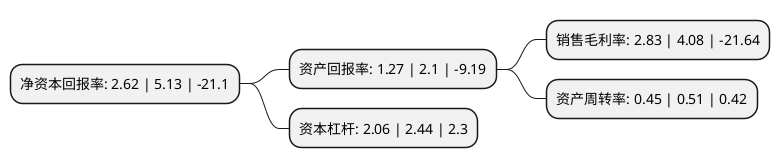

> 本页面由自动化程序生成于 2022年5月20日 01:16
> 内容可能存在错误，如有bug请提交issue至：https://github.com/Eroleice/doc-pi/issues
{.is-warning}

# 上市公司基本情况

## 基本资料

张家港富瑞特种装备股份有限公司（以下简称“富瑞特装”）成立于2003年08月05日，苏州市。于2011年06月08日在深交所创业板上市。

富瑞特装注册资本57,540.635万元，主营业务为金属压力容器的设计，生产和销售。公司主要产品划分为以LNG应用设备为主的低温储运及应用设备，以海水淡化设备为主的换热设备和用于分离空气的气体分离设备三大类。以下是详细信息：

- 公司名称: 张家港富瑞特种装备股份有限公司
- 股票代码: 300228.SZ
- 所在地: 江苏 - 苏州市
- 成立日期: 2003年08月05日
- 注册资本: 57,540.635万元
- 法定代表人: 黄锋
- 主营业务: 主营业务为金属压力容器的设计，生产和销售公司主要产品划分为以LNG应用设备为主的低温储运及应用设备，以海水淡化设备为主的换热设备和用于分离空气的气体分离设备三大类
- 公司官网: www.furuise.com
- 公司介绍: 公司作为国内领先的车船用LNG供气系统供应商，主要从事金属压力容器的设计、生产和销售。根据产品应用领域及客户所处行业的不同，公司主要产品划分为以LNG应用设备为主的低温储运及应用设备、以海水淡化设备为主的换热设备和用于分离空气的气体分离设备三大类。公司经过多年的研发和积累，已经掌握了具有自主知识产权的LNG供气系统生产技术，并且已经与多家发动机制造企业、重型卡车和大型客车制造企业等达成战略合作伙伴关系。公司产品通过了ISO9001：2008质量管理体系认证，拥有较为全面的特种设备设计制造资格证书以及全球多个国家和地区颁布的工厂认证证书。公司参与制订的《汽车用液化天然气气瓶》、《液化天然气(LNG)汽车供气系统安装及安全使用技术条件》企业产品标准及韩中深冷制定的《固定式奥氏体不锈钢应变强化低温容器》企业标准均已通过评审，并在江苏省质量技术监督局进行了企业产品标准备案。

## 股东及高管情况

上市公司第一大股东为黄锋，持股43,280,000股，占比7.52%，**疑似为**上市公司实际控制人。

截至2022年03月31日，上市公司的前十大股东中，共有6名自然人股东，4名机构股东，其中5%以上大股东共有1名。上市公司前十大股东明细如下：

> 未能通过持股比例判定出上市公司实际控制人（持股30%以上）
> 可能存在通过间接持股、联合持股、协议控制等方式拥有实际控制权的主体，具体请参考上市公司定期公告！
{.is-warning}

> 上市公司第一大股东持股不超过10%，请检查是否存在公司控制权风险！
{.is-danger}

> 截至2022年03月31日，上市公司前十大股东信息如下：

| 股东名称 | 持股数量（股） | 持股比例 |
| --- | --- | --- |
| 黄锋 | 43,280,000 | 7.52% |
| 毛文灏 | 16,369,532 | 2.84% |
| 王春妹 | 9,808,213 | 1.7% |
| 杨韬 | 4,205,473 | 0.73% |
| 张家港市金城创融投资管理有限公司 | 3,200,000 | 0.56% |
| 张家港市金城创融创业投资有限公司 | 2,895,235 | 0.5% |
| 张家港市金科创业投资有限公司 | 2,647,685 | 0.46% |
| 杨治华 | 2,514,923 | 0.44% |
| 林彬 | 1,878,600 | 0.33% |
| 华泰证券股份有限公司 | 1,690,013 | 0.29% |

## 利润表分析

上市公司2021年总收入为15.86亿元，净利润为0.44亿元，实现盈利。

## 杜邦分析

> 数据列示周期：2021年 | 2020年 | 2019年
{.is-info}

上市公司的净资产收益率在近一年有所下降，下降幅度为-48.93%，其变化情况分解如下：
- 上市公司的销售毛利率在近一年下降了-30.64%，可能是生产效率的下降、商品原材料价格上涨或商品价格的下跌所致。
- 上市公司的资产周转率在近一年下降了-11.76%，可能是源自于更慢的销售回款或库存管理效果下降。
- 上市公司的财务杠杆比率在近一年下降了-15.57%，可能是减少负债降低财务费用。

