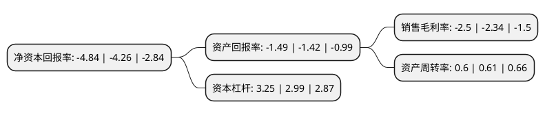

> 本页面由自动化程序生成于 2022年5月20日 01:27
> 内容可能存在错误，如有bug请提交issue至：https://github.com/Eroleice/doc-pi/issues
{.is-warning}

# 上市公司基本情况

## 基本资料

克劳斯玛菲股份有限公司（以下简称“克劳斯”）成立于1999年06月30日，青岛市。于2002年08月09日在上交所主板上市。

克劳斯注册资本49,907.436万元，化工装备的研发，生产和销售。以下是详细信息：

- 公司名称: 克劳斯玛菲股份有限公司
- 股票代码: 600579.SH
- 所在地: 山东 - 青岛市
- 成立日期: 1999年06月30日
- 注册资本: 49,907.436万元
- 法定代表人: 刘韬
- 主营业务: 化工装备的研发，生产和销售
- 公司官网: www.kraussmaffei.ltd
- 公司介绍: 公司主要从事化工机器、化学工程及设备、材料及腐蚀、生产过程自动控制、在线分析仪表、放射性检测仪表及环保技术与设备的研究开发、工程设计、产品制造和推广应用工作。持有国家统一颁发的中国工程咨询(甲级)、设备监理(乙级)、工程设计(乙级)、压力容器设计(三类)、压力容器制造(三类)、ASME“U”钢印制造许可证、建筑企业防腐保温工程专业承包(二级)、锅炉压力容器和压力管道及特殊设备检验许可证、国家级实验室认证证书、国家计量认证合格证、计量器具制造许可证、核辐射安全许可证等资格证书。通过了ISO9001:2008质量体系认证和GB/T24001、GB/T28001以及中石油、中石化环境职业健康安全和HSE管理体系认证；挂靠或设有中国化工学会化工机械专业委员会、全国化工机械与设备标准化技术委员会、化学工业设备质量监督检验中心等15个行业工作机构。

## 股东及高管情况

上市公司第一大股东为中国化工科学研究院有限公司，持股214,723,549股，占比43.02%，为上市公司实际控制人。

截至2022年03月31日，上市公司的前十大股东中，共有3名自然人股东，6名机构股东，1个产品账户，其中5%以上大股东共有2名。上市公司前十大股东明细如下：

> 截至2022年03月31日，上市公司前十大股东信息如下：

| 股东名称 | 持股数量（股） | 持股比例 |
| --- | --- | --- |
| 中国化工科学研究院有限公司 | 214,723,549 | 43.02% |
| 中国化工装备环球控股(香港)有限公司 | 71,750,400 | 14.38% |
| 福建省三明双轮化工机械有限公司 | 9,592,088 | 1.92% |
| 福建华橡自控技术股份有限公司 | 9,038,847 | 1.81% |
| 广发证券股份有限公司-中庚小盘价值股票型证券投资基金 | 7,281,400 | 1.46% |
| 肖星鹏 | 6,058,995 | 1.21% |
| 肖晓勇 | 4,139,300 | 0.83% |
| 中国化工装备有限公司 | 4,135,206 | 0.83% |
| 中国化工橡胶有限公司 | 3,000,000 | 0.6% |
| 温小力 | 2,822,400 | 0.57% |

## 利润表分析

上市公司2021年总收入为98.54亿元，净利润为-2.46亿元，**未实现盈利**。

## 杜邦分析

> 数据列示周期：2021年 | 2020年 | 2019年
{.is-info}

上市公司的净资产收益率在近一年有所上升，上升幅度为13.62%，其变化情况分解如下：
- 上市公司的销售毛利率在近一年上升了6.84%，可能是生产效率的提升、商品原材料价格下跌或商品价格的上涨所致。
- 上市公司的资产周转率在近一年下降了-1.64%，可能是源自于更慢的销售回款或库存管理效果下降。
- 上市公司的财务杠杆比率在近一年上升了8.7%，可能是增加负债扩大生产规模。

