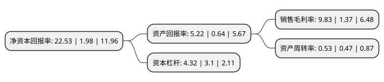

> 本页面由自动化程序生成于 2022年5月20日 01:01
> 内容可能存在错误，如有bug请提交issue至：https://github.com/Eroleice/doc-pi/issues
{.is-warning}

# 上市公司基本情况

## 基本资料

江苏东方盛虹股份有限公司（以下简称“东方盛虹”）成立于1998年07月16日，苏州市。于2000年05月29日在深交所主板上市。

东方盛虹注册资本594,649.597万元，主营业务:纺织，贸易，电力，热能，房地产。以下是详细信息：

- 公司名称: 江苏东方盛虹股份有限公司
- 股票代码: 000301.SZ
- 所在地: 江苏 - 苏州市
- 成立日期: 1998年07月16日
- 注册资本: 594,649.597万元
- 法定代表人: 缪汉根
- 主营业务: 主营业务:纺织，贸易，电力，热能，房地产
- 公司官网: www.jsessh.com
- 公司介绍: 公司确立“以市场为核心的纺织业现代综合服务商”的商业模式，以中国东方丝绸市场为载体，以区域内近万家纺织企业和纺织专业商户为服务对象，主要业务涉及对东方市场进行经营和管理，并提供电力、热能、广告等多项服务。公司以盛泽千年丝绸历史和商贸文化为财富，充分利用建设盛泽成为世界级纺织产业基地的发展机遇，依托良好的区域经济环境和市场空间，通过对东方市场核心区域开发升级、优化区域内纺织产业配套等资本运作与资源整合，并积极参与创投、股权投资等业务，创新投资机制，不断完善企业综合服务功能，积极发挥纺织业现代综合服务商的作用，推动和引导区域纺织产业升级，实现公司战略发展规划，实现股东权益最大化。2018年公司通过重大资产重组收购国望高科100%股权,公司盈利能力及发展空间得到有效提升，有助于提高公司的资产质量和可持续经营能力。

## 股东及高管情况

上市公司第一大股东为江苏盛虹科技股份有限公司，持股2,768,225,540股，占比46.55%，为上市公司实际控制人。

截至2022年03月31日，上市公司的前十大股东中，共有6名机构股东，3个产品账户，1个海外主体，其中5%以上大股东共有4名。上市公司前十大股东明细如下：

> 截至2022年03月31日，上市公司前十大股东信息如下：

| 股东名称 | 持股数量（股） | 持股比例 |
| --- | --- | --- |
| 江苏盛虹科技股份有限公司 | 2,768,225,540 | 46.55% |
| 盛虹石化集团有限公司 | 1,052,404,479 | 17.7% |
| 盛虹(苏州)集团有限公司 | 334,821,428 | 5.63% |
| 江苏吴江丝绸集团有限公司 | 315,735,353 | 5.31% |
| 香港中央结算有限公司(陆股通) | 192,988,590 | 3.25% |
| 苏州市吴江东方国有资本投资经营有限公司 | 99,770,000 | 1.68% |
| 陕西省国际信托股份有限公司-陕国投·东方盛虹控股股东及其关联企业第一期员工持股集合资金信托计划 | 83,855,847 | 1.41% |
| 陕西省国际信托股份有限公司-陕国投·东方盛虹第一期员工持股集合资金信托计划 | 61,377,829 | 1.03% |
| 连云港博虹实业有限公司 | 59,123,847 | 0.99% |
| 上海迎水投资管理有限公司-迎水征东2号私募证券投资基金 | 34,565,596 | 0.58% |

## 杜邦分析

> 数据列示周期：2021年 | 2020年 | 2019年
{.is-info}

上市公司的净资产收益率在近一年有所上升，上升幅度为1037.88%，其变化情况分解如下：
- 上市公司的销售毛利率在近一年上升了617.52%，可能是生产效率的提升、商品原材料价格下跌或商品价格的上涨所致。
- 上市公司的资产周转率在近一年上升了12.77%，可能是源自于更快的销售回款或库存管理效果提升。
- 上市公司的财务杠杆比率在近一年上升了39.35%，可能是增加负债扩大生产规模。

